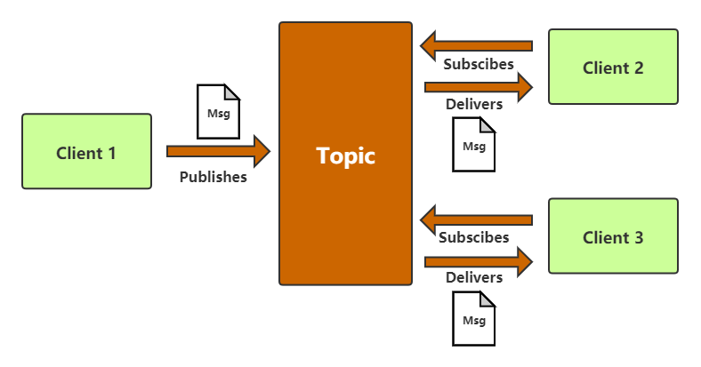
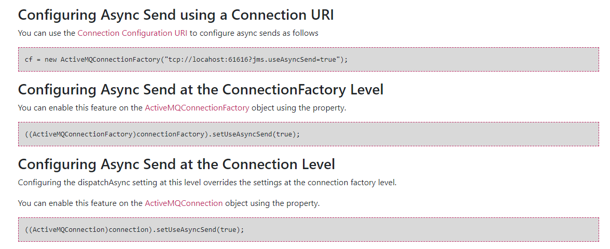

# 一、入门概述

## 1.2 MQ的产生背景

系统之间直接调用存在问题？

​	微服务架构后，链式调用是我们写程序时候的一般流程，为了完成一个整体功能会将其拆分成多个函数（或子模块），比如模块A调用模块B，模块B调用模块C，模块C调用模块D。但在大型分布式应用中，系统间的RPC交互繁杂，一个功能背后要调用上百个接口并非不可能，从单机架构过渡到分布式微服务架构的通例。这些架构会有哪些问题？

**（1）系统之间接口耦合比较严重**

每新增一个下游功能，都要对上游的相关接口进行改造：

例如：如果新系统A要发送数据给系统B和系统C，发送给每个系统的数据可能有差异，因此系统A对要发送给每个系统的数据进行了组装，然后逐一发送

当代码上线后有新增了一个需求：把数据也发送给系统D，新上了一个系统D也要接受系统A的数据，此时需要修改A系统，让它感知到系统D的存在，同时把数据处理好发送给系统D。在这个过程你会看到，每接入一个下游系统，都要对系统A进行代码改造，开发联调的效率很低。其整体架构如下图：


**（2）面对大流量并发时，容易被冲垮**

每个接口模块的吞吐能力是有限的，这个上限能力如果是堤坝，当大流量（洪水）来临时，容易被冲垮。

举个例子：秒杀业务，上游系统发起下单购买操作，就是一个下单操作，很快就完成。然而，下游系统要完成秒杀业务后面的所有逻辑（读取订单->库存检查->库存冻结->余额检查->余额冻结->订单生产->余额扣减->库存减少->生成流水->余额解冻->库存解冻)

**（3）等待同步存在性能问题**

RPC接口上基本都是同步调用，整体的服务性能遵循“木桶理论”，即整体系统的耗时取决于链路中最慢的那个接口。比如A调用B/C/D都是50ms，但此时B又调用了B1，话费2000ms，那么久直接拖累了整个服务性能。


根据上述问题，在设计系统时，可以明确要达到的目标：

1、要做到系统解耦，当新的模块接进来时，可以做到代码改动最小；能够解耦

2、设置流量缓冲池，可以让后端系统按照自身吞吐能力进行消费，不被冲垮；能够削峰

3、强弱依赖梳理能将非关键调用链路的操作异步优化并提升整体系统的吞吐能力；能够异步


## 1.3 MQ的主要作用

（1）**`解耦`**。解决了系统之间耦合调用问题

（2）**`削峰`**。解抵御洪峰流量，保护了主业务

（3）**`异步`**。调用者无需等待

## 1.4 MQ的定义

​	面向消息的中间件（message-oriented middleware）MOM能够很好的解决以上问题。是指利用高效可靠的消息传递机制与平台无关的数据交流，并基于数据通信来进行分布式系统的集成。通过提供消息传递和消息排队模型在分布式环境下提供应用解耦，弹性伸缩，冗余存储、流量削峰，异步通信，数据同步等功能。

大致的过程是这样的：

1、发送者把消息发送给消息服务器

2、消息服务器将消息存放在若干队列/主题topic中

3、在合适的时候，消息服务器回将消息转发给接受者

在这个过程中，发送和接收是异步的，也就是发送无需等待，而且发送者和接受者的生命周期也没有必然的关系；尤其在发布pub/订阅sub模式下，也可以完成一对多的通信，即让一个消息有多个接受者。


## 1.5 MQ的特点

（**1）采用异步处理模式**

消息发送者可以发送一个消息而无须等待响应。消息发送者将消息发送到一条虚拟的通道（主题或者队列）上；

消息接收者则订阅或者监听该爱通道。一条消息可能最终转发给一个或者多个消息接收者，这些消息接收者都无需对消息发送者做出同步回应。整个过程都是异步的。

案例：

也就是说，一个系统跟另一个系统之间进行通信的时候，假如系统A希望发送一个消息给系统B，让他去处理。但是系统A不关注系统B到底怎么处理或者有没有处理好，所以系统A把消息发送给MQ，然后就不管这条消息的“死活了”，接着系统B从MQ里面消费出来处理即可。至于怎么处理，是否处理完毕，什么时候处理，都是系统B的事儿，与系统A无关。


这样的一种通信方式，就是所谓的“异步”通信方式，对于系统A来说，只需要把消息发送给MQ，然后系统B就会异步的去进行处理了，系统A不需要“同步”的等待系统B处理完成。这样的好处是什么呢？两个字：解耦

**（2）应用系统之间解耦**

发送者和接收者不必了解对方，只需确认消息

发送者接收者不必同时在线

**（3）整体架构**


# 二、ActiveMQ的安装和控制台

## 2.1 安装

官网下载：http://activemq.apache.org/

```shell 
tar -xzvf apache-activemq-5.14.3-bin.tar.gz
```

### 2.1.1 普通启动( 默认端口为61616)

```shell
./activemq start
```

### 2.1.2 普通关闭

```shell
./activemq stop
```

### 2.1.3 带日志启动

activemq日志默认的位置是在：%activemq安装目录%/data/activemq.log 

```shell
./activemq start  ->  /myactivemq/run_activemq.lg
```


### 2.1.1查看是否启动成功的三种方式：

#### 方式1：查看进程

ps -ef|grep activemq|grep -v grep

```shell
[root@iz2zeb44670a4odvpvtemmz ~]# ps -ef|grep activemq|grep -v grep
root      6950     1  0 Mar17 ?        00:02:13 /opt/jdk1.8.0_171/bin/java -Xms64M -Xmx1G -Djava.util.logging.config.file=logging.properties -Djava.security.auth.login.config=/opt/apache-activemq-5.15.11//conf/login.config -Dcom.sun.management.jmxremote -Djava.awt.headless=true -Djava.io.tmpdir=/opt/apache-activemq-5.15.11//tmp -Dactivemq.classpath=/opt/apache-activemq-5.15.11//conf:/opt/apache-activemq-5.15.11//../lib/: -Dactivemq.home=/opt/apache-activemq-5.15.11/ -Dactivemq.base=/opt/apache-activemq-5.15.11/ -Dactivemq.conf=/opt/apache-activemq-5.15.11//conf -Dactivemq.data=/opt/apache-activemq-5.15.11//data -jar /opt/apache-activemq-5.15.11//bin/activemq.jar start
```

#### 方式2：查看端口是否被占用

netstat -anp|grep 61616

```shell
[root@iz2zeb44670a4odvpvtemmz ~]# netstat -anp|grep 61616
tcp        0      0 0.0.0.0:61616           0.0.0.0:*               LISTEN      6950/java
```

#### 方式3：查看端口是否被占用

lsof -i:61616

```shell
[root@iz2zeb44670a4odvpvtemmz ~]# lsof -i:61616
COMMAND  PID USER   FD   TYPE DEVICE SIZE/OFF NODE NAME
java    6950 root  129u  IPv4 517772      0t0  TCP *:61616 (LISTEN)
```


##  2.2 控制台

**http://服务器地址:8161/admin/**

用户名和密码默认是admin


ActiveMQ采用61616端口提供JMS服务

ActiveMQ采用8161端口提供管理控制台服务


# 三、编码实现ActiveMQ通讯

## 3.1 pom.xml文件

```xml
<!-- https://mvnrepository.com/artifact/org.apache.activemq/activemq-all -->
<dependency>
    <groupId>org.apache.activemq</groupId>
    <artifactId>activemq-all</artifactId>
    <version>5.15.11</version>
</dependency>
<!-- https://mvnrepository.com/artifact/org.apache.xbean/xbean-spring -->
<dependency>
    <groupId>org.apache.xbean</groupId>
    <artifactId>xbean-spring</artifactId>
    <version>4.15</version>
</dependency>
```

## 3.2 JMS编码总体架构


## 3.3 Destination目的地简介

### 3.3.1 Queue队列


点对点消息传递域的特点如下：
（1）每个消息只能有一个消费者，类似于1对1的关系。好比个人快递自己领自己的。
（2）消息的生产者和消费者之间==**没有时间上的相关性**==。无论消费者在生产者发送消息的时候是否处于运行状态，消费者都可以提取消息。好比我们的发送短信，发送者发送后不见得接收者会即收即看。
（3）消息被消费后队列中==**不会再存储**==，所以消费者==**不会消费到已经被消费掉的消息**==。


#### 代码案例

##### 消息生产者

```java
package com.demo.activemq.queue;
import org.apache.activemq.ActiveMQConnectionFactory;
import javax.jms.*;
public class JmsProduce {
    private static final String ACTIVEMQ_URL = "tcp://192.168.10.130:61616";
    private static final String QUEUE_NAME = "queue01";
    public static void main(String[] args) throws JMSException {
        //1.创建连接工厂，按照给定的URL，采用默认的用户名密码
        ActiveMQConnectionFactory activeMQConnectionFactory = new ActiveMQConnectionFactory(ACTIVEMQ_URL);
        //2.通过连接工厂,获得connection并启动访问
        Connection connection = activeMQConnectionFactory.createConnection();
        connection.start();
        //3.创建会话session
        //两个参数transacted=事务,acknowledgeMode=确认模式(签收)
        Session session = connection.createSession(false, Session.AUTO_ACKNOWLEDGE);
        //4.创建目的地(具体是队列queue还是主题topic)
        Queue queue = session.createQueue(QUEUE_NAME);
        //5.创建消息的生产者
        MessageProducer messageProducer = session.createProducer(queue);
        //6.通过使用消息生产者,生产三条消息,发送到MQ的队列里面
        for (int i = 0; i < 3; i++) {
            //7.创建消息
            TextMessage textMessage = session.createTextMessage("msg---hello" + i);//理解为一个字符串
            //8.通过messageProducer发送给MQ队列
            messageProducer.send(textMessage);
        }
        //9.关闭资源
        messageProducer.close();
        session.close();
        System.out.println("****消息发布到MQ队列完成");
    }
}
```

控制台：


##### 消息消费者

###### 1、阻塞式消费者(receive)

订阅者或接收者抵用MessageConsumer的receive()方法来接收消息，receive方法在能接收到消息之前（或超时之前）将一直阻塞。

```java
package com.demo.activemq.queue;
import org.apache.activemq.ActiveMQConnectionFactory;
import javax.jms.*;
/**
 * 简单消息消费者
 */
public class JmsConsumer {
    private static final String ACTIVEMQ_URL = "tcp://192.168.10.130:61616";
    private static final String QUEUE_NAME = "queue01";
    public static void main(String[] args) throws JMSException {
        //1.创建连接工厂，按照给定的URL，采用默认的用户名密码
        ActiveMQConnectionFactory activeMQConnectionFactory = new ActiveMQConnectionFactory(ACTIVEMQ_URL);
        //2.通过连接工厂,获得connection并启动访问
        Connection connection = activeMQConnectionFactory.createConnection();
        connection.start();
        //3.创建会话session
        //两个参数transacted=事务,acknowledgeMode=确认模式(签收)
        Session session = connection.createSession(false, Session.AUTO_ACKNOWLEDGE);
        //4.创建目的地(具体是队列queue还是主题topic)
        Queue queue = session.createQueue(QUEUE_NAME);
        //5.创建消息的消费者,指定消费哪一个队列里面的消息
        MessageConsumer messageConsumer = session.createConsumer(queue);
        //循环获取
        while (true) {
            //6.通过消费者调用方法获取队列里面的消息(发送的消息是什么类型,接收的时候就强转成什么类型)
            TextMessage textMessage = (TextMessage) messageConsumer.receive();
            if (textMessage != null) {
                System.out.println("****消费者接收到的消息:  " + textMessage.getText());
            }else {
                break;
            }
        }
        //7.关闭资源
        messageConsumer.close();
        session.close();
        connection.close();
    }
}

```

###### 2、异步式监听式消费者(onMessage)

订阅者或接收者通过MessageConsumer的setMessageListener(MessageListener listener)注册一个消息监听器，
当消息到达之后，系统会自动调用监听器MessageListener的onMessage(Message message)方法。

```java
package com.demo.activemq.queue;
import org.apache.activemq.ActiveMQConnectionFactory;
import javax.jms.*;
import java.io.IOException;
/**
 * 监听模式下的消费者
 */
public class JmsConsumer2 {
    private static final String ACTIVEMQ_URL = "tcp://192.168.10.130:61616";
    private static final String QUEUE_NAME = "queue01";
    public static void main(String[] args) throws JMSException, IOException {
        //1.创建连接工厂，按照给定的URL，采用默认的用户名密码
        ActiveMQConnectionFactory activeMQConnectionFactory = new ActiveMQConnectionFactory(ACTIVEMQ_URL);
        //2.通过连接工厂,获得connection并启动访问
        Connection connection = activeMQConnectionFactory.createConnection();
        connection.start();
        //3.创建会话session
        //两个参数transacted=事务,acknowledgeMode=确认模式(签收)
        Session session = connection.createSession(false, Session.AUTO_ACKNOWLEDGE);
        //4.创建目的地(具体是队列queue还是主题topic)
        Queue queue = session.createQueue(QUEUE_NAME);
        //5.创建消息的消费者,指定消费哪一个队列里面的消息
        MessageConsumer messageConsumer = session.createConsumer(queue);
        //6.通过监听的方式消费消息
        /*
        异步非阻塞式方式监听器(onMessage)
        订阅者或消费者通过创建的消费者对象,给消费者注册消息监听器setMessageListener,
        当消息有消息的时候,系统会自动调用MessageListener类的onMessage方法
        我们只需要在onMessage方法内判断消息类型即可获取消息
         */
        messageConsumer.setMessageListener(new MessageListener() {
            @Override
            public void onMessage(Message message) {
                if (message != null && message instanceof TextMessage) {
                    //7.把message转换成消息发送前的类型并获取消息内容
                    TextMessage textMessage = (TextMessage) message;
                    try {
                        System.out.println("****消费者接收到的消息:  " + textMessage.getText());
                    } catch (JMSException e) {
                        e.printStackTrace();
                    }
                }
            }
        });
        System.out.println("执行了39行");
        //保证控制台不关闭,阻止程序关闭
        System.in.read();
        //关闭资源
        messageConsumer.close();
        session.close();
        connection.close();
    }
}

```

控制台：


##### 控制台说明


> **Number Of Pending Messages**=等待消费的消息，这个是未出队列的数量，公式=总接收数-总出队列数。
> **Number Of Consumers**=消费者数量，消费者端的消费者数量。
> **Messages Enqueued**=进队消息数，进队列的总消息量，包括出队列的。这个数只增不减。
> **Messages Dequeued**=出队消息数，可以理解为是消费者消费掉的数量。
> 总结：
> 当有一个消息进入这个队列时，等待消费的消息是1，进入队列的消息是1。
> 当消息消费后，等待消费的消息是0，进入队列的消息是1，出队列的消息是1。
> 当再来一条消息时，等待消费的消息是1，进入队列的消息就是2。

### 3.3.2 Topic主题


发布/订阅消息传递域的特点如下：
（1）生产者将消息发布到topic中，每个消息可以有多个消费者，属于1：N的关系；
（2）生产者和消费者之间==**有时间上的相关性**==。订阅某一个主题的消费者只能消费==**自它订阅之后发布的消息**==。
（3）生产者生产时，topic不保存消息它是==**无状态**==的不落地，假如无人订阅就去生产，那就是一条废消息，所以，一般先启动消费者再启动生产者。

JMS规范允许客户创建持久订阅，这在一定程度上放松了时间上的相关性要求。持久订阅允许消费者消费它在未处于激活状态时发送的消息。==**一句话，好比我们的微信公众号订阅**==



##### 代码案例

###### 发布主题生产者

```java
package com.demo.activemq.topic;
import org.apache.activemq.ActiveMQConnectionFactory; 
import javax.jms.*;
 
public class JmsProducer_Topic {
    public static final String ACTIVEMQ_URL = "tcp://192.168.10.130:61616";
    public static final String TOPIC_NAME = "topic01";
 
    public static void main(String[] args) throws JMSException {
        //1.创建连接工厂，按照给定的URL，采用默认的用户名密码
        ActiveMQConnectionFactory activeMQConnectionFactory = new ActiveMQConnectionFactory(ACTIVEMQ_URL);
        //2.通过连接工厂,获得connection并启动访问
        Connection connection = activeMQConnectionFactory.createConnection();
        connection.start();
        //3.创建会话session
        //两个参数transacted=事务,acknowledgeMode=确认模式(签收)
        Session session = connection.createSession(false, Session.AUTO_ACKNOWLEDGE);
        //4.创建目的地(具体是队列queue还是主题topic)
        Topic topic = session.createTopic(TOPIC_NAME);
        //5.创建消息的生产者
        MessageProducer messageProducer = session.createProducer(topic);
        //6.通过使用消息生产者,生产三条消息,发送到MQ的队列里面
        for (int i = 0; i < 3; i++) {
            //7.通过session创建消息
            TextMessage textMessage = session.createTextMessage("TOPIC_NAME---" + i);
            //8.使用指定好目的地的消息生产者发送消息
            messageProducer.send(textMessage);
        }
        //9.关闭资源
        messageProducer.close();
        session.close();
        connection.close();
        System.out.println("****TOPIC_NAME消息发布到MQ完成");
    }
}
```

控制台：


###### 订阅主题消费者

```java
package com.demo.activemq.topic;
import org.apache.activemq.ActiveMQConnectionFactory;
import javax.jms.*;
import java.io.IOException;
 
public class JmsConsumer_Topic {
    public static final String ACTIVEMQ_URL = "tcp://192.168.10.130:61616";
    public static final String TOPIC_NAME = "topic01";
 
    public static void main(String[] args) throws JMSException, IOException {
        System.out.println("我是1号消费者");
        //1.创建连接工厂，按照给定的URL，采用默认的用户名密码
        ActiveMQConnectionFactory activeMQConnectionFactory = new ActiveMQConnectionFactory(ACTIVEMQ_URL);
        //2.通过连接工厂,获得connection并启动访问
        Connection connection = activeMQConnectionFactory.createConnection();
        connection.start();
        //3.创建会话session
        //两个参数transacted=事务,acknowledgeMode=确认模式(签收)
        Session session = connection.createSession(false, Session.AUTO_ACKNOWLEDGE);
        //4.创建目的地(具体是队列queue还是主题topic)
        Topic topic = session.createTopic(TOPIC_NAME);
        //5.创建消息的消费者
        MessageConsumer messageConsumer = session.createConsumer(topic);
        //5.创建消息的消费者,指定消费哪一个队列里面的消息
        messageConsumer.setMessageListener(message -> {
            if (message instanceof TextMessage){
                try {
                    String text = ((TextMessage) message).getText();
                    System.out.println(text);
                } catch (JMSException e) {
                    e.printStackTrace();
                }
            }
        });
        System.in.read();
    }
}
```

控制台：


**先启动订阅者再启动生产者,不然发送的消息是废消息**


### 3.3.3 两个模式的比较

| 比较项目       | Topic主题模式                                                | Queue队列模式                                                |
| :------------- | :----------------------------------------------------------- | :----------------------------------------------------------- |
| **工作模式**   | "订阅-发布"模式，如果当前没有订阅者，消息将会被丢弃，如果有多个订阅者，那么这些订阅者都会收到消息 | "负载均衡"模式，如果当前没有消费者，消息也不会丢弃；如果有多个消费者，那么一条消息也只会发送给其中一个消费者，并且要求消费者ack信息 |
| **有无状态**   | 无状态                                                       | Queue数据默认会在mq服务器上以文件形式保存，比如Active MQ一般保存在$AMQ_HOME\data\kr-store\data下面，也可以配置成DB存储 |
| **传递完整性** | 如果没有订阅者，消息会被丢弃                                 | 消息不会被丢弃                                               |
| **处理效率**   | 由于消息要按照订阅者的数量进行复制，所以处理性能会随着订阅者的增加而明显降低，并且还要结合不同消息协议自身的性能差异 | 由于一条消息只发送给一个消费者，所以就算消费者再多，性能也不会有明显降低。当然不同消息协议的具体性能也是有差异的 |


# 四、JMS规范和落地产品

## 4.1 JMS定义

​	Java消息服务(Java Message Service)指的是两个应用程序之间进行异步通信的API，它为标准协议和消息服务提供了一组通用接口，包括创建、发送、读取消息等，用于支持Java应用程序开发。在JavaEE中，当两个应用程序使用JMS进行通信时，它们之间不是直接相连的，而是通过一个共同的消息收发服务组件关联起来以达到解耦/异步削峰的效果。

## 4.2消息中间件的详细比较

| 特性              | ActiveMQ      | RabbitMQ | Kafka          | RocketMQ     |
| ----------------- | ------------- | -------- | -------------- | ------------ |
| PRODUCER-CUMSUMER | 支持          | 支持     | 支持           | 支持         |
| PUBLISH-SUBSCRIBE | 支持          | 支持     | 支持           | 支持         |
| REQUEST-REPLY     | 支持          | 支持     | -              | 支持         |
| API完备性         | 高            | 高       | 高             | 低(静态配置) |
| 多语言支持        | 支持,Java优先 | 语言无关 | 支持,Java优先  | 支持         |
| 单机吞吐量        | 万级          | 万级     | 十万级         | 单机万级     |
| 消息延迟          | -             | 微秒级   | 毫秒级         | -            |
| 可用性            | 高(主从)      | 高(主从) | 非常高(分布式) | 高           |
| 消息丢失          | -             | 低       | 理论上不会丢失 | -            |
| 消息重复          | -             | 可控制   | 理论上会有重复 | -            |
| 文档的完备性      | 高            | 高       | 高             | 中           |
| 提供快速入门      | 有            | 有       | 有             | 无           |
| 首次部署难度      | -             | 低       | 中             | 高           |

## 4.3 JMS的组成结构和特点

### 4.3.1 JMS Provider

实现JMS接口和规范的消息中间件，也就是我们说的MQ服务器

### 4.3.2 JMS Producer

消息生产者，创建和发送JMS消息的客户端应用

### 4.3.3 JMS Consumer

消息消费者，接收和处理JMS消息的客户端应用

### 4.3.4 JMS Message

##### 4.3.4.1 消息头

###### (1)JMS Destination

消息发送的目的地，主要是指==**Queue**==和==**Topic**==

###### (2)JMSDeliveryMode

持久模式和非持久模式。

一条持久性的消息：应该被传送“一次仅仅一次”，这就意味着如果JMS提供者出现故障，该消息并不会丢失，它会在服务器恢复之后再次传递。

一条非持久的消息：最多会传递一次，这意味着服务器出现故障，该消息将会永远丢失。

###### (3)JMSException

可以设置消息在一定时间后过期，**默认是永不过期**

消息过期时间，等于Destination的send方法中的timeToLive值加上发送时刻的GMT时间值。

如果timeToLive值等于0，则**JMSExpiration被设为0，表示该消息永不过期**。

如果发送后，**在消息过期时间之后还没有被发送到目的地，则该消息被清除**。

###### (4)JMSPriority

消息优先级，从0-9十个级别，0-4是普通消息5-9是加急消息。

JMS不要求MQ严格按照这十个优先级发送消息但**必须保证==加急消息==要先于==普通消息==到达**。默认是4级。

###### (5)JMSMessageID

唯一标识每个消息的标识由MQ产生。

##### 4.3.4.2 消息属性

1、封装具体的消息数据

2、消息格式（5种）

- **TextMessage：**普通字符串消息，包含一个String
- **MapMeesage：**一个Map类型的消息，key为Strng类型，而值为Java基本类型
- BytesMessage：二进制数组消息，包含一个byte[]
- StreamMessage：Java数据流消息，用标准流操作来顺序填充和读取
- ObjectMessage：对象消息，包含一个可序列化的Java对象

3、发送和接收的消息体类型**必须一致对应**

##### 4.3.4.3 消息体

​	如果需要**除消息字段以外的值**，那么可以使用消息属性，它是识别/去重/重点标注等操作非常有用的方法

​	他们是以属性名和属性值对的形式制定的。可以将属性是为消息头得扩展，属性指定一些消息头没有包括的附加信息，比如可以在属性里指定消息选择器。消息的属性就像可以分配给一条消息的附加消息头一样。它们允许开发者添加有关消息的不透明附加信息。它们还用于暴露消息选择器在消息过滤时使用的数据。 

设置消息属性的api（可用于配置延迟投递的时间，重复次数，重复间隔等）


## 4.4 JMS的可靠性

### 4.4.1 Persistent：持久性

#### 1.参数设置说明

- 非持久：当服务器宕机，消息不存在

  ```java
  messageProducer.setDeliveryMode(DeliveryMode.NON_PERSISTENT);
  ```

- 持久：当服务器宕机，消息依然存在。

  ```java
  messageProducer.setDeliveryMode(DeliveryMode.PERSISTENT);
  ```

- Queue默认是持久


#### 2.持久化的Queue

```java
MessageProducer messageProducer = session.createProducer(queue);
//设置通过session创建出来的生产者生产的Queue消息为持久性
messageProducer.setDeliveryMode(DeliveryMode.PERSISTENT);
```

这是队列的默认传递模式，此模式保证这些消息**只被传送一次和成功使用一次**。对于这些消息，可靠性是优先考虑的因素。

可靠性的另一个重要方面是确保持久性消息传送至目标后，消息服务在**向消费者传送它们之前**不会丢失这些消息。

#### 3.持久化的Topic

##### 持久的发布主题生产者

```java
package com.demo.activemq.persist;
import org.apache.activemq.ActiveMQConnectionFactory;
import javax.jms.*;

/**
 * 持久化Topic生产者
 */
public class JmsProducer_Topic_Persist {
    private static final String ACTIVEMQ_URL = "tcp://192.168.10.130:61616";
    private static final String ACTIVEMQ_TOPIC_NAME = "Topic-Persist";

    public static void main(String[] args) throws JMSException {
        //1.创建连接工厂，按照给定的URL，采用默认的用户名密码
        ActiveMQConnectionFactory activeMQConnectionFactory = new ActiveMQConnectionFactory(ACTIVEMQ_URL);
        //2.通过连接工厂,持久化的topic必须在生产者创建并设置持久化完成后调用start
        Connection connection = activeMQConnectionFactory.createConnection();
        //3.创建会话session
        //两个参数transacted=事务,acknowledgeMode=确认模式(签收)
        Session session = connection.createSession(false, Session.AUTO_ACKNOWLEDGE);
        //4.创建目的地(具体是队列queue还是主题topic)
        Topic topic = session.createTopic(ACTIVEMQ_TOPIC_NAME);
        //5.创建消息的生产者
        MessageProducer messageProducer = session.createProducer(topic);
        //6.设置生产者生产持久化的Topic
        messageProducer.setDeliveryMode(DeliveryMode.PERSISTENT);
        //7.启动连接
        connection.start();
        //8.通过使用持久化Topic消息生产者,生产三条消息,发送到MQ的队列里面
        for (int i = 0; i < 3; i++) {
            //7.通过session创建消息
            TextMessage textMessage = session.createTextMessage("msg-persist" + i);
            //8.使用指定好目的地的消息生产者发送消息
            messageProducer.send(textMessage);
        }
        //9.关闭资源
        messageProducer.close();
        session.close();
        connection.close();
        System.out.println("****TOPIC_NAME消息发布到MQ完成");
    }

}

```


##### 持久的订阅主题消费者

```java
package com.demo.activemq.persist;

import org.apache.activemq.ActiveMQConnectionFactory;
import javax.jms.*;
import java.io.IOException;

/**
 * 持久化Topic消费者
 */
public class Jms_Topic_Consumer_Persist {
    private static final String ACTIVEMQ_URL = "tcp://192.168.10.130:61616";
    private static final String ACTIVEMQ_TOPIC_NAME = "Topic-Persist";

    public static void main(String[] args) throws JMSException, IOException {
        System.out.println("我是1号消费者张三");
        //1.创建连接工厂，按照给定的URL，采用默认的用户名密码
        ActiveMQConnectionFactory activeMQConnectionFactory = new ActiveMQConnectionFactory(ACTIVEMQ_URL);
        //2.通过连接工厂,获得connection,设置connectionID
        Connection connection = activeMQConnectionFactory.createConnection();
        connection.setClientID("张三");
        //3.创建会话session
        //两个参数transacted=事务,acknowledgeMode=确认模式(签收)
        Session session = connection.createSession(false, Session.AUTO_ACKNOWLEDGE);
        //4.创建目的地(具体是队列queue还是主题topic)
        Topic topic = session.createTopic(ACTIVEMQ_TOPIC_NAME);
        //5.通过session创建持久化订阅
        TopicSubscriber topicSubscriber = session.createDurableSubscriber(topic, "我是张三");
        //6.启动连接
        connection.start();
        //7.接收消息
        topicSubscriber.setMessageListener(message -> {
            if (message instanceof TextMessage) {
                TextMessage textMessage = (TextMessage) message;
                try {
                    System.out.println("收到的持久化订阅消息: " + textMessage.getText());
                } catch (JMSException e) {
                    e.printStackTrace();
                }
            }
        });

        /**
         * 一定要先运行一次消费者,类似于像MQ注册,我订阅了这个主题
         * 然后再运行主题生产者
         * 无论消费着是否在线,都会接收到,在线的立即接收到,不在线的等下次上线把没接收到的接收
         */
    }
}

```

控制台：


**订阅者在线**


**订阅者离线**


### 4.4.2 Transaction：事务

事务偏生产者，签收偏消费者

```java
//参数1表示的是否开启事务
//参数2表示签收的模式
Session session = connection.createSession(false,Session.AUTO_ACKNOWLEDGE);
```

(1) 生产者开启事务后，send之后需要执行commit方法，这批消息才真正的被提交。不执行commit方法，这批消息不会提交。执行rollback方法，之前的消息会回滚掉。生产者的事务机制，要高于签收机制，当生产者开启事务，签收机制不再重要。

(2) 消费者开启事务后，执行commit方法，这批消息才算真正的被消费。不执行commit方法，这些消息不会标记已消费，下次还会被消费。执行rollback方法，是不能回滚之前执行过的业务逻辑，但是能够回滚之前的消息，回滚后的消息，下次还会被消费。消费者利用commit和rollback方法，甚至能够违反一个消费者只能消费一次消息的原理。

### 4.4.3 Acknowledge：签收

**签收的方式**：

①　==**自动签收（Session.AUTO_ACKNOWLEDGE）**==：该方式是默认的。该种方式，无需我们程序做任何操作，框架会帮我们自动签收收到的消息。

②　==**手动签收（Session.CLIENT_ACKNOWLEDGE）**==：手动签收。该种方式，需要我们手动调用Message.acknowledge()，来签收消息。如果不签收消息，该消息会被我们反复消费，直到被签收。

③　允许重复消息（Session.DUPS_OK_ACKNOWLEDGE）：多线程或多个消费者同时消费到一个消息，因为线程不安全，可能会重复消费。该种方式很少使用到。

④　事务下的签收（Session.SESSION_TRANSACTED）：开始事务的情况下，可以使用该方式。该种方式很少使用到。


### 4.4.4 签收与事务的关系

（1）在事务性会话中，当一个事务被成功提交则消息被自动签收。如果事务回滚，则消息会被再次传送。==**事务优先于签收**==，==**开始事务后，签收机制不再起任何作用**==。

（2）非事务性会话中，消息何时被确认==**取决于创建会话时的应答模式**==。

（3）消费者事务开启，只有commit后才能将全部消息变为已消费。

（4）事务偏向生产者，签收偏向消费者。也就是说，生产者使用事务更好点，消费者使用签收机制更好点。


## 4.5 JMS的点对点总结

​	点对点模型是基于队列的，生产者发消息到队列，消费者从队列接收消息，队列的存在使得消息的异步传输成为可能。和我们平时给朋友发送短信类似。

​	如果在Session关闭时有部分消息己被收到但还没有被签收(acknowledged),那当消费者下次连接到相同的队列时，这些消息还会被再次接收

​	队列可以长久地保存消息直到消费者收到消息。消费者不需要因为担心消息会丢失而时刻和队列保持激活的连接状态，充分体现了异步传输模式的优势

## 4.6 JMS的发布订阅总结

JMS Pub/Sub 模型定义了如何向一个内容节点发布和订阅消息，这些节点被称作topic。

主题可以被认为是消息的传输中介，发布者（publisher）发布消息到主题，订阅者（subscribe）从主题订阅消息。

主题使得消息订阅者和消息发布者保持互相独立不需要解除即可保证消息的传送

**(1) 非持久订阅**

- 非持久订阅只有当客户端处于激活状态，也就是和MQ保持连接状态才能收发到某个主题的消息。
- 如果消费者处于离线状态，生产者发送的主题消息将会丢失作废，消费者永远不会收到。
-   ==**一句话：先订阅注册才能接受到发布，只给订阅者发布消息**==。

**(2) 持久订阅**

- 客户端首先向MQ注册一个自己的身份ID识别号，当这个客户端处于离线时，生产者会为这个ID保存所有发送到主题的消息，当客户再次连接到MQ的时候，会根据消费者的ID得到所有当自己处于离线时发送到主题的消息
- 当持久订阅状态下，不能恢复或重新派送一个未签收的消息。
- 持久订阅才能恢复或重新派送一个未签收的消息。

**(3) 非持久和持久化订阅如何选择**

​	当所有的消息必须被接收，则用持久化订阅。当消息丢失能够被容忍，则用非持久订阅。


# 五、ActiveMQ的broker

broker相当于一个ActiveMQ服务器实例。说白了，Broker其实就是实现了用代码的形式启动ActiveMQ将MQ嵌入到Java代码中，以便随时用随时启动，

在用的时候再去启动这样能节省了资源，也保证了可用性。

## 5.1 pom.xml

```xml
<dependencies>
    <!-- https://mvnrepository.com/artifact/org.apache.activemq/activemq-all -->
    <dependency>
        <groupId>org.apache.activemq</groupId>
        <artifactId>activemq-all</artifactId>
        <version>5.15.11</version>
    </dependency>
    
    <dependency>
        <groupId>com.fasterxml.jackson.core</groupId>
        <artifactId>jackson-databind</artifactId>
        <version>2.10.1</version>
    </dependency>

    <!-- https://mvnrepository.com/artifact/org.apache.xbean/xbean-spring -->
    <dependency>
        <groupId>org.apache.xbean</groupId>
        <artifactId>xbean-spring</artifactId>
        <version>4.15</version>
    </dependency>     
    <dependency>
        <groupId>log4j</groupId>
        <artifactId>log4j</artifactId>
        <version>1.2.17</version>
    </dependency>
    <dependency>
        <groupId>junit</groupId>
        <artifactId>junit</artifactId>
        <version>4.12</version>
    </dependency>
    <dependency>
        <groupId>org.projectlombok</groupId>
        <artifactId>lombok</artifactId>
        <version>1.18.10</version>
    </dependency>
</dependencies>
 
```


## 5.2 EmbedBroker

```java
import org.apache.activemq.broker.BrokerService;

public class EmbedBroker {

    public static void main(String[] args) throws Exception {
        //ActiveMQ也支持在vm中通信基于嵌入的broker
        BrokerService brokerService = new BrokerService();
        brokerService.setUseJmx(true);
        brokerService.addConnector("tcp://127.0.0.1:61616");
        brokerService.start();
    }
}
```


# 六、Spring整合ActiveMQ

## 6.1 pom.xml文件

```xml
<dependencies>
    <!-- activemq核心依赖包  -->
    <dependency>
        <groupId>org.apache.activemq</groupId>
        <artifactId>activemq-all</artifactId>
        <version>5.10.0</version>
    </dependency>
    <!--  嵌入式activemq的broker所需要的依赖包   -->
    <dependency>
        <groupId>com.fasterxml.jackson.core</groupId>
        <artifactId>jackson-databind</artifactId>
        <version>2.10.1</version>
    </dependency>
    <!-- activemq连接池 -->
    <dependency>
        <groupId>org.apache.activemq</groupId>
        <artifactId>activemq-pool</artifactId>
        <version>5.15.10</version>
    </dependency>
    <!-- spring支持jms的包 -->
    <dependency>
        <groupId>org.springframework</groupId>
        <artifactId>spring-jms</artifactId>
        <version>5.2.4.RELEASE</version>
    </dependency>
    <!--spring相关依赖包-->
    <dependency>
        <groupId>org.apache.xbean</groupId>
        <artifactId>xbean-spring</artifactId>
        <version>4.14</version>
    </dependency>
    <!-- Spring核心依赖 -->
    <dependency>
        <groupId>org.springframework</groupId>
        <artifactId>spring-core</artifactId>
        <version>5.2.4.RELEASE</version>
    </dependency>
    <dependency>
        <groupId>org.springframework</groupId>
        <artifactId>spring-context</artifactId>
        <version>5.2.4.RELEASE</version>
    </dependency>
    <dependency>
        <groupId>org.springframework</groupId>
        <artifactId>spring-aop</artifactId>
        <version>5.2.4.RELEASE</version>
    </dependency>
    <dependency>
        <groupId>org.springframework</groupId>
        <artifactId>spring-orm</artifactId>
        <version>5.2.4.RELEASE</version>
    </dependency>

    <dependency>
        <groupId>commons-pool</groupId>
        <artifactId>commons-pool</artifactId>
        <version>1.6</version>
    </dependency>

    <dependency>
        <groupId>junit</groupId>
        <artifactId>junit</artifactId>
        <version>4.12</version>
        <scope>test</scope>
    </dependency>
</dependencies>
```


## 6.2 Spring配置文件

```xml
<?xml version="1.0" encoding="UTF-8"?>
<beans xmlns="http://www.springframework.org/schema/beans"
       xmlns:xsi="http://www.w3.org/2001/XMLSchema-instance"
       xmlns:context="http://www.springframework.org/schema/context"
       xsi:schemaLocation="http://www.springframework.org/schema/beans
       http://www.springframework.org/schema/beans/spring-beans.xsd
       http://www.springframework.org/schema/context
       https://www.springframework.org/schema/context/spring-context.xsd">
    <!-- 开启注解扫描 -->
    <context:component-scan base-package="cn.codelau.myactivemq.*" />

    <!-- 配置生产者 -->
    <bean id="jmsFactory" class="org.apache.activemq.pool.PooledConnectionFactory" destroy-method="stop">
        <property name="connectionFactory">
            <bean class="org.apache.activemq.ActiveMQConnectionFactory">
                <property name="brokerURL" value="tcp://182.92.113.52:61616" />
            </bean>
        </property>
        <property name="maxConnections" value="100"/>
    </bean>

    <!-- 设置目的地Queue -->
    <bean id="destinationQueue" class="org.apache.activemq.command.ActiveMQQueue">
        <constructor-arg index="0" name="name" value="queue_spring" />
    </bean>

    <!-- 设置目的地Topic -->
    <bean id="destinationTopic" class="org.apache.activemq.command.ActiveMQTopic">
        <constructor-arg index="0" name="name" value="topic_spring" />
    </bean>


    <!--设置JMSTemplate，Spring提供的JMS工具类,他可以进行消息发送,接收等-->
    <bean id="jmsTemplate" class="org.springframework.jms.core.JmsTemplate">
        <!--连接工厂-->
        <property name="connectionFactory" ref="jmsFactory" />
        <!--默认目的地-->
        <property name="defaultDestination" ref="destinationQueue" />
        <!--消息自动转换器-->
        <property name="messageConverter">
            <bean class="org.springframework.jms.support.converter.SimpleMessageConverter" />
        </property>
    </bean>
	
    <!--设置监听器-->
    <bean id="listenerContainer" class="org.springframework.jms.listener.DefaultMessageListenerContainer">
        <property name="connectionFactory" ref="jmsFactory" />
        <property name="destination" ref="destinationQueue" />
        <property name="messageListener" ref="myMessageListener" />
    </bean>
</beans>
```


## 6.3 队列（Queue）

### 6.3.1 生产者

```java
package myactivemq.spring;

import org.apache.xbean.spring.context.ClassPathXmlApplicationContext;
import org.springframework.beans.factory.annotation.Autowired;
import org.springframework.context.ApplicationContext;
import org.springframework.jms.core.JmsTemplate;
import org.springframework.stereotype.Service;

import javax.jms.TextMessage;

@Service
public class JMS_Producer_Spring {
    @Autowired
    private JmsTemplate jmsTemplate;

    public static void main(String[] args) {
        //加载配置文件
        ApplicationContext context = new ClassPathXmlApplicationContext("applicationContext.xml");

        JMS_Producer_Spring producer = (JMS_Producer_Spring)context.getBean("JMS_Producer_Spring");

        producer.jmsTemplate.send(session -> {
            TextMessage textMessage = session.createTextMessage("******Spring整合ActiveMQ*******MessageListener");
            return textMessage;
        });
        System.out.println("The message has been send..");
    }
}

```


### 6.3.2 消费者

```java
package myactivemq.spring;

import org.apache.xbean.spring.context.ClassPathXmlApplicationContext;
import org.springframework.beans.factory.annotation.Autowired;
import org.springframework.context.ApplicationContext;
import org.springframework.jms.core.JmsTemplate;
import org.springframework.stereotype.Service;

import javax.jms.JMSException;

@Service
public class JMS_Consumer_Spring {
    @Autowired
    private JmsTemplate jmsTemplate;

    public static void main(String[] args) throws JMSException {
        //加载配置文件
        ApplicationContext context = new ClassPathXmlApplicationContext("applicationContext.xml");

        JMS_Consumer_Spring consumer = (JMS_Consumer_Spring)context.getBean("JMS_Consumer_Spring");

        String message = (String) consumer.jmsTemplate.receiveAndConvert();
        System.out.println("消息内容是:"+message);
    }
}
```

## 6.4 主题（Topic）

只需修改配置文件中jmsTemplate的destination属性即可，代码无需变动

```xml
<?xml version="1.0" encoding="UTF-8"?>
<beans xmlns="http://www.springframework.org/schema/beans"
       xmlns:xsi="http://www.w3.org/2001/XMLSchema-instance"
       xmlns:context="http://www.springframework.org/schema/context"
       xsi:schemaLocation="http://www.springframework.org/schema/beans
       http://www.springframework.org/schema/beans/spring-beans.xsd
       http://www.springframework.org/schema/context
       https://www.springframework.org/schema/context/spring-context.xsd">
    <!-- 开启注解扫描 -->
    <context:component-scan base-package="cn.codelau.myactivemq.*" />

    <!-- 配置生产者 -->
    <bean id="jmsFactory" class="org.apache.activemq.pool.PooledConnectionFactory" destroy-method="stop">
        <property name="connectionFactory">
            <bean class="org.apache.activemq.ActiveMQConnectionFactory">
                <property name="brokerURL" value="tcp://182.92.113.52:61616" />
            </bean>
        </property>
        <property name="maxConnections" value="100"/>
    </bean>

    <!-- 设置目的地Topic -->
    <bean id="destinationTopic" class="org.apache.activemq.command.ActiveMQTopic">
        <constructor-arg index="0" name="name" value="topic_spring" />
    </bean>


    <!--设置JMSTemplate，Spring提供的JMS工具类,他可以进行消息发送,接收等-->
    <bean id="jmsTemplate" class="org.springframework.jms.core.JmsTemplate">
        <!--连接工厂-->
        <property name="connectionFactory" ref="jmsFactory" />
        <!--默认目的地-->
        <property name="defaultDestination" ref="destinationTopic" />
        <!--消息自动转换器-->
        <property name="messageConverter">
            <bean class="org.springframework.jms.support.converter.SimpleMessageConverter" />
        </property>
    </bean>
</beans>
```


## 6.5 实现异步监听，无需启动消费者

### 6.5.1 Spring配置文件

```xml
<?xml version="1.0" encoding="UTF-8"?>
<beans xmlns="http://www.springframework.org/schema/beans"
       xmlns:xsi="http://www.w3.org/2001/XMLSchema-instance"
       xmlns:context="http://www.springframework.org/schema/context"
       xsi:schemaLocation="http://www.springframework.org/schema/beans
       http://www.springframework.org/schema/beans/spring-beans.xsd
       http://www.springframework.org/schema/context
       https://www.springframework.org/schema/context/spring-context.xsd">
    <!-- 开启注解扫描 -->
    <context:component-scan base-package="cn.codelau.myactivemq.*" />

    <!-- 配置生产者 -->
    <bean id="jmsFactory" class="org.apache.activemq.pool.PooledConnectionFactory" destroy-method="stop">
        <property name="connectionFactory">
            <bean class="org.apache.activemq.ActiveMQConnectionFactory">
                <property name="brokerURL" value="tcp://182.92.113.52:61616" />
            </bean>
        </property>
        <property name="maxConnections" value="100"/>
    </bean>

    <!-- 设置目的地Queue -->
    <bean id="destinationQueue" class="org.apache.activemq.command.ActiveMQQueue">
        <constructor-arg index="0" name="name" value="queue_spring" />
    </bean>

    <!-- 设置目的地Topic -->
    <bean id="destinationTopic" class="org.apache.activemq.command.ActiveMQTopic">
        <constructor-arg index="0" name="name" value="topic_spring" />
    </bean>


    <!--设置JMSTemplate，Spring提供的JMS工具类,他可以进行消息发送,接收等-->
    <bean id="jmsTemplate" class="org.springframework.jms.core.JmsTemplate">
        <!--连接工厂-->
        <property name="connectionFactory" ref="jmsFactory" />
        <!--默认目的地-->
        <property name="defaultDestination" ref="destinationQueue" />
        <!--消息自动转换器-->
        <property name="messageConverter">
            <bean class="org.springframework.jms.support.converter.SimpleMessageConverter" />
        </property>
    </bean>
	
    <!--设置监听器-->
    <bean id="listenerContainer" class="org.springframework.jms.listener.DefaultMessageListenerContainer">
        <!--Jms连接的工厂-->
        <property name="connectionFactory" ref="jmsFactory" />
        <!--设置默认的监听目的地-->
        <property name="destination" ref="destinationQueue" />
        <!--指定自己实现了MessageListener的类-->
        <property name="messageListener" ref="myMessageListener" />
    </bean>
</beans>
```

### 6.5.2 实现一个监听器实例

```java
package myactivemq.spring;

import org.springframework.stereotype.Component;

import javax.jms.JMSException;
import javax.jms.Message;
import javax.jms.MessageListener;
import javax.jms.TextMessage;

/**
 * 实现MessageListener的类,需要把这个类交给xml配置里面的DefaultMessageListenerContainer管理
 */
@Component
public class MyMessageListener implements MessageListener {
    @Override
    public void onMessage(Message message) {
        if (message instanceof TextMessage) {
            TextMessage textMessage = (TextMessage) message;
            try {
                System.out.println("消费者收到的消息" + textMessage.getText());
            } catch (JMSException e) {
                e.printStackTrace();
            }
        }
    }
}

```

消费者配置了自动监听，就相当于在spring里面后台运行，有消息就运行我们实现监听类里面的方法


# 七、SpringBoot整合ActiveMQ

## 7.1 队列（Queue）

### 7.1.1 队列生产者

#### pom.xml文件

```xml
<?xml version="1.0" encoding="UTF-8"?>
<project xmlns="http://maven.apache.org/POM/4.0.0" xmlns:xsi="http://www.w3.org/2001/XMLSchema-instance"
         xsi:schemaLocation="http://maven.apache.org/POM/4.0.0 https://maven.apache.org/xsd/maven-4.0.0.xsd">
    <modelVersion>4.0.0</modelVersion>
    <parent>
        <groupId>org.springframework.boot</groupId>
        <artifactId>spring-boot-starter-parent</artifactId>
        <version>2.2.5.RELEASE</version>
        <relativePath/> <!-- lookup parent from repository -->
    </parent>
    <groupId>cn.codelau</groupId>
    <artifactId>boot_activemq_producer</artifactId>
    <version>0.0.1-SNAPSHOT</version>
    <name>boot_activemq_producer</name>
    <description>Demo project for Spring Boot</description>

    <properties>
        <java.version>1.8</java.version>
    </properties>

    <dependencies>
        <dependency>
            <groupId>org.springframework.boot</groupId>
            <artifactId>spring-boot-starter-activemq</artifactId>
        </dependency>

        <dependency>
            <groupId>org.springframework.boot</groupId>
            <artifactId>spring-boot-devtools</artifactId>
            <scope>runtime</scope>
            <optional>true</optional>
        </dependency>
        <dependency>
            <groupId>org.springframework.boot</groupId>
            <artifactId>spring-boot-configuration-processor</artifactId>
            <optional>true</optional>
        </dependency>
        <dependency>
            <groupId>org.springframework.boot</groupId>
            <artifactId>spring-boot-starter-test</artifactId>
            <scope>test</scope>
            <exclusions>
                <exclusion>
                    <groupId>org.junit.vintage</groupId>
                    <artifactId>junit-vintage-engine</artifactId>
                </exclusion>
            </exclusions>
        </dependency>

        <dependency>
            <groupId>javax.jms</groupId>
            <artifactId>javax.jms-api</artifactId>
            <version>2.0.1</version>
        </dependency>
    </dependencies>

    <build>
        <plugins>
            <plugin>
                <groupId>org.springframework.boot</groupId>
                <artifactId>spring-boot-maven-plugin</artifactId>
            </plugin>
        </plugins>
    </build>

</project>
```


#### application.yml文件

```yaml
server:
  port: 7777

spring:
  activemq:
    broker-url: tcp://182.92.113.52:61616
    user: admin
    password: admin
  jms:
    pub-sub-domain: false #   false = Queue   true = Topic

#自定义队列名称
myqueue: boot_activemq_queue
```


#### 配置Bean

```java
package cn.codelau.boot_activemq_producer.config;

import org.apache.activemq.command.ActiveMQQueue;
import org.springframework.beans.factory.annotation.Value;
import org.springframework.context.annotation.Bean;
import org.springframework.jms.annotation.EnableJms;
import org.springframework.stereotype.Component;

import javax.jms.Queue;

@Component
@EnableJms	//启用jms
public class ConfigBean {
    @Value("${myqueue}")
    private String myQueue;

    @Bean
    public Queue queue() {
        return new ActiveMQQueue(myQueue);
    }

}

```


#### Queue_Producer

```java
package cn.codelau.boot_activemq_producer.producer;

import org.springframework.beans.factory.annotation.Autowired;
import org.springframework.jms.core.JmsMessagingTemplate;
import org.springframework.scheduling.annotation.Scheduled;
import org.springframework.stereotype.Service;

import javax.jms.Queue;
import java.util.UUID;

@Service
public class Queue_Producer {
    @Autowired
    private JmsMessagingTemplate jmsMessagingTemplate;

    @Autowired
    private Queue queue;

    public void produceMsg() {
        jmsMessagingTemplate.convertAndSend(queue, "**************Scheduled:" + UUID.randomUUID().toString().substring(0, 6));
    }
	
    //间隔3秒投递,SpringBoot的Scheduled用来定时执行
    @Scheduled(fixedDelay = 3000)
    public void produceMsgSchedule() {
        produceMsg();
        System.out.println("******Scheduled定时投递*****");
    }
}

```


#### 主启动类

```java
package cn.codelau.boot_activemq_producer;

import org.springframework.boot.SpringApplication;
import org.springframework.boot.autoconfigure.SpringBootApplication;
import org.springframework.scheduling.annotation.EnableScheduling;

@SpringBootApplication
@EnableScheduling	//启用定时任务
public class BootActivemqProducerApplication {
    public static void main(String[] args) {
        SpringApplication.run(BootActivemqProducerApplication.class, args);
    }
}
```


#### 测试单元

```java
package cn.codelau.boot_activemq_producer;

import cn.codelau.boot_activemq_producer.producer.Queue_Producer;
import org.junit.jupiter.api.Test;
import org.springframework.beans.factory.annotation.Autowired;
import org.springframework.boot.test.context.SpringBootTest;
import org.springframework.context.ApplicationContext;
import org.springframework.context.support.ClassPathXmlApplicationContext;
import org.springframework.test.context.web.WebAppConfiguration;

@SpringBootTest(classes = BootActivemqProducerApplication.class)
@WebAppConfiguration
public class BootActivemqProducerApplicationTests {
    @Autowired
    private Queue_Producer queue_producer;

    @Test
    public void testProduce() {
        queue_producer.produceMsgSchedule();
    }

}

```


### 7.1.2 队列消费者

#### yml文件

```yaml
server:
  port: 8081

spring:
  activemq:
    broker-url: tcp://192.168.10.130:61616
    user: admin
    password: admin
  jms: #指定连接的是队列(Queue)还是主题(Topic)
    pub-sub-domain: false #false代表队列,true代表主题

#定义连接的队列名
myQueueName: springboot-activemq-queue
 

```

#### Queue_Consumer

```java
package cn.codelau.boot_activemq_consumer.consumer;

import org.springframework.jms.annotation.JmsListener;
import org.springframework.stereotype.Service;

import javax.jms.JMSException;
import javax.jms.TextMessage;

@Service
public class Queue_Consumer {
	//springboot的消息监听注解
    //监听过后会随着springboot一起启动,有消息就执行加了该注解的方法
    @JmsListener(destination = "${myqueue}")
    public void receiveMsg(TextMessage textMessage) throws JMSException {
        System.out.println("******消费者受到的消息:"+textMessage.getText());
    }

}

```


## 7.2 主题（Topic）

### 7.2.1 Topic生产者

#### pom.xml文件

```xml
<?xml version="1.0" encoding="UTF-8"?>
<project xmlns="http://maven.apache.org/POM/4.0.0" xmlns:xsi="http://www.w3.org/2001/XMLSchema-instance"
         xsi:schemaLocation="http://maven.apache.org/POM/4.0.0 https://maven.apache.org/xsd/maven-4.0.0.xsd">
    <modelVersion>4.0.0</modelVersion>
    <parent>
        <groupId>org.springframework.boot</groupId>
        <artifactId>spring-boot-starter-parent</artifactId>
        <version>2.2.5.RELEASE</version>
        <relativePath/> <!-- lookup parent from repository -->
    </parent>
    <groupId>cn.codelau</groupId>
    <artifactId>boot_activemq_topic_consumer</artifactId>
    <version>0.0.1-SNAPSHOT</version>
    <name>boot_activemq_topic_consumer</name>
    <description>Demo project for Spring Boot</description>

    <properties>
        <java.version>1.8</java.version>
    </properties>

    <dependencies>
        <dependency>
            <groupId>org.springframework.boot</groupId>
            <artifactId>spring-boot-starter-activemq</artifactId>
        </dependency>

        <dependency>
            <groupId>org.springframework.boot</groupId>
            <artifactId>spring-boot-devtools</artifactId>
            <scope>runtime</scope>
            <optional>true</optional>
        </dependency>
        <dependency>
            <groupId>org.springframework.boot</groupId>
            <artifactId>spring-boot-configuration-processor</artifactId>
            <optional>true</optional>
        </dependency>
        <dependency>
            <groupId>org.springframework.boot</groupId>
            <artifactId>spring-boot-starter-test</artifactId>
            <scope>test</scope>
            <exclusions>
                <exclusion>
                    <groupId>org.junit.vintage</groupId>
                    <artifactId>junit-vintage-engine</artifactId>
                </exclusion>
            </exclusions>
        </dependency>

        <dependency>
            <groupId>javax.jms</groupId>
            <artifactId>javax.jms-api</artifactId>
            <version>2.0.1</version>
        </dependency>
    </dependencies>

    <build>
        <plugins>
            <plugin>
                <groupId>org.springframework.boot</groupId>
                <artifactId>spring-boot-maven-plugin</artifactId>
            </plugin>
        </plugins>
    </build>

</project>
```


#### application.yml文件

```yaml
server:
  port: 6666

spring:
  activemq:
    broker-url: tcp://182.92.113.52:61616
    user: admin
    password: admin
  jms:
    pub-sub-domain: true  #   false = Queue   true = Topic

mytopic: boot_activemq_topic

```


#### 配置Bean

```java
package cn.codelau.boot_activemq_topic_consumer.config;

import org.apache.activemq.command.ActiveMQTopic;
import org.springframework.beans.factory.annotation.Value;
import org.springframework.context.annotation.Bean;
import org.springframework.stereotype.Component;

import javax.jms.Topic;

@Component
public class ConfigBean {
    @Value("${mytopic}")
    private String myTopic;

    @Bean
    public Topic topic() {
        return new ActiveMQTopic(myTopic);
    }
}

```


#### Topic_Producer

```java
package cn.codelau.boot_activemq_topic_producer.producer;

import org.springframework.beans.factory.annotation.Autowired;
import org.springframework.jms.core.JmsMessagingTemplate;
import org.springframework.scheduling.annotation.Scheduled;
import org.springframework.stereotype.Service;

import javax.jms.Topic;
import java.util.UUID;

@Service
public class Topic_Producer {
    @Autowired
    private JmsMessagingTemplate jmsMessagingTemplate;
    @Autowired
    private Topic topic;


    @Scheduled(fixedDelay = 3000)
    public void produceMsg() {
        jmsMessagingTemplate.convertAndSend(topic,"******topic:"+ UUID.randomUUID().toString().substring(0,6));
    }
}
```


#### 主启动类

```java
package cn.codelau.boot_activemq_topic_producer;

import org.springframework.boot.SpringApplication;
import org.springframework.boot.autoconfigure.SpringBootApplication;
import org.springframework.scheduling.annotation.EnableScheduling;

@SpringBootApplication
@EnableScheduling
public class BootActivemqTopicProducerApplication {
	public static void main(String[] args) {
		SpringApplication.run(BootActivemqTopicProducerApplication.class, args);
	}
}
```


### 7.2.2 Topic消费者

#### 7.2.2.1 非持久订阅

##### application.yml文件

```yaml
server:
  port: 5555

spring:
  activemq:
    broker-url: tcp://182.92.113.52:61616
    user: admin
    password: admin
  jms:
    pub-sub-domain: true  #   false = Queue   true = Topic

mytopic: boot_activemq_topic

```

##### Topic_Consumer

```java
package cn.codelau.boot_activemq_topic_consumer.consumer;

import org.springframework.jms.annotation.JmsListener;
import org.springframework.stereotype.Service;

import javax.jms.JMSException;
import javax.jms.TextMessage;

@Service
public class Topic_Consumer {

    @JmsListener(destination = "${mytopic}")
    public void receiveMsg(TextMessage textMessage) throws JMSException {
        System.out.println("TOPIC收到的消息为:"+textMessage.getText());
    }

}

```


#### 7.2.2.2 持久订阅

##### 配置bean

```java
package cn.codelau.boot_activemq_topic_consumer.config;

import org.apache.activemq.ActiveMQConnectionFactory;
import org.checkerframework.checker.units.qual.A;
import org.springframework.beans.factory.annotation.Value;
import org.springframework.context.annotation.Bean;
import org.springframework.jms.annotation.EnableJms;
import org.springframework.jms.config.DefaultJmsListenerContainerFactory;
import org.springframework.stereotype.Component;

import javax.jms.ConnectionFactory;

/**
 * 设置持久化订阅
 * 配置文件的方式无法进行配置持久化订阅。所以需要自己去生成一个持久化订阅
 */
@Component
@EnableJms
public class ActiveMQConfigBean {
    @Value("${spring.activemq.broker-url}")
    private String brokerUrl;
    @Value("${spring.activemq.user}")
    private String user;
    @Value("${spring.activemq.password}")
    private String password;

    public ConnectionFactory connectionFactory(){
        ActiveMQConnectionFactory connectionFactory = new ActiveMQConnectionFactory();
        connectionFactory.setBrokerURL(brokerUrl);
        connectionFactory.setUserName(user);
        connectionFactory.setPassword(password);
        return connectionFactory;
    }


    @Bean(name = "jmsListenerContainerFactory")
    public DefaultJmsListenerContainerFactory jmsListenerContainerFactory() {
        DefaultJmsListenerContainerFactory defaultJmsListenerContainerFactory = new DefaultJmsListenerContainerFactory();
        defaultJmsListenerContainerFactory.setConnectionFactory(connectionFactory());
        defaultJmsListenerContainerFactory.setSubscriptionDurable(true);
        defaultJmsListenerContainerFactory.setClientId("我是持久订阅者一号");
        return defaultJmsListenerContainerFactory;
    }
}

```

##### Topic_Consumer

```java
package package cn.codelau.boot_activemq_topic_consumer.consumer;

import org.springframework.jms.annotation.JmsListener;
import org.springframework.stereotype.Component;

import javax.jms.JMSException;
import javax.jms.TextMessage;

@Component
public class Topic_Consumer {
    //需要在监听方法指定连接工厂
    @JmsListener(destination = "${myTopicName}",containerFactory = "jmsListenerContainerFactory")
    public void consumer(TextMessage textMessage) throws JMSException {
        System.out.println("订阅着收到消息:    " + textMessage.getText());
    }
}
```


# 八、ActiveMQ的传输协议（重点）

## 8.1 简介

ActiveMQ支持的client-broker通讯协议有：TVP、NIO、UDP、SSL、Http(s)、VM。其中配置Transport Connector的文件在ActiveMQ安装目录的conf/activemq.xml中的`<transportConnectors>`标签之内。

activemq传输协议的官方文档：http://activemq.apache.org/configuring-version-5-transports.html

 **这些协议参见文件：%activeMQ安装目录%/conf/activemq.xml，下面是文件的重要的内容** 

```xml
<transportConnectors>
	<transportConnector name="openwire" uri="tcp://0.0.0.0:61616?maximumConnections=1000&amp;wireFormat.maxFrameSize=104857600"/>
	<transportConnector name="amqp" uri="amqp://0.0.0.0:5672?maximumConnections=1000&amp;wireFormat.maxFrameSize=104857600"/>
	<transportConnector name="stomp" uri="stomp://0.0.0.0:61613?maximumConnections=1000&amp;wireFormat.maxFrameSize=104857600"/>
	<transportConnector name="mqtt" uri="mqtt://0.0.0.0:1884?maximumConnections=1000&amp;wireFormat.maxFrameSize=104857600"/>
	<transportConnector name="ws" uri="ws://0.0.0.0:61614?maximumConnections=1000&amp;wireFormat.maxFrameSize=104857600"/>
</transportConnectors>
```

在上文给出的配置信息中，URI描述信息的头部都是采用协议名称：例如

- 描述amqp协议的监听端口时，采用的URI描述格式为“amqp://······”；
- 描述Stomp协议的监听端口时，采用URI描述格式为“stomp://······”；
- 唯独在进行openwire协议描述时，URI头却采用的“tcp://······”。这是因为ActiveMQ中默认的消息协议就是openwire
- 官方解释：OpenWire is our cross language [Wire Protocol](http://activemq.apache.org/wire-protocol) to allow native access to ActiveMQ from a number of different languages and platforms. The Java OpenWire transport is the default transport in ActiveMQ 4.x or later. For other languages see the following… 

## 8.2 支持的传输协议

个人说明：除了tcp和nio协议，其他的了解就行。各种协议有各自擅长该协议的中间件，工作中一般不会使用activemq去实现这些协议。如： mqtt是物联网专用协议，采用的中间件一般是mosquito。ws是websocket的协议，是和前端对接常用的，一般在java代码中内嵌一个基站（中间件）。stomp好像是邮箱使用的协议的，各大邮箱公司都有基站（中间件）。

注意：协议不同，我们的代码都会不同。

### TCP协议

Transmission Control Protocol(TCP)

1.这是默认的Broker配置，TCP的Client监听端口61616

2.在网络传输数据前，必须要先序列化数据，消息是通过一个叫wire protocol的来序列化成字节流。

3.TCP连接的URI形式如：==**tcp://HostName:port?key=value&key=value**==，后面的参数是可选的。

4.TCP传输的的优点：

- TCP协议传输可靠性高，稳定性强
- 高效率：字节流方式传递，效率很高
- 有效性、可用性：应用广泛，支持任何平台

5.关于Transport协议的可选配置参数可以参考官网http://activemq.apache.org/configuring-version-5-transports.html

### NIO协议

New I/O API Protocol(NIO)

1.NIO协议和TCP协议类似，但NIO更侧重于底层的访问操作。它允许开发人员对同一资源可有更多的client调用和服务器端有更多的负载。

2.适合使用NIO协议的场景：

- 可能有大量的Client去连接到Broker上，一般情况下，大量的Client去连接Broker是被操作系统的线程所限制的。因此，NIO的实现比TCP需要更少的线程去运行，所以建议使用NIO协议。
- 可能对于Broker有一个很迟钝的网络传输，NIO比TCP提供更好的性能。

3.NIO连接的URI形式：==**nio://hostname:port?key=value&key=value**==

4.关于Transport协议的可选配置参数可以参考官网http://activemq.apache.org/configuring-version-5-transports.html


### AMQP协议

<http://activemq.apache.org/amqp> 

Advanced Message Queuing Protocol，一个提供统一消息服务的应用层标准高级消息队列协议，是应用层协议的一个开放标准，为面向消息的中间件设计。基于此协议的客户端与消息中间件可传递消息，并不受客户端/中间件不同产品，不同开发语言等条件限制。

### STOMP协议

<http://activemq.apache.org/stomp> 

STOP，Streaming Text Orientation Message Protocol，是流文本定向消息协议，是一种为MOM(Message Oriented Middleware，面向消息中间件)设计的简单文本协议。

### SSL协议

<http://activemq.apache.org/ssl-transport-reference> 

### MQTT协议

MQTT(Message Queuing Telemetry Transport，消息队列遥测传输)是IBM开发的一个即时通讯协议，有可能成为物联网的重要组成部分。该协议支持所有平台，几乎可以把所有联网物品和外部连接起来，被用来当作传感器和致动器(比如通过Twitter让房屋联网)的通信协议。

### WS协议(websocket)

<http://activemq.apache.org/websockets> 


## 8.3 NIO案例演示

ActiveMQ这些协议传输的底层默认都是使用BIO网络的IO模型。只有当我们指定使用nio才使用NIO的IO模型 

### 修改activemq.xml配置文件

````xml
<transportConnectors>
    <!-- DOS protection, limit concurrent connections to 1000 and frame size to 100MB -->
    <!--默认是openwire协议-->
    <transportConnector name="openwire" uri="tcp://0.0.0.0:61616?maximumConnections=1000&amp;wireFormat.maxFrameSize=104857600"/>
    <transportConnector name="amqp" uri="amqp://0.0.0.0:5672?maximumConnections=1000&amp;wireFormat.maxFrameSize=104857600"/>
    <transportConnector name="stomp" uri="stomp://0.0.0.0:61613?maximumConnections=1000&amp;wireFormat.maxFrameSize=104857600"/>
    <transportConnector name="mqtt" uri="mqtt://0.0.0.0:1883?maximumConnections=1000&amp;wireFormat.maxFrameSize=104857600"/>
    <transportConnector name="ws" uri="ws://0.0.0.0:61614?maximumConnections=1000&amp;wireFormat.maxFrameSize=104857600"/>
    <!--添加nio协议,端口随意-->
    <transportConnector name="nio" uri="nio://0.0.0.0:61618"/>
</transportConnectors>


````

### 代码修改

**生产者**

```java
import org.apache.activemq.ActiveMQConnectionFactory;

import javax.jms.*;

public class Producer {
    //修改url即可
    private static final String ACTIVEMQ_URL = "nio://192.168.10.130:61618";
    private static final String QUEUE_NAME = "Queue-NIO";

    public static void main(String[] args) throws JMSException {
        ActiveMQConnectionFactory connectionFactory = new ActiveMQConnectionFactory();
        connectionFactory.setBrokerURL(ACTIVEMQ_URL);
        Connection connection = connectionFactory.createConnection();
        Session session = connection.createSession(true, Session.AUTO_ACKNOWLEDGE);
        Queue queue = session.createQueue(QUEUE_NAME);
        MessageProducer messageProducer = session.createProducer(queue);
        connection.start();
        for (int i = 0; i < 3; i++) {
            TextMessage textMessage = session.createTextMessage("测试Nio" + i);
            messageProducer.send(textMessage);
        }
        session.commit();
        System.out.println("消息发送完成");
        messageProducer.close();
        session.close();
        connection.close();
    }
}
```

**消费者**

```java
import org.apache.activemq.ActiveMQConnectionFactory;

import javax.jms.*;
import java.io.IOException;

public class Consumer {
    private static final String ACTIVEMQ_URL = "nio://192.168.10.130:61618";
    private static final String QUEUE_NAME = "Queue-NIO";

    public static void main(String[] args) throws JMSException, IOException {
        ActiveMQConnectionFactory activeMQConnectionFactory = new ActiveMQConnectionFactory();
        activeMQConnectionFactory.setBrokerURL(ACTIVEMQ_URL);
        Connection connection = activeMQConnectionFactory.createConnection();
        connection.start();
        Session session = connection.createSession(true, Session.AUTO_ACKNOWLEDGE);
        Queue queue = session.createQueue(QUEUE_NAME);
        MessageConsumer messageConsumer = session.createConsumer(queue);
        messageConsumer.setMessageListener(message -> {
            TextMessage textMessage = (TextMessage) message;
            try {
                System.out.println("消费者接收到的消息:  " + textMessage.getText());
                session.commit();
            } catch (JMSException e) {
                e.printStackTrace();
            }
        });
        System.in.read();
    }
}
```


## 8.4 NIO案例增强

如何进一步优化？

URI格式以"nio"开头，代表这个端口使用TCP协议为基础的NIO网络模型。
但是这样的设置方式，只能使这个端口支持Openwire协议。

### 使用auto关键字

http://activemq.apache.org/auto

auto : 针对所有的协议，他会识别我们是什么协议。

nio   ：使用NIO网络IO模型

> The AUTO Transport
>
> Starting with 5.13.0 ActiveMQ ==**has support for automatic wire protocol detection over TCP, SSL, NIO, and NIO SSL.  OpenWire, STOMP, AMQP, and MQTT are supported**==.  For details see the [AUTO](http://activemq.apache.org/auto) Transport Reference.


### 修改activemq.xml配置文件

```xml
<transportConnectors>
    <transportConnector name="openwire" uri="tcp://0.0.0.0:61626?maximumConnections=1000&amp;wireFormat.maxFrameSize=104857600"/>
    <transportConnector name="amqp" uri="amqp://0.0.0.0:5682?maximumConnections=1000&amp;wireFormat.maxFrameSize=104857600"/>
    <transportConnector name="stomp" uri="stomp://0.0.0.0:61623?maximumConnections=1000&amp;wireFormat.maxFrameSize=104857600"/>
    <transportConnector name="mqtt" uri="mqtt://0.0.0.0:1893?maximumConnections=1000&amp;wireFormat.maxFrameSize=104857600"/>
    <transportConnector name="ws" uri="ws://0.0.0.0:61624?maximumConnections=1000&amp;wireFormat.maxFrameSize=104857600"/>
    <transportConnector name="nio" uri="nio://0.0.0.0:61618?trace=true" />
  	<transportConnector name="auto+nio" uri="auto+nio://0.0.0.0:61608?maximumConnections=1000&amp;wireFormat.maxFrameSize=104857600&amp;org.apache.activemq.transport.nio.SelectorManager.corePoolSize=20&amp;org.apache.activemq.transport.nio.Se1ectorManager.maximumPoo1Size=50"/>
</transportConnectors>
```


# 九、ActiveMQ的消息存储和持久化（重点）

http://activemq.apache.org/persistence


MQ高可用：事务、可持久、签收，是属于MQ自身特性，自带的。这里的持久化是外力，是外部组件。之前讲的持久化是MQ的外在表现，现在讲的的持久是是底层实现。 

## 9.2 持久化的说明

​	为了避免意外宕机以后丢失信息，需要做到重启后可以恢复消息队列，消息系统一半都会采用持久化机制。
	ActiveMQ的消息持久化机制有**JDBC，AMQ，KahaDB和LevelDB**，无论使用哪种持久化方式，消息的存储逻辑都是一致的。

​	就是在发送者将消息发送出去后，消息中心首先将消息存储到本地数据文件、内存数据库或者远程数据库等。再试图将消息发给接收者，成功则将消息从存储中删除，失败则继续尝试尝试发送。

​	消息中心启动以后，要先检查指定的存储位置是否有未成功发送的消息，如果有，则会先把存储位置中的消息发出去。

## 9.3 消息的存储

### 9.3.1 AMQ Mesage Store(了解）

AMS是一种文件存储形式，它具有写入速度快和容易恢复的特点。消息存储再一个个文件中文件的默认大小为32M，当一个文件中的消息已经全部被消费，那么这个文件将被标识为可删除，在下一个清除阶段，这个文件被删除。**AMQ适用于ActiveMQ5.3之前的版本**

### 9.3.2 KahaDB消息存储(默认)

<http://activemq.apache.org/kahadb> 


```xml
 <broker brokerName="broker">
    <persistenceAdapter>
      <kahaDB directory="activemq-data" journalMaxFileLength="32mb"/>
    </persistenceAdapter>
 </broker>
```


日志文件的存储目录在：%activemq安装目录%/data/kahadb


KahaDB是目前默认的存储方式，可用于任何场景，提高了性能和恢复能力。
**消息存储使用==一个事务日志==和仅仅用==一个索引文件==来存储它所有的地址**。
KahaDB是一个==专门针对消息持久化==的解决方案，它对典型的消息使用模型进行了优化。
==**数据被追加到data logs中**==。当不再需要log文件中的数据的时候，log文件会被丢弃。

```shell
[root@iz2zeb44670a4odvpvtemmz kahadb]# pwd
/opt/apache-activemq-5.15.11/data/kahadb
[root@iz2zeb44670a4odvpvtemmz kahadb]# ll
total 596
-rw-r--r-- 1 root root 33554432 Mar 18 19:07 db-1.log
-rw-r--r-- 1 root root    90112 Mar 18 22:43 db.data
-rw-r--r-- 1 root root    69760 Mar 18 22:43 db.redo
-rw-r--r-- 1 root root        8 Mar 18 19:07 lock
```

kahadb存储原理

```shell
[root@iz2zeb44670a4odvpvtemmz kahadb]# pwd
/opt/apache-activemq-5.15.11/data/kahadb
[root@iz2zeb44670a4odvpvtemmz kahadb]# ll
total 596
-rw-r--r-- 1 root root 33554432 Mar 18 19:07 db-1.log
-rw-r--r-- 1 root root    90112 Mar 18 22:43 db.data
-rw-r--r-- 1 root root    69760 Mar 18 22:43 db.redo
-rw-r--r-- 1 root root        8 Mar 18 19:07 lock
```

db-\<number>.log	kahadb存储信息到预定义大小的数据记录文件中，文件命名为db-<number>.log。当数据文件已满时，一个新的文件存储随之创建，number数值也会递增，它随着消息的增多，每32M/文件，文件名按照数字进行编号，如db-1.log，db-2.log...。**当不再有引用到数据文件中的任何信息，文件会被删除或归档，也就是消息被消费完后，文件会自动删除或归档**


db.data	该文件包含了持久化的BTree索引，索引了消息数据记录中的消息，它是消息的索引文件，本质上是BTree，使用B-Tree作为索引指向db-\<number>.log里面存储信息

db.free	当前db.data文件里哪些页面页面是空闲的，文件具体内容是所有空闲页的ID

db.redo	用来进行消息恢复，如果kahadb消息存储在强制退出后启动，用于恢复BTree索引

lock	文件锁，表示当前获得kahadb读写权限的broker


### 9.3.3 JDBC消息存储

消息基于JDBC存储的

#### 9.3.3.1 添加数据库的驱动包到lib文件夹


#### 9.3.3.2 修改activemq.xml配置文件


```xml
<!--  
<persistenceAdapter>
            <kahaDB directory="${activemq.data}/kahadb"/>
      </persistenceAdapter>
-->
<persistenceAdapter>  
      <jdbcPersistenceAdapter dataSource="#mysql-ds" createTableOnStartup="true"/> 
</persistenceAdapter>

```

dataSource指定将要引用的持久化数据库的bean名称，createTableOnStartup是否在启动的时候创建数据表，一般是第一次设置为true之后改成false

#### 9.3.3.3 数据库连接池配置

在\</broker>标签和\<import>标签之间插入数据库连接池配置 

```xml
<bean id="mysql-ds" class="org.apache.commons.dbcp2.BasicDataSource" destroy-method="close">
    <property name="driverClassName" value="com.mysql.jdbc.Driver"/>
    <property name="url" value="jdbc:mysql://mysql数据库URL/activemq?relaxAutoCommit=true"/>
    <property name="username" value="mysql数据库用户名"/>
    <property name="password" value="mysql数据库密码"/>
    <property name="poolPreparedStatements" value="true"/>
</bean>
```

之后需要建一个数据库，名为activemq。新建的数据库要采用latin1 或者ASCII编码。<https://blog.csdn.net/JeremyJiaming/article/details/88734762>

默认是的dbcp数据库连接池，如果要换成其他数据库连接池，需要将该连接池jar包，也放到lib目录下。

#### 9.3.3.4 建库SQL和创表说明

重启activemq。会自动生成如下3张表。如果没有自动生成，需要我们手动执行SQL。我个人建议要自动生成，我在操作过程中查看日志文件，发现了不少问题，最终解决了这些问题后，是能够自动生成的。如果不能自动生成说明你的操作有问题。如果实在不行，下面是手动建表的SQL: 

```sql
-- auto-generated definition
create table ACTIVEMQ_ACKS
(
    CONTAINER     varchar(250)     not null comment '消息的Destination',
    SUB_DEST      varchar(250)     null comment '如果使用的是Static集群，这个字段会有集群其他系统的信息',
    CLIENT_ID     varchar(250)     not null comment '每个订阅者都必须有一个唯一的客户端ID用以区分',
    SUB_NAME      varchar(250)     not null comment '订阅者名称',
    SELECTOR      varchar(250)     null comment '选择器，可以选择只消费满足条件的消息，条件可以用自定义属性实现，可支持多属性AND和OR操作',
    LAST_ACKED_ID bigint           null comment '记录消费过消息的ID',
    PRIORITY      bigint default 5 not null comment '优先级，默认5',
    XID           varchar(250)     null,
    primary key (CONTAINER, CLIENT_ID, SUB_NAME, PRIORITY)
)
    comment '用于存储订阅关系。如果是持久化Topic，订阅者和服务器的订阅关系在这个表保存';

create index ACTIVEMQ_ACKS_XIDX
    on ACTIVEMQ_ACKS (XID);

 
-- auto-generated definition
create table ACTIVEMQ_LOCK
(
    ID          bigint       not null
        primary key,
    TIME        bigint       null,
    BROKER_NAME varchar(250) null
);

 
-- auto-generated definition
create table ACTIVEMQ_MSGS
(
    ID         bigint       not null
        primary key,
    CONTAINER  varchar(250) not null,
    MSGID_PROD varchar(250) null,
    MSGID_SEQ  bigint       null,
    EXPIRATION bigint       null,
    MSG        blob         null,
    PRIORITY   bigint       null,
    XID        varchar(250) null
);

create index ACTIVEMQ_MSGS_CIDX
    on ACTIVEMQ_MSGS (CONTAINER);

create index ACTIVEMQ_MSGS_EIDX
    on ACTIVEMQ_MSGS (EXPIRATION);

create index ACTIVEMQ_MSGS_MIDX
    on ACTIVEMQ_MSGS (MSGID_PROD, MSGID_SEQ);

create index ACTIVEMQ_MSGS_PIDX
    on ACTIVEMQ_MSGS (PRIORITY);

create index ACTIVEMQ_MSGS_XIDX
    on ACTIVEMQ_MSGS (XID);
```

##### ACTIVEMQ_MSGS

```sql
ID：自增的数据库主键

CONTAINER：消息的Destination

MSGID_PROD：消息发送者的主键

MSG_SEQ：是发送消息的顺序，MSGID_PROD+MSG_SEQ可以组成JMS的MessageID

EXPIRATION：消息的过期时间，存储的是从1970-01-01到现在的毫秒数

MSG：消息本体的Java序列化对象的二进制数据

PRIORITY：优先级，从0-9，数值越大优先级越高
```

消息表，缺省表名ACTIVEMQ_MSGS，Queue和Topic都存在里面，结构如下


##### ACTIVEMQ_ACKS

```sql
CONTAINER：消息的Destination

SUB_DEST：如果使用的是static集群，这个字段会有集群其他系统的信息

CLIENT_ID：每个订阅者都必须有一个唯一的客户端ID用以区分

SUB_NAME：订阅者的名称

SELECTOR：选择器，可以选择只消费满足条件的消息，条件可以用自定义属性实现，可支持多熟悉AND和OR操作

LAST_ACKED_ID：记录消费过消息的ID
```


##### ACTIVEMQ_LOCK

表ACTIVEMQ_LOCK在集群环境下才有用，只有一个Broker可以获取消息，称为Master Broker，其他的只能作为备份等待Master Broker不可用，才可能成为下一个Master Broker。这个表用于记录哪个Broker是当前的Master Broker

```sql
ID: 锁的唯一ID
BROKE_NAME: 在ActiveMQ中拥有锁的broke名称（记录master节点的broker）
```

#### 9.3.3.5 queue验证和数据表的变化

一定要开启持久化：messageProducer.setDeliveryMode(DeliveryMode.PERSISTENT);

 在点对点类型中

- 当DeliveryMode设置为NON_PERSISTENCE时，消息被保存在内存中
- 当DeliveryMode设置为PERSISTENCE时，消息保存在broker的相应的文件或者数据库中。

而且点对点类型中消息一旦被Consumer消费，就从数据中删除 

生产者

```java
package com.demo.queue;

import org.apache.activemq.ActiveMQConnectionFactory;

import javax.jms.*;

public class Producer {
    private static final String ACTIVEMQ_URL = "nio://192.168.10.130:61616";
    private static final String ACTIVEMQ_QUEUE_NAME = "Queue-JdbcPersistence";

    public static void main(String[] args) throws JMSException {
        ActiveMQConnectionFactory activeMQConnectionFactory = new ActiveMQConnectionFactory();
        activeMQConnectionFactory.setBrokerURL(ACTIVEMQ_URL);
        Connection connection = activeMQConnectionFactory.createConnection();
        Session session = connection.createSession(true, Session.AUTO_ACKNOWLEDGE);
        Queue queue = session.createQueue(ACTIVEMQ_QUEUE_NAME);
        MessageProducer messageProducer = session.createProducer(queue);
        messageProducer.setDeliveryMode(DeliveryMode.PERSISTENT);
        connection.start();
        for (int i = 0; i < 3; i++) {
            TextMessage textMessage = session.createTextMessage("Queue-JdbcPersistence测试消息" + i);
            messageProducer.send(textMessage);
        }
        session.commit();
        System.out.println("消息发送完成");
        messageProducer.close();
        session.close();
        connection.close();
    }
}
```

消费者

```java
package com.demo.queue;

import lombok.SneakyThrows;
import org.apache.activemq.ActiveMQConnectionFactory;

import javax.jms.*;
import java.io.IOException;

public class Consumer {
    private static final String ACTIVEMQ_URL = "nio://192.168.10.130:61616";
    private static final String ACTIVEMQ_QUEUE_NAME = "Queue-JdbcPersistence";

    public static void main(String[] args) throws JMSException, IOException {
        ActiveMQConnectionFactory activeMQConnectionFactory = new ActiveMQConnectionFactory();
        activeMQConnectionFactory.setBrokerURL(ACTIVEMQ_URL);
        Connection connection = activeMQConnectionFactory.createConnection();
        Session session = connection.createSession(true, Session.AUTO_ACKNOWLEDGE);
        Queue queue = session.createQueue(ACTIVEMQ_QUEUE_NAME);
        MessageConsumer messageConsumer = session.createConsumer(queue);
        connection.start();
        messageConsumer.setMessageListener(new MessageListener() {
            @SneakyThrows
            @Override
            public void onMessage(Message message) {
                if (message instanceof TextMessage) {
                    TextMessage textMessage = (TextMessage) message;
                    session.commit();
                    System.out.println("消费者收到消息" + textMessage.getText());
                }
            }
        });
        System.in.read();
    }
}
```


消费前的消息，会被存到数据库中


上面的消息被消费后会自动删除


#### 9.3.3.6 topic验证和数据表的变化

我们先启动持久化的消费者

```java
package com.demo.topic;

import org.apache.activemq.ActiveMQConnectionFactory;

import javax.jms.*;
import java.io.IOException;

public class Consumer1 {
    private static final String ACTIVEMQ_URL = "nio://192.168.10.130:61616";
    private static final String ACTIVEMQ_TOPIC_NAME = "Topic-JdbcPersistence";

    public static void main(String[] args) throws JMSException, IOException {
        ActiveMQConnectionFactory activeMQConnectionFactory = new ActiveMQConnectionFactory();
        activeMQConnectionFactory.setBrokerURL(ACTIVEMQ_URL);
        Connection connection = activeMQConnectionFactory.createConnection();
        connection.setClientID("我是消费者李四");
        Session session = connection.createSession(true, Session.AUTO_ACKNOWLEDGE);
        Topic topic = session.createTopic(ACTIVEMQ_TOPIC_NAME);
        TopicSubscriber topicSubscriber = session.createDurableSubscriber(topic, "我是消费者李四我要订阅这个消息");
        connection.start();
        topicSubscriber.setMessageListener(new MessageListener() {
            @Override
            public void onMessage(Message message) {
                if (message instanceof TextMessage) {
                    TextMessage textMessage = (TextMessage) message;
                    try {
                        System.out.println("消费者李四收到的消息： " + textMessage.getText());
                        session.commit();
                    } catch (JMSException e) {
                        e.printStackTrace();
                    }
                }
            }
        });
        System.in.read();
    }
}

```

生产者

```java
package com.demo.topic;

import org.apache.activemq.ActiveMQConnectionFactory;

import javax.jms.*;

public class Producer {
    private static final String ACTIVEMQ_URL = "nio://192.168.10.130:61616";
    private static final String ACTIVEMQ_TOPIC_NAME = "Topic-JdbcPersistence";

    public static void main(String[] args) throws JMSException {
        ActiveMQConnectionFactory activeMQConnectionFactory = new ActiveMQConnectionFactory();
        activeMQConnectionFactory.setBrokerURL(ACTIVEMQ_URL);
        Connection connection = activeMQConnectionFactory.createConnection();
        connection.setClientID("我是生产者张三");
        Session session = connection.createSession(true, Session.AUTO_ACKNOWLEDGE);
        Topic topic = session.createTopic(ACTIVEMQ_TOPIC_NAME);
        MessageProducer messageProducer = session.createProducer(topic);
        messageProducer.setDeliveryMode(DeliveryMode.PERSISTENT);
        connection.start();
        for (int i = 0; i < 3; i++) {
            TextMessage textMessage = session.createTextMessage("Topic-JdbcPersistence测试消息" + i);
            messageProducer.send(textMessage);
        }
        session.commit();
        System.out.println("主题发送到MQ完成");
        messageProducer.close();
        session.close();
        connection.close();
    }
}
```

ACTIVEMQ_ACKS数据表，多了一个消费者的身份信息。一条记录代表：一个持久化topic消费者 


我们启动持久化生产者发布3个数据，ACTIVEMQ_MSGS数据表新增3条数据，==**消费者消费所有的数据后，ACTIVEMQ_MSGS数据表的数据并没有消失**==。持久化topic的消息不管是否被消费，是否有消费者，产生的数据永远都存在，且只存储一条。这个是要注意的，持久化的topic大量数据后可能导致性能下降。这里就像公众号一样，消费者消费完后，消息还会保留 

ACTIVEMQ_ACKS表中的LAST_ACKED_ID记录了CLIENT_ID最后签收的一条消息


而LAST_ACKED_ID和ACTIVEMQ_MSGS的ID字段是外键关联关系，这样就可以实现，Topic的消息保存到ACTIVEMQ_MSGS表内，还能根据ACTIVEMQ_ACKS表中的持久订阅者查到该订阅者上次收到的最后一条消息是什么


#### 9.3.3.7 总结

如果是queue，在没有消费者消费的情况下，会将消息保存到activemq_msgs表中，只要有任意一个消费者已经消费过了，消费之后这些消极将会立即被删除

如果是topic，一般是先启动消费订阅然后再生产的情况下会将订阅者的消息保存到activemq_acks，而且消息保存在activemq_msgs中没有被删除

### 9.3.4 JDBC Message Store with ActiveMQ Journal

#### 说明

​	这种方式克服了JDBC Store的不足，JDBC每次消息过来，都需要去写库读库。ActiveMQ Journal，使用高速缓存写入技术，大大提高了性能。当消费者的速度能够及时跟上生产者消息的生产速度时，journal文件能够大大减少需要写入到DB中的消息。

​	举个例子：生产者生产了1000条消息，这1000条消息会保存到journal文件，如果消费者的消费速度很快的情况下，在journal文件还没有同步到DB之前，消费者已经消费了90%的以上消息，那么这个时候只需要同步剩余的10%的消息到DB。如果消费者的速度很慢，这个时候journal文件可以使消息以批量方式写到DB。

​	为了高性能，这种方式使用日志文件存储+数据库存储。先将消息持久到日志文件，等待一段时间再将未消费的消息持久到数据库。该方式要比JDBC性能要高。

一句话，相当于在MQ和数据库中引入了一层journal，类似于redis那样。

#### 修改activemq.xml配置文件

```xml
<!--修改前-->
<persistenceAdapter> 
        <jdbcPersistenceAdapter dataSource="#mysql-ds" /> 
</persistenceAdapter>

<!--修改后-->
<persistenceFactory>        
	<journalPersistenceAdapterFactory 
    	journalLogFiles="5" 
        journalLogFileSize="32768" 
        useJournal="true" 
        useQuickJournal="true" 
        dataSource="#mysql-ds" 
        dataDirectory="../activemq-data" /> 
</persistenceFactory>
```

以前是实时写入mysql，在使用了journal后，数据会被journal处理，如果在一定时间内journal处理（消费）完了，就不写入mysql，如果没消费完，就写入mysql，起到一个缓存的作用


### 9.3.5 总结

性能高低：JDBC Journal > kahadb > JDBC

持久化消息主要指的是：
	MQ所在服务器宕机了消息不会丢试的机制。

持久化机制演变的过程：
	从最初的AMQ Message Store方案到ActiveMQ V4版本退出的High Performance Journal（高性能事务支持）附件，并且同步推出了关于关系型数据库的存储方案。ActiveMQ5.3版本又推出了对KahaDB的支持（5.4版本后被作为默认的持久化方案），后来ActiveMQ 5.8版本开始支持LevelDB，到现在5.9提供了标准的Zookeeper+LevelDB集群化方案。

ActiveMQ消息持久化机制有：

| 持久化机制               | 实现原理                                                     |
| ------------------------ | ------------------------------------------------------------ |
| AMQ                      | 基于日志文件                                                 |
| KahaDB                   | 基于日志文件，从ActiveMQ5.4开始默认使用                      |
| JDBC                     | 基于第三方数据库                                             |
| Replicated LevelDB Store | 从5.9开始提供了LevelDB和Zookeeper的数据复制方法，用于Master-slave方式的首选数据复制方案。 |


# 十、ActiveMQ的多节点集群

需要zookeeper相关知识，往后再补上。

http://activemq.apache.org/masterslave

三种集群方式比较：基于shareFileSystem共享文件系统（KahaDB）、基于JDBC、基于可复制的LevelDB


## 本次案例采用ZK+Replicated LevelDB Store

http://activemq.apache.org/replicated-leveldb-store

从ActiveMQ5.9开始,ActiveMQ的集群实现方式取消了传统的Masster-Slave方式.
增加了基于Zookeeper+LevelDB的Master-Slave实现方式,从5.9版本后也是官网的推荐

基于Zookeeper和LevelDB搭建ActiveMQ集群,集群仅提供主备方式的高可用集群功能,避免单点故障.

### 原理

​	使用Zookeeper集群注册所有的ActiveMQ Broker但只有其中一个Broker可以提供服务，它将被视为Master,其他的Broker处于待机状态被视为Slave。
	如果Master因故障而不能提供服务，Zookeeper会从Slave中选举出一个Broker充当Master。Slave连接Master并同步他们的存储状态，Slave不接受客户端连接。所有的存储操作都将被复制到连接至Maste的Slaves。
	如果Master宕机得到了最新更新的Slave会变成Master。故障节点在恢复后会重新加入到集群中并连接Master进入Slave模式。

> 所有需要同步的消息操作都将等待存储状态被复制到其他法定节点的操作完成才能完成。
> 所以，如给你配置了replicas=3，name法定大小是（3/2）+1 = 2。Master将会存储更新然后等待（2-1）=1个Slave存储和更新完成，才汇报success。
> 有一个node要作为观察者存在。当一个新的Master被选中，你需要至少保障一个法定node在线以能够找到拥有最新状态的node，这个node才可以成为新的Master。
>
> 因此，推荐运行至少3个replica nodes以防止一个node失败后服务中断。


### 部署和规划步骤

#### 1.环境和版本

#### 2.关闭防火墙并保证各个服务器能够ping通

#### 3.要求具备zk集群并可以成功启动

##### 1）创建我们自己的文件夹存放Zookeeper

mkdir /my_zookeeper

##### 2）下载Zookeeper

wget -P /my_zookeeper/ https://mirrors.tuna.tsinghua.edu.cn/apache/zookeeper/zookeeper-3.5.6/apache-zookeeper-3.5.6-bin.tar.gz

##### 3）解压

tar -zxvf apache-zookeeper-3.5.6-bin.tar.g

##### 4）修改配置文件

文件名必须叫这个zoo.cfg
cp zoo_sample.cfg zoo.cfg
设置一下自定义的数据文件夹(注意要手动创建这个目录,后面会用到),,注意最后一定要有/结尾,没有/会报错这是坑
dataDir=/my_zookeeper/apache-zookeeper-3.5.6-bin/data/
在zoo.cfg件最后面追加集群服务器
server.1=192.168.10.130:2888:3888
server.2=192.168.10.132:2888:3888
server.3=192.168.10.133:2888:3888

server.1=leantaot-zk-01:2888:3888
1是一个数字，标识这个是第几号服务器
leantaot-zk-01是这个服务器的IP地址（或者是与IP地址做了映射的主机名）
2888第一个端口用来集群成员的信息交换，标识这个服务器与集群中的leader服务器交换信息的端口
3888是在leader挂掉时专门用来进行选举leader所用的端口

##### 5）把刚刚配置好的Zookeeper整个文件夹远程推送到其他服务器的/my_zookeeper文件夹内

scp -r /my_zookeeper/ root@192.168.10.132:/
scp -r /my_zookeeper/ root@192.168.10.133:/ 

##### 6）创建myid文件， id 与 zoo.cfg 中的序号对应

在192.168.10.130机器上执行
echo 1 > /my_zookeeper/apache-zookeeper-3.5.6-bin/data/zookeeper_server.pid
echo 1 > /my_zookeeper/apache-zookeeper-3.5.6-bin/data/myid
在192.168.10.132机器上执行
echo 2 > /my_zookeeper/apache-zookeeper-3.5.6-bin/data/zookeeper_server.pid
echo 2 > /my_zookeeper/apache-zookeeper-3.5.6-bin/data/myid
在192.168.10.133机器上执行
echo 3 > /my_zookeeper/apache-zookeeper-3.5.6-bin/data/zookeeper_server.pid
echo 3 > /my_zookeeper/apache-zookeeper-3.5.6-bin/data/myid

##### 7）bin目录下启动Zookeeper做测试

 ./zkServer.sh start
输出
ZooKeeper JMX enabled by default
Using config: /my_zookeeper/apache-zookeeper-3.5.6-bin/bin/../conf/zoo.cfg
Starting zookeeper ... already running as process 1.

#### 4.集群部署规划表

#### 5.创建3台集群目录

#### 6.修改管理控制台端口

就是ActiveMQ后台管理页面的访问端口，修改conf文件夹下的jetty.xml文件

```shell
[root@iz2zeb44670a4odvpvtemmz conf]# pwd
/opt/apache-activemq-5.15.11/conf
[root@iz2zeb44670a4odvpvtemmz conf]# vim jetty.xml
```


#### 7.hostname名字映射

如果不映射只需要把mq配置文件的hostname改成当前主机ip

#### 8.ActiveMQ集群部署

配置文件里面的BrokerName要全部一致

持久化配置（必须）

```xml
<persistenceAdapter>
   <replicatedLevelDB
                        directory="${activemq.data}/leveldb"
                        replicas="3"
                        bind="tcp://0.0.0.0:62621"
                        zkAddress="192.168.10.130:2181,192.168.10.132:2181,192.168.10.133:2181"
                        hostname="192.168.10.130"
                        zkPath="/activemq/leveldb-stores"
                        />
  </persistenceAdapter>
```


#### 9.修改各个节点的消息端口

真实的三台机器不用管

#### 10.按顺序启动3个ActiveMQ节点，到这步前提是zk集群成功启动运行

#### 11.zk集群节点状态说明

##### 1）3台Zk连接任意一台验证三台ActiveMQ是否注册上了Zookeeper

使用zkCli.sh连接一台Zookeeper
/my_zookeeper/apache-zookeeper-3.5.6-bin/bin/zkCli.sh -server 192.168.10.130:2181

##### 2）查看master


集群启动后，可以看到ActiveMQ的有3个节点，分别是00000000024、00000000025、00000000026，其中00000000024的==**elected属性的值不为null，说明这个节点是master节点**==。

### 可用性测试

集群需要使用(failover:(tcp://192.168.10.130:61616,tcp://192.168.10.132:61616,tcp://192.168.10.133:61616))配置多个ActiveMQ


ActiveMQ的客户端只能访问Master的Broker，其他处于Slave的Broker不能访问，所以客户端连接的Broker应该使用failover协议（失败转移）

当一个ActiveMQ节点挂掉或者一个Zookeeper节点挂点，ActiveMQ服务依然正常运转，如果仅剩一个ActiveMQ节点，由于不能选举Master，所以ActiveMQ不能正常运行。

同样的，
如果zookeeper仅剩一个活动节点，不管ActiveMQ各节点存活，ActiveMQ也不能正常提供服务。
（**ActiveMQ集群的高可用依赖于Zookeeper集群的高可用**）


# 十一、高级特性


## 11.1 异步投递

这里的异步是指producer与broker之间的异步发送，对于一个Slow Consumer，使用同步发送消息可能出成Producer堵塞等情况，慢消费者适合使用异步发送。

ActiveMQ默认使用异步发送的模式：除非**明确指定使用同步发送**的方式或者在**未使用事务的前提下发送持久化的消息**，这两种情况都是同步发送的

实现方式：



总结：

1、异步发送可以让生产者发的更快。

2、它可以最大化producer端的发送效率。我们通常在发送消息量比较密集的情况下使用异步发送，它可以==**很大的提升Producer性能**==；不过这也带来了额外的问题，就是==**需要消耗更多的Client端内存同时也会导致broker端性能消耗增加**==；此外它不能有效的确保消息的发送成功。==**在userAsyncSend=true的情况下客户端需要容忍消息丢失的可能**==

3、异步发送要确保消息发送成功，需要接收回调，需要客户端回执并由客户端再判断一次是否发送成功

```java
package com.activemq.demo;

import org.apache.activemq.ActiveMQConnection;
import org.apache.activemq.ActiveMQConnectionFactory;
import org.apache.activemq.ActiveMQMessageProducer;
import org.apache.activemq.AsyncCallback;

import javax.jms.*;
import java.util.UUID;

public class Jms_TX_Producer {

    private static final String ACTIVEMQ_URL = "tcp://118.24.20.3:61626";

    private static final String ACTIVEMQ_QUEUE_NAME = "Async";

    public static void main(String[] args) throws JMSException {
        ActiveMQConnectionFactory activeMQConnectionFactory = new ActiveMQConnectionFactory(ACTIVEMQ_URL);
        activeMQConnectionFactory.setUseAsyncSend(true);
        Connection connection = activeMQConnectionFactory.createConnection();
        connection.start();
        Session session = connection.createSession(false, Session.AUTO_ACKNOWLEDGE);
        Queue queue = session.createQueue(ACTIVEMQ_QUEUE_NAME);
        ActiveMQMessageProducer activeMQMessageProducer = (ActiveMQMessageProducer)session.createProducer(queue);
        try {
            for (int i = 0; i < 3; i++) {
                TextMessage textMessage = session.createTextMessage("tx msg--" + i);
                textMessage.setJMSMessageID(UUID.randomUUID().toString()+"orderAtguigu");
                final String  msgId = textMessage.getJMSMessageID();
                activeMQMessageProducer.send(textMessage, new AsyncCallback() {
                    public void onSuccess() {
                        System.out.println("成功发送消息Id:"+msgId);
                    }

                    public void onException(JMSException e) {
                        System.out.println("失败发送消息Id:"+msgId);
                    }
                });
            }
            System.out.println("消息发送完成");
        } catch (Exception e) {
            e.printStackTrace();
        } finally {
            activeMQMessageProducer.close();
            session.close();
            connection.close();
        }
    }
}


```

控制台查看：


## 11.2 延迟投递和定时投递

### 介绍

<http://activemq.apache.org/delay-and-schedule-message-delivery.html> 


### 修改配置文件

在broker标签添加schedulerSupport="true" 这个属性


### 代码

java代码里面封装的辅助消息类型：ScheduleMessage 

```java
package com.activemq.demo;

import org.apache.activemq.*;
import javax.jms.*;
import java.util.UUID;

public class Jms_TX_Producer {

    private static final String ACTIVEMQ_URL = "tcp://118.24.20.3:61626";

    private static final String ACTIVEMQ_QUEUE_NAME = "Schedule01";

    public static void main(String[] args) throws JMSException {
        ActiveMQConnectionFactory activeMQConnectionFactory = new ActiveMQConnectionFactory(ACTIVEMQ_URL);
        Connection connection = activeMQConnectionFactory.createConnection();
        connection.start();
        Session session = connection.createSession(false, Session.AUTO_ACKNOWLEDGE);
        Queue queue = session.createQueue(ACTIVEMQ_QUEUE_NAME);
        MessageProducer messageProducer = session.createProducer(queue);
        long delay =  10*1000;
        long period = 5*1000;
        int repeat = 3 ;
        try {
            for (int i = 0; i < 3; i++) {
                TextMessage textMessage = session.createTextMessage("tx msg--" + i);
                // 延迟的时间
                textMessage.setLongProperty(ScheduledMessage.AMQ_SCHEDULED_DELAY, delay);
                // 重复投递的时间间隔
                textMessage.setLongProperty(ScheduledMessage.AMQ_SCHEDULED_PERIOD, period);
                // 重复投递的次数
                textMessage.setIntProperty(ScheduledMessage.AMQ_SCHEDULED_REPEAT, repeat);
                // 此处的意思：该条消息，等待10秒，之后每5秒发送一次，重复发送3次。
                messageProducer.send(textMessage);
            }
            System.out.println("消息发送完成");
        } catch (Exception e) {
            e.printStackTrace();
        } finally {
            messageProducer.close();
            session.close();
            connection.close();
        }
    }
}
```


## 11.3 消息消费的重试机制

http://activemq.apache.org/redelivery-policy 

消费者收到消息，之后出现异常了，没有告诉broker确认收到该消息，broker会尝试再将该消息发送给消费者。尝试n次，如果消费者还是没有确认收到该消息，那么该消息将被放到死信队列重，之后broker不会再将该消息发送给消费者 

### 引发重试机制的情况


1、事务会话中，当还未进行session.commit()时，进行session.rollback()，那么所有还没commit的消息都会进行重发。
2、使用客户端手动确认的方式时，还未进行确认并且执行Session.recover()，那么所有还没acknowledge的消息都会进行重发。
3、所有未ack的消息，当进行session.closed()关闭事务，那么所有还没ack的消息broker端都会进行重发，而且是马上重发。
4、消息被消费者拉取之后，超时没有响应ack，消息会被broker重发

### 重试间隔和重试次数

间隔：1s

重试次数：6


## 11.4 死信队列

http://activemq.apache.org/message-redelivery-and-dlq-handling.html

### 有毒消息poison ack


当一个消息被接收的次数超过maximumRedeliveries(默认为6次)次数时，会给broker发送一个poison _ack，这种ack类型告诉broker这个消息“有毒”，尝试多次依然失败，这时broker会将这个消息发送到DLQ，以便后续处理。activeMQ默认的死信队列是ActiveMQ.DLQ，如果没有特别指定，死信消息都会被发送到这个队列。

默认情况下持久消息过期都会被送到DLQ，非持久消息过期默认不会送到DLQ。

可以通过配置文件为指定队列创建死信队列

### 死信队列配置（一般采用默认即可）

#### **1.**  sharedDeadLetterStrategy 

不管是queue还是topic，失败的消息都放到这个队列中。下面修改activemq.xml的配置，可以达到修改队列的名字 

```xml
<deadLetterStrategy>
    <!--
     Use the prefix 'DLQ.' for the destination name, and make
     the DLQ a queue rather than a topic
    -->
    <sharedDeadLetterStrategy deadLetterQueue="DLQ-QUEUE" />
</deadLetterStrategy>
```

#### 2.  individualDeadLetterStrategy

可以为queue和topic单独指定两个死信队列。还可以为某个话题，单独指定一个死信队列。 

- 对于queue而言，死信通道的默认前缀通常为ActiveMQ.DLQ.Queue
- 对于topic而言，死信通道的默认前缀通常为ActiveMQ.DLQ.Topic

useQueueForQueueMessages：表示是否将topic的死信信息保存到queue中，默认为true

```xml
<deadLetterStrategy>
    <!--
     Use the prefix 'DLQ.' for the destination name, and make
     the DLQ a queue rather than a topic
    -->
    <individualDeadLetterStrategy queuePrefix="DLQ." useQueueForQueueMessages="true" />
</deadLetterStrategy>
```

#### 3.自动删除过期信息

有时候需要直接删除过期信息而不需要发送到死信队列中，processExpired表示是否将过期信息放入到死信队列中，默认为true

```xml
<deadLetterStrategy>
    <!-- 
           Tell the dead letter strategy not to process expired messages
           so that they will just be discarded instead of being sent to
           the DLQ 
    -->
    <sharedDeadLetterStrategy processExpired="false" />
</deadLetterStrategy>
```


#### 4.存放非持久信息到死信队列中

processNonPersistent：表示是否将非持久化信息放到死信队列中，默认为false

```xml
<!-- 
           Tell the dead letter strategy to also place non-persisted messages 
           onto the dead-letter queue if they can't be delivered.
 -->
<deadLetterStrategy>
    <sharedDeadLetterStrategy processNonPersistent="true" />
</deadLetterStrategy>
```


## 11.5 消息不被重复消费，幂等性

如何解决？

根据messageID去查看是否被消费了