**JVM知识总结**

# **JVM架构图**

​      **灰色-线程私有，独占；**

​      **橙黄色-所有线程共享，存在垃圾回收**

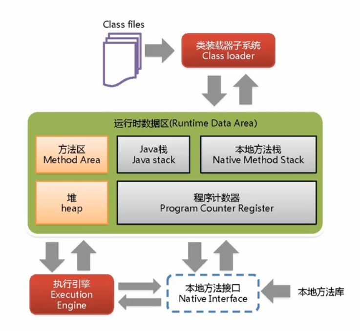


 

# **JVM的类加载器**

​	负责加载class文件，class文件在文件开头有特定的文件标示，将class文件字节码内容加载到内存中，并将这些内容转换成方法区中的运行时数据结构并且ClassLoader只负责class文件的加载，至于它是否可以运行，则由Execution Engine决定  

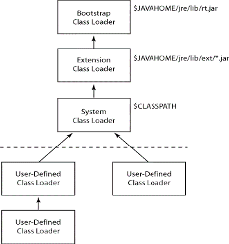

- 虚拟机自带的加载器
  - 启动类加载器（Bootstrap）C++
  - 扩展类加载器（Extension）Java
  - 应用程序类加载器（AppClassLoader）Java也叫系统类加载器，加载当前应用的classpath的所有类 

- 用户自定义加载器  
  - Java.lang.ClassLoader的子类，用户可以定制类的加载方式

# **双亲委派机制**

​	当一个类收到了类加载请求，他首先不会尝试自己去加载这个类，而是把这个请求委派给父类去完成，每一个层次类加载器都是如此，因此所有的加载请求都应该传送到启动类加载其中，只有当父类加载器反馈自己无法完成这个请求的时候（在它的加载路径下没有找到所需加载的Class），子类加载器才会尝试自己去加载。 

采用双亲委派的一个好处是比如加载位于 rt.jar 包中的类 java.lang.Object，不管是哪个加载器加载这个类，最终都是委托给顶层的启动类加载器进行加载，这样就保证了使用不同的类加载器最终得到的都是同样一个 Object对象。 

1. 当AppClassLoader加载一个class时，它首先不会自己去尝试加载这个类，而是把类加载请求委派给父类加载器ExtClassLoader去完成。
2. 当ExtClassLoader加载一个class时，它首先也不会自己去尝试加载这个类，而是把类加载请求委派给BootStrapClassLoader去完成。
3. 如果BootStrapClassLoader加载失败（例如在$JAVA_HOME/jre/lib里未查找到该class），会使用ExtClassLoader来尝试加载；
4. 若ExtClassLoader也加载失败，则会使用AppClassLoader来加载，如果AppClassLoader也加载失败，则会报出异常ClassNotFoundException。

# **沙箱安全机制**

​      沙箱安全机制是由基于双亲委派机制上 采取的一种JVM的自我保护机制,假设你要写一个java.lang.String 的类,由于双亲委派机制的原理,此请求会先交给Bootstrap试图进行加载,但是Bootstrap在加载类时首先通过包和类名查找rt.jar中有没有该类,有则优先加载rt.jar包中的类,因此就**保证了java的运行机制不会被破坏**

 

# **Native-本地方法**

​      Native是一个关键字，JVM是依赖于操作系统的，声明为native的方法就是本地方法，只有声明，没有方法体，表示java的范围只到这里了，native的方法会装载到JVM的**本地方法栈（Native Method Stack）**里面，接下来的实现就是需要调用C/C++的第三方函数库去实现。

 

# **PC寄存器（Program Counter Register）**

​	每个线程都有一个程序计数器，是线程私有的,就是一个指针，指向方法区中的方法字节码（**用来存储指向下一条指令的地址,也即将要执行的指令代码**），由执行引擎读取下一条指令，是一个非常小的内存空间，几乎可以忽略不记。

​	这块内存区域很小，它是当前线程所执行的字节码的行号指示器，字节码解释器通过改变这个计数器的值来选取下一条需要执行的字节码指令。

如果执行的是一个Native方法，那这个计数器是空的。

用以完成分支、循环、跳转、异常处理、线程恢复等基础功能。不会发生内存溢出(OutOfMemory=OOM)错误

 

# **Method Area方法区**

供各线程共享的运行时内存区域。**它存储了每一个类的结构信息（相当于一个模板）**，例如运行时常量池（Runtime Constant Pool）、字段和方法数据、构造函数和普通方法的字节码内容，上面讲的是规范，在不同虚拟机里头实现是不一样的，最典型的就是永生代（PermGen Space）和元空间（Metaspace）。


实例变量存在堆内存中,和方法区无关 

 

# Stack 栈

**栈管运行，堆管内存**

​	栈也叫栈内存，主管Java程序的运行，是在线程创建时创建，它的生命周期时跟随线程的生命期，线程结束栈内存也就释放了，**对于栈来说不存在垃圾回收问题**。只要线程一结束该栈就over，生命周期和线程是一致的，是线程私有的。8种**基本数据类型的变量+对象的引用变量+实例方法**都是在函数的栈内存中分配


栈帧中主要保存3类数据

- `本地变量`：输入参数和输出参数以及方法内的变量


- `栈操作`：记录出栈、入栈操作


- `栈帧数据`：包括类文件、方法等


栈的运行原理：

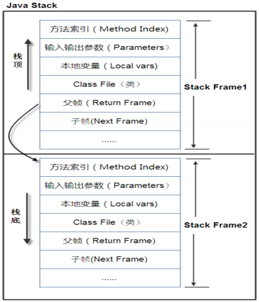

> 栈中的数据都是以栈帧（Stack Frame）的格式存在，栈帧是一个内存区块，是一个数据集，是一个有关方法(Method)和运行期数据的数据集，当一个方法A被调用时就产生了一个栈帧 F1，并被压入到栈中，
>
> A方法又调用了 B方法，于是产生栈帧 F2 也被压入栈，
>
> B方法又调用了 C方法，于是产生栈帧 F3 也被压入栈，
>
> ……
>
> 执行完毕后，先弹出F3栈帧，再弹出F2栈帧，再弹出F1栈帧……
>
> 遵循“先进后出”/“后进先出”原则。


**每个方法执行的同时都会创建一个栈帧，用于存储局部变量表、操作数栈、动态链接、方法出口等信息**，每一个方法从调用直至执行完毕的过程，就对应着一个栈帧在虚拟机中入栈到出栈的过程。**栈的大小和具体JVM的实现有关，通常在256K~756K之间,与等于1Mb左右。** 


**栈+堆+方法区的交互关系**：


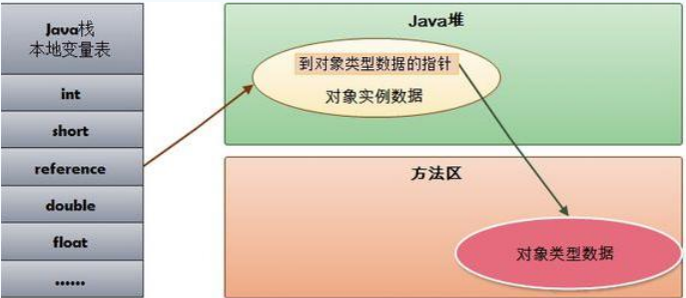


# Heap 堆

一个JVM实例只存在一个堆内存，堆内存的大小是可以调节的。类加载器读取了类文件后，需要把类、方法、常变量放到堆内存中，保存所有引用类型的真实信息，以方便执行器执行，堆内存分为三部分 ：

- Young Generation Space  	新生区		Young/New 

	 Tenure generation space  	养老区		Old/ Tenure 

	 Permanent Space              	永久区		Perm


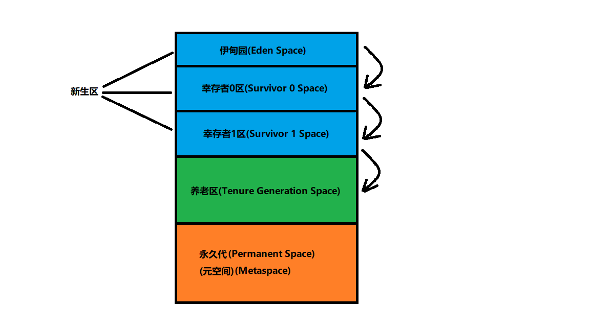

新生区是类的诞生、成长、消亡的区域，一个类在这里产生，应用，最后被垃圾回收器收集，结束生命。

新生区又分为两部分： 伊甸区（Eden space）和幸存者区（Survivor pace） ，所有的类都是在伊甸区被new出来的。

幸存区有两个： 0区（Survivor 0 space）和1区（Survivor 1 space）。

> 当伊甸园的空间用完时，程序又需要创建对象，JVM的垃圾回收器将对伊甸园区进行垃圾回收(**Minor GC**)，将伊甸园区中的不再被其他对象所引用的对象进行销毁。然后将伊甸园中的剩余对象移动到幸存 0区。若幸存 0区也满了，再对该区进行垃圾回收，然后移动到 1 区。那如果1 区也满了呢？再移动到养老区。若养老区也满了，那么这个时候将产生**MajorGC（FullGC）**，进行养老区的内存清理。若养老区执行了Full GC之后发现依然无法进行对象的保存，就会产生OOM异常“OutOfMemoryError”。

**如果出现java.lang.OutOfMemoryError: Java heap space异常，说明Java虚拟机的堆内存不够。原因有二：**

**（1）Java虚拟机的堆内存设置不够，可以通过参数-Xms、-Xmx来调整。**

**（2）代码中创建了大量大对象，并且长时间不能被垃圾收集器收集（存在被引用）。**

------

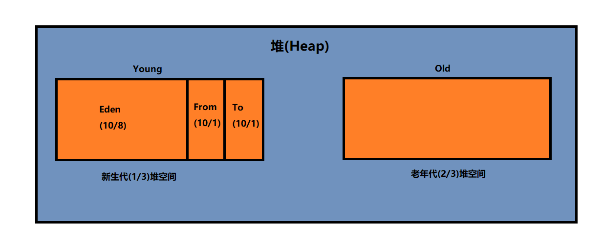

​							    **MinorGC的过程（复制->清空->互换）**  

**1：eden、SurvivorFrom 复制到 SurvivorTo，年龄+1** 

首先，当Eden区满的时候会触发第一次GC,把还活着的对象拷贝到SurvivorFrom区，当Eden区再次触发GC的时候会扫描Eden区和From区域,对这两个区域进行垃圾回收，经过这次回收后还存活的对象,则直接复制到To区域（如果有对象的年龄已经达到了老年的标准，则赋值到老年代区），同时把这些对象的年龄+1

**2：清空 eden、SurvivorFrom** 

然后，清空Eden和SurvivorFrom中的对象，也即**复制之后有交换，谁空谁是to**

**3：SurvivorTo和 SurvivorFrom 互换** 

最后，SurvivorTo和SurvivorFrom互换，原SurvivorTo成为下一次GC时的SurvivorFrom区。**部分对象会在From和To区域中复制来复制去,如此交换15次(由JVM参数MaxTenuringThreshold决定,这个参数默认是15)**,最终如果还是存活,`就存入到老年代`


实际而言，方法区（Method Area）和堆一样，是各个线程共享的内存区域，它用于存储虚拟机加载的：类信息+普通常量+静态常量+编译器编译后的代码等等，**虽然JVM规范将方法区描述为堆的一个逻辑部分，但它却还有一个别名叫做Non-Heap(非堆)，目的就是要和堆分开**。 


在Java8中，永久代已经被移除，被一个称为元空间的区域所取代。元空间的本质和永久代类似。

> 元空间与永久代之间最大的区别在于：
>
> 永久带使用的JVM的堆内存，但是java8以后的**元空间并不在虚拟机中而是使用本机物理内存**。
>
> 因此，默认情况下，元空间的大小仅受本地内存限制。类的元数据放入 native memory, 字符串池和类的静态变量放入 java 堆中，这样可以加载多少类的元数据就不再由MaxPermSize 控制, 而由系统的实际可用空间来控制。


## 堆内存调优


| **-Xms**               | **设置初始分配大小，默认为物理内存的1/64** |
| ---------------------- | ------------------------------------------ |
| **-Xmx**               | **最大分配内存，默认为物理内存的1/4**      |
| **-XX:PrintGCDetails** | **输出详细的GC处理日志**                   |


```java
public static void main(String[] args){
	long maxMemory = Runtime.getRuntime().maxMemory() ;//返回 Java 虚拟机试图使用的最大内存量。
	long totalMemory = Runtime.getRuntime().totalMemory() ;//返回 Java 虚拟机中的内存总量。
	System.out.println("MAX_MEMORY = " + maxMemory + "（字节）、" + (maxMemory / (double)1024 / 1024) + "MB");
	System.out.println("TOTAL_MEMORY = " + totalMemory + "（字节）、" + (totalMemory / (double)1024 / 1024) + "MB");
}
```

输出结果：

```java
-Xmx:MAX_MEMORY:	1883242496	字节,	1796.0	MB
-Xms:TOTAL_MEMORY:	128974848	字节,	123.0	MB
```

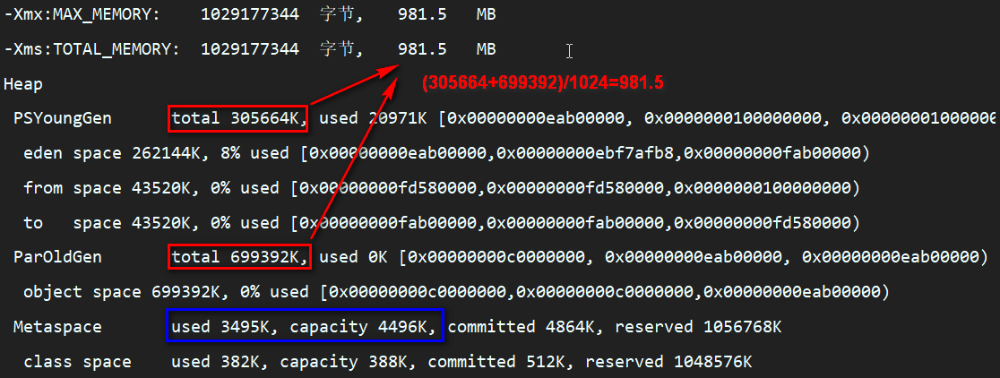


GC的打印结果：

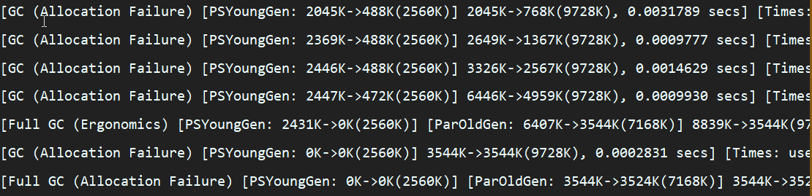


# GC垃圾回收

## GC算法总体概述

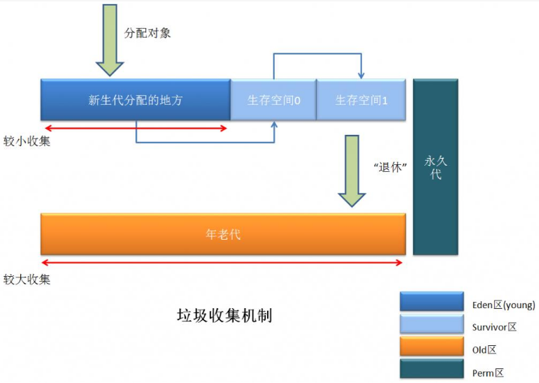

JVM在进行GC时，并非每次都对上面三个内存区域一起回收的，大部分时候回收的都是指新生代。

因此GC按照回收的区域又分了两种类型，一种是普通GC（minor GC），一种是全局GC（major GC or Full GC）

------

**Minor GC和Full GC的区别**

`普通GC（minor GC）`：只针对新生代区域的GC,指发生在新生代的垃圾收集动作，因为大多数Java对象存活率都不高，所以Minor GC非常频繁，一般回收速度也比较快。 

`全局GC（major GC or Full GC）`：指发生在老年代的垃圾收集动作，出现了Major GC，经常会伴随至少一次的Minor GC（但并不是绝对的）。Major GC的速度一般要比Minor GC慢上10倍以上 


## GC的4个算法

### 引用计数法（现在基本不用）


代码演示：

```java

/**@Description:-verbose:gc*/
public class RefCountGC{
	private byte[] bigSize = new byte[2 * 1024 * 1024];//这个成员属性唯一的作用就是占用一点内存
  	Object instance = null;
	public static void main(String[] args){
    	RefCountGC objectA = new RefCountGC();
    	RefCountGC objectB = new RefCountGC();
        objectA.instance = objectB;
        objectB.instance = objectA;
        objectA = null;
        objectB = null;
    	System.gc();
  	}
}

```


### 复制算法（Copying)

年轻代中使用的是Minor GC，这种GC算法采用的是复制算法(Copying)

原理：


Minor GC会把Eden中的所有活的对象都移到Survivor区域中，如果Survivor区中放不下，那么剩下的活的对象就被移到Old  generation中，**也即一旦收集后，Eden是就变成空的了**。

​	当对象在 Eden ( 包括一个 Survivor 区域，这里假设是 from 区域 ) 出生后，在经过一次 Minor GC 后，如果对象还存活，并且能够被另外一块 Survivor 区域所容纳( 上面已经假设为 from 区域，这里应为 to 区域，即 to 区域有足够的内存空间来存储 Eden 和 from 区域中存活的对象 )，则使用**复制算法**将这些仍然还存活的对象复制到另外一块 Survivor 区域 ( 即 to 区域 ) 中，然后清理所使用过的 Eden 以及 Survivor 区域 ( 即 from 区域 )，并且将这些对象的年龄设置为1，以后对象在 Survivor 区每熬过一次 Minor GC，就将对象的年龄 + 1，**当对象的年龄达到某个值时 ( 默认是 15 岁，通过-XX:MaxTenuringThreshold 来设定参数)**，这些对象就会成为老年代。

`-XX:MaxTenuringThreshold — 设置对象在新生代中存活的次数`


解释：

年轻代中的GC,主要是复制算法（Copying）

​	HotSpot JVM把年轻代分为了三部分：1个Eden区和2个Survivor区（分别叫from和to）。默认比例为8:1:1,一般情况下，新创建的对象都会被分配到Eden区(一些大对象特殊处理),这些对象经过第一次Minor GC后，如果仍然存活，将会被移到Survivor区。对象在Survivor区中每熬过一次Minor GC，年龄就会增加1岁，当它的年龄增加到一定程度时，就会被移动到年老代中。因为年轻代中的对象基本都是朝生夕死的(90%以上)，所以在**年轻代的垃圾回收算法使用的是复制算法**，复制算法的基本思想就是将内存分为两块，每次只用其中一块，当这一块内存用完，就将还活着的对象复制到另外一块上面。**复制算法不会产生内存碎片**。

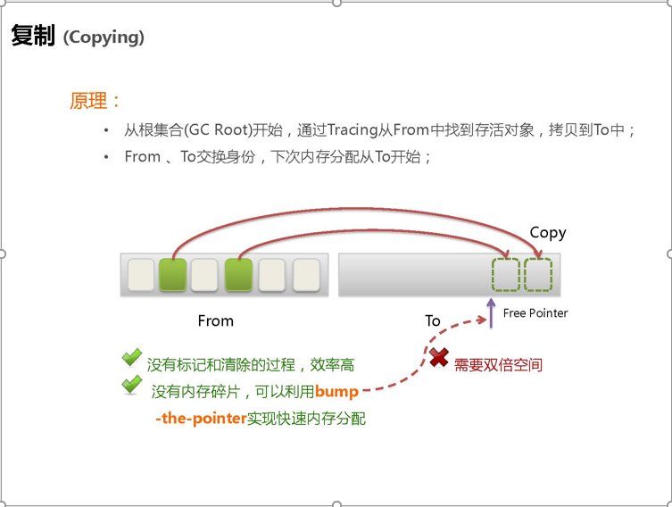 

在GC开始的时候，对象只会存在于Eden区和名为“From”的Survivor区，Survivor区“To”是空的。紧接着进行GC，Eden区中所有存活的对象都会被复制到“To”，而在“From”区中，仍存活的对象会根据他们的年龄值来决定去向。年龄达到一定值(年龄阈值，可以通过-XX:MaxTenuringThreshold来设置)的对象会被移动到年老代中，没有达到阈值的对象会被复制到“To”区域。经过这次GC后，Eden区和From区已经被清空。这个时候，“From”和“To”会交换他们的角色，也就是新的“To”就是上次GC前的“From”，新的“From”就是上次GC前的“To”。不管怎样，都会保证名为To的Survivor区域是空的。Minor GC会一直重复这样的过程，直到“To”区被填满，“To”区被填满之后，会将所有对象移动到年老代中。

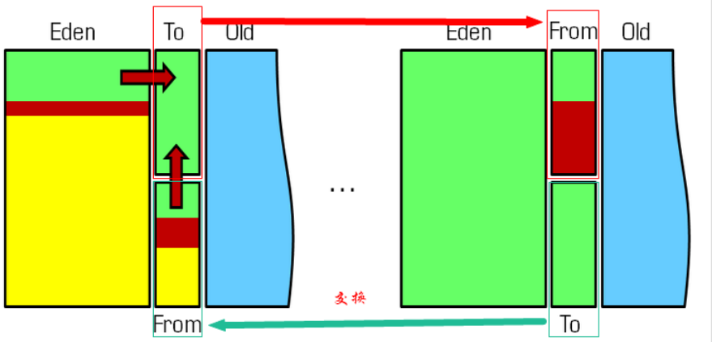 

因为Eden区对象一般存活率较低，一般的，使用两块10%的内存作为空闲和活动区间，而另外80%的内存，则是用来给新建对象分配内存的。一旦发生GC，将10%的from活动区间与另外80%中存活的eden对象转移到10%的to空闲区间，接下来，将之前90%的内存全部释放，以此类推。 


动图演示：


### 标记-清楚算法(Clean-Mark-Sweap)

老年代一般是由标记清除或者是标记清除与标记整理的混合实现

原理：

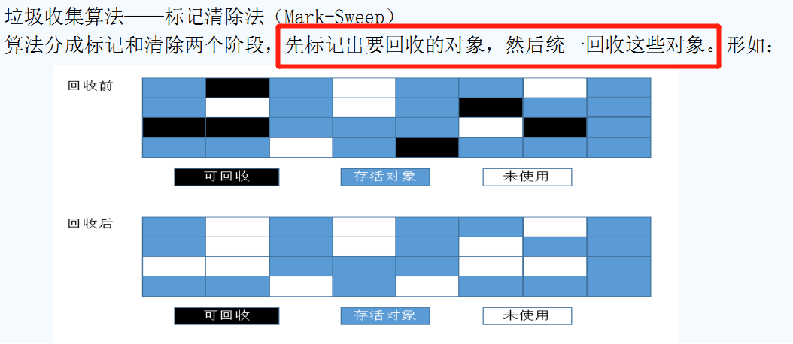 

 

用通俗的话解释一下标记清除算法，就是当程序运行期间，若可以使用的内存被耗尽的时候，GC线程就会被触发并将**程序暂停**，随后将要回收的对象标记一遍，最终统一回收这些对象，完成标记清理工作接下来便让应用程序恢复运行。

主要进行两项工作，第一项则是标记，第二项则是清除。 

- 标记：从引用根节点开始标记遍历所有的GC Roots， 先标记出要回收的对象。
- 清除：遍历整个堆，把标记的对象清除。 

**缺点：此算法需要暂停整个应用，会产生内存碎片** 


动态演示：


### 标记-压缩算法(Clean-Mark-Compact)

原理：

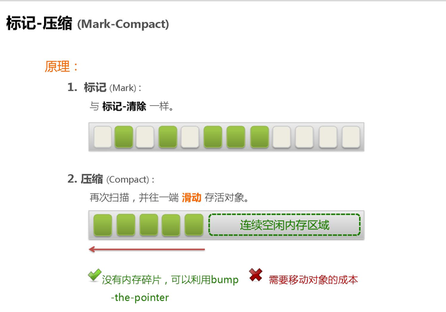 

------

 


在整理压缩阶段，不再对标记的对像做回收，而是通过所有存活对像都向一端移动，然后直接清除边界以外的内存。

可以看到，标记的存活对象将会被整理，按照内存地址依次排列，而未被标记的内存会被清理掉。如此一来，当我们需要给新对象分配内存时，JVM只需要持有一个内存的起始地址即可，这比维护一个空闲列表显然少了许多开销。 

标记/整理算法不仅可以弥补标记/清除算法当中，内存区域分散的缺点，也消除了复制算法当中，内存减半的高额代价

**缺点：标记/整理算法唯一的缺点就是效率也不高，不仅要标记所有存活对象，还要整理所有存活对象的引用地址。从效率上来说，标记/整理算法要低于复制算法。**


动态演示：


## 小总结

内存效率：复制算法>标记清除算法>标记整理算法（此处的效率只是简单的对比时间复杂度，实际情况不一定如此）。 

内存整齐度：复制算法=标记整理算法>标记清除算法。 

内存利用率：标记整理算法=标记清除算法>复制算法。 

可以看出，效率上来说，复制算法是当之无愧的老大，但是却浪费了太多内存，而为了尽量兼顾上面所提到的三个指标，标记/整理算法相对来说更平滑一些，但效率上依然不尽如人意，它比复制算法多了一个标记的阶段，又比标记/清除多了一个整理内存的过程

------

难道就没有一种最优算法吗？ 猜猜看，下面还有

 回答：无，没有最好的算法，只有最合适的算法。==========>分代收集算法。


**年轻代(Young Gen)**  

年轻代特点是区域相对老年代较小，对像存活率低。

这种情况复制算法的回收整理，速度是最快的。复制算法的效率只和当前存活对像大小有关，因而很适用于年轻代的回收。而复制算法内存利用率不高的问题，通过hotspot中的两个survivor的设计得到缓解。


**老年代(Tenure Gen)**

老年代的特点是区域较大，对像存活率高。

这种情况，存在大量存活率高的对像，复制算法明显变得不合适。一般是由标记清除或者是标记清除与标记整理的混合实现。

- **Mark阶段**的开销与存活对像的数量成正比，这点上说来，对于老年代，标记清除或者标记整理有一些不符，但可以通过多核/线程利用，对并发、并行的形式提标记效率。
- **Sweep阶段**的开销与所管理区域的大小形正相关，但Sweep“就地处决”的特点，回收的过程没有对像的移动。使其相对其它有对像移动步骤的回收算法，仍然是效率最好的。但是需要解决内存碎片问题。
- **Compact阶段**的开销与存活对像的数据成开比，如上一条所描述，对于大量对像的移动是很大开销的，做为老年代的第一选择并不合适。

基于上面的考虑，老年代一般是由标记清除或者是标记清除与标记整理的混合实现。以hotspot中的CMS回收器为例，CMS是基于Mark-Sweep实现的，对于对像的回收效率很高，而对于碎片问题，CMS采用基于Mark-Compact算法的Serial Old回收器做为补偿措施：当内存回收不佳（碎片导致的Concurrent Mode Failure时），将采用Serial Old执行Full GC以达到对老年代内存的整理。