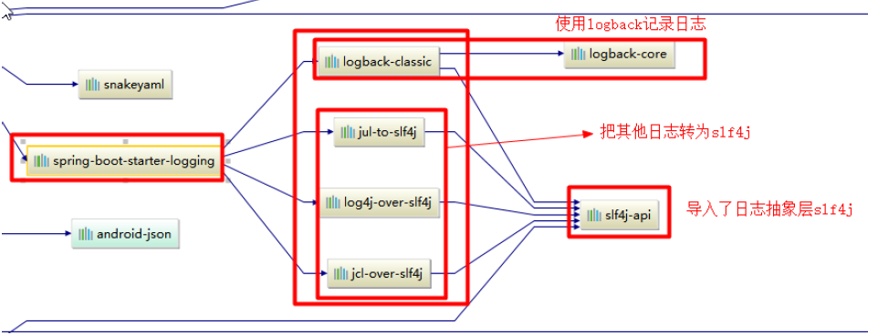
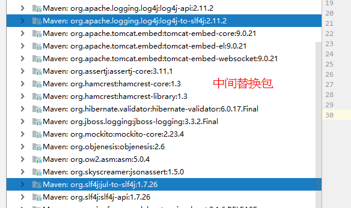
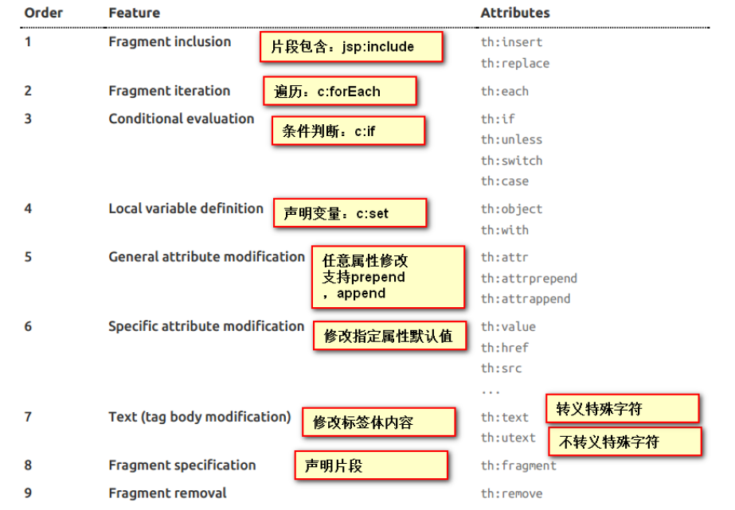
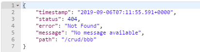
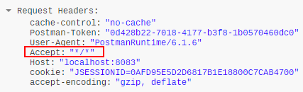
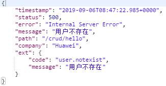
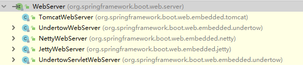
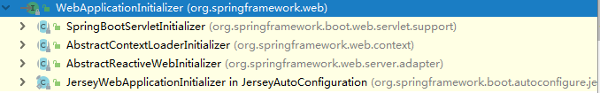
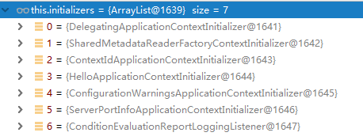
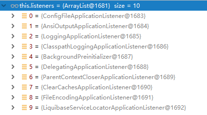

# 一、Spring Boot简单入门

## 1、POM文件

### 1）父项目

```xml
<parent>
    <groupId>org.springframework.boot</groupId>
    <artifactId>spring-boot-starter-parent</artifactId>
    <version>2.1.6.RELEASE</version>
    <relativePath/> <!-- lookup parent from repository -->
</parent>

<!-- 他的父项目 -->
<parent>
    <groupId>org.springframework.boot</groupId>
    <artifactId>spring-boot-dependencies</artifactId>
    <version>2.1.6.RELEASE</version>
    <relativePath>../../spring-boot-dependencies</relativePath>
</parent>
```

Spring Boot的版本仲裁中心；
以后我们导入依赖默认是不需要写版本；（没有在dependencies里面管理的依赖自然需要声明版本号）

### 2）启动器starter

```xml
<dependency>
	<groupId>org.springframework.boot</groupId>
	<artifactId>spring‐boot‐starter‐web</artifactId>
</dependency>	
```

**spring-boot-starter-**==web==：
	spring-boot-starter：spring-boot场景启动器；帮我们导入了web模块正常运行所依赖的组件；


Spring Boot将所有的功能场景都抽取出来，做成一个个的starters（启动器），只需要在项目里面引入这些starter相关场景的所有依赖都会导入进来。要用什么功能就导入什么场景的启动器


## 2、主程序类，主入口类

```java
/**
* @SpringBootApplication 来标注一个主程序类，说明这是一个Spring Boot应用
*/
@SpringBootApplication
public class HelloWorldMainApplication {
	public static void main(String[] args) {
		// Spring应用启动起来
		SpringApplication.run(HelloWorldMainApplication.class,args);
	}
}
```

**@SpringBootApplication**: Spring Boot应用标注在某个类上说明这个类是SpringBoot的主配置类，SpringBoot
就应该运行这个类的main方法来启动SpringBoot应用；


```java
@Target(ElementType.TYPE)
@Retention(RetentionPolicy.RUNTIME)
@Documented
@Inherited
@SpringBootConfiguration
@EnableAutoConfiguration
@ComponentScan(excludeFilters = { @Filter(type = FilterType.CUSTOM, classes = TypeExcludeFilter.class),
		@Filter(type = FilterType.CUSTOM, classes = AutoConfigurationExcludeFilter.class) })
public @interface SpringBootApplication {
```

**@SpringBootConfiguration**：Spring Boot的配置类；
标注在某个类上，表示这是一个Spring Boot的配置类；

**@Configuration**：配置类上来标注这个注解；
配置类 ----- 配置文件；配置类也是容器中的一个组件；@Component

**@EnableAutoConfiguration**：开启自动配置功能；
以前我们需要配置的东西，Spring Boot帮我们自动配置；@EnableAutoConfiguration告诉SpringBoot开启自
动配置功能；这样自动配置才能生效；

```java
@Target(ElementType.TYPE)
@Retention(RetentionPolicy.RUNTIME)
@Documented
@Inherited
@AutoConfigurationPackage
@Import(AutoConfigurationImportSelector.class)
public @interface EnableAutoConfiguration {
```

**@AutoConfigurationPackage**：自动配置包

> **@Import(AutoConfigurationPackages.Registrar.class)**：
> Spring的底层注解@Import，给容器中导入一个组件；导入的组件由
> AutoConfigurationPackages.Registrar.class；
> ==将主配置类（@SpringBootApplication标注的类）的所在包及下面所有子包里面的所有组件扫描到Spring容器；==


**@Import**(AutoConfigurationImportSelector.class)；
给容器中导入组件？
**AutoConfigurationImportSelector**：导入哪些组件的选择器；

> 将所有需要导入的组件以全类名的方式返回；这些组件就会被添加到容器中；
> 会给容器中导入非常多的自动配置类（xxxAutoConfiguration）；就是给容器中导入这个场景需要的所有组件，
> 并配置好这些组件；


有了自动配置类，免去了我们手动编写配置注入功能组件等的工作；

SpringFactoriesLoader.loadFactoryNames(EnableAutoConfiguration.class,getBeanClassLoader());


==Spring Boot在启动的时候从类路径下的**META-INF/spring.factories**中获取EnableAutoConfiguration指定的值，将这些值作为自动配置类导入到容器中，自动配置类就生效，帮我们进行自动配置工作；==以前我们需要自己配置的东西，自动配置类都帮我们；


## 3、使用Spring Initializer快速创建Spring Boot项目

### 1）IDEA：使用 Spring Initializer快速创建项目

IDE都支持使用Spring的项目创建向导快速创建一个Spring Boot项目；

选择我们需要的模块；向导会联网创建Spring Boot项目；

默认生成的Spring Boot项目；

- 主程序已经生成好了，我们只需要我们自己的逻辑

- resources文件夹中目录结构

  - static：保存所有的静态资源； js css images；

  - templates：保存所有的模板页面；（Spring Boot默认jar包使用嵌入式的Tomcat，默认不支持JSP页

    面）；可以使用模板引擎（freemarker、thymeleaf）；

  - application.properties：Spring Boot应用的配置文件；可以修改一些默认设置；


# 二、Spring Boot配置文件

## 1、配置文件

SpringBoot使用一个全局的配置文件，配置文件名是固定的；

- application.properties
- application.yml


配置文件的作用：修改SpringBoot自动配置的默认值；SpringBoot在底层都给我们自动配置好；


YAML：以数据为中心，比json、xml等更适合做配置文件；


例子：

YAML:

```yaml
server: 
  port: 8081
```

XML:

```xml
<server>
	<port>8081</port>
</server>
```


## 2、YAML语法

### 1）基本语法

k:(空格)v：表示一对键值对，空格必须要有；

> 根据**空格**的缩进来控制层级关系；只要左对齐的一列数据，都是同一层级的


```yaml
server: 
	port: 8081
	path: /hello
```

属性和值也是大小写敏感


### 2）值的写法

#### ① **字面量：普通的值（数字，字符串，布尔）**

k: v：字面直接来写

字符串默认不用加上单引号或者双引号

""：双引号；不会转义字符串里面的特殊字符；特殊字符会作为本身想表示的意思

name:"zhangsan \n lisi":输出；zhangsan 换行 lisi

''：单引号；会转义特殊字符，特殊字符最终只是一个普通的字符串数据

name: ‘zhangsan \n lisi’：输出；zhangsan \n lisi


#### ② 对象、Map（属性和值）（键值对）

k: v：在下一行来写对象的属性和值的关系；注意缩进

对象还是k: v的方式

```yaml
friends: 
	lastName: zhangsan
	age: 20
```

行内写法：

```yaml
friends: {lastName: zhangsan,age: 18}
```


#### ③ 数组（List、Set）

用==**-（空格）值**==表示数组中的一个元素

```yaml
pets: 
 - cat
 - dog
 - pig
```

行内写法：

```yaml
pets: [cat,dog,pig]
```


## 3、配置文件值注入

配置文件：

```yaml
person:
   lastName: hello
   age: 18
   boss: false
   birth: 2017/12/12
   maps: {k1: v1,k2: 12}
   lists:
      ‐ lisi
      ‐ zhaoliu
   dog:
      name: 小狗
      age: 12
```


Java Bean：

```java
/**
* 将配置文件中配置的每一个属性的值，映射到这个组件中
* @ConfigurationProperties：告诉SpringBoot将本类中的所有属性和配置文件中相关的配置进行绑定；
* prefix = "person"：配置文件中哪个下面的所有属性进行一一映射
*
* 只有这个组件是容器中的组件，才能容器提供的@ConfigurationProperties功能；
*
*/
@Component
@ConfigurationProperties(prefix = "person")
public class Person {
    private String lastName;
    private Integer age;
    private Boolean boss;
    private Date birth;
    private Map<String,Object> maps;
    private List<Object> lists;
    private Dog dog;
```

我们可以导入配置文件处理器，以后编写配置就有提示了

```xml
<!--导入配置文件处理器，配置文件进行绑定就会有提示 -->
<dependency>
    <groupId>org.springframework.boot</groupId>
    <artifactId>spring‐boot‐configuration‐processor</artifactId>
    <optional>true</optional>
</dependency>
```


### 1）@Value获取值和@ConfigurationProperties获取值比较

|                      | @ConfigurationProperties | @Value     |
| -------------------- | ------------------------ | ---------- |
| 功能                 | 批量注入配置文件中的属性 | 一个个指定 |
| 松散绑定（松散语法） | √                        | ×          |
| SpEL                 | ×                        | √          |
| JSR303数据校验       | √                        | ×          |
| 复杂类型封装         | √                        | ×          |


配置文件yml还是properties他们都能获取到值；


根据业务场景来决定用哪个

> 如果说，我们只是在某个业务逻辑中需要获取一下配置文件中的某项值，使用@Value；
> 如果说，我们专门编写了一个javaBean来和配置文件进行映射，我们就直接使@ConfigurationProperties；


### 2）配置文件注入值数据校验

```java
@Component
@ConfigurationProperties(prefix = "person")
@Validated
public class Person {
    /**
    * <bean class="Person">
    * 	<property name="lastName" value="字面量/${key}从环境变量、配置文件中获取值/#{SpEL}"></property>
    * <bean/>
    */
    //lastName必须是邮箱格式
    @Email
    //@Value("${person.last‐name}")
    private String lastName;
    //@Value("#{11*2}")
    private Integer age;
    //@Value("true")
    private Boolean boss;
    private Date birth;
    private Map<String,Object> maps;
    private List<Object> lists;
    private Dog dog;
```


### 3）@PropertySource&@ImportResource&@Bean

**@PropertySource**：加载指定的配置文件；

```java
/**
* 将配置文件中配置的每一个属性的值，映射到这个组件中
* @ConfigurationProperties：告诉SpringBoot将本类中的所有属性和配置文件中相关的配置进行绑定；
* prefix = "person"：配置文件中哪个下面的所有属性进行一一映射
*
* 只有这个组件是容器中的组件，才能容器提供的@ConfigurationProperties功能；
* @ConfigurationProperties(prefix = "person")默认从全局配置文件中获取值；
*
*/
@PropertySource(value = {"classpath:person.properties"})
@Component
@ConfigurationProperties(prefix = "person")
//@Validated
public class Person {
    /**
    * <bean class="Person">
    * <property name="lastName" value="字面量/${key}从环境变量、配置文件中获取值/#
    {SpEL}"></property>
    * <bean/>
    */
    //lastName必须是邮箱格式
    // @Email
    //@Value("${person.last‐name}")
    private String lastName;
    //@Value("#{11*2}")
    private Integer age;
    //@Value("true")
    private Boolean boss;
```


**@ImportResource**：导入Spring的配置文件，让配置文件里面的内容生效；

Spring Boot里面没有Spring的配置文件，我们自己编写的配置文件，也不能自动识别；

想让Spring的配置文件生效，加载进来；**@ImportResource**标注在一个配置类上

```java
@ImportResource(locations = {"classpath:beans.xml"})
导入Spring的配置文件让其生效
```


Spring的配置文件：

```xml
<?xml version="1.0" encoding="UTF‐8"?>
<beans xmlns="http://www.springframework.org/schema/beans"
    xmlns:xsi="http://www.w3.org/2001/XMLSchema‐instance"
    xsi:schemaLocation="http://www.springframework.org/schema/beans
    http://www.springframework.org/schema/beans/spring‐beans.xsd">
    
	<bean id="helloService" class="com.atguigu.springboot.service.HelloService"></bean>
</beans>
```


SpringBoot推荐给容器中添加组件的方式；推荐使用全注解的方式

1、配置类**@Configuration**--->Spring配置文件

2、使用**@Bean**给容器中添加组件

```java
/**
* @Configuration：指明当前类是一个配置类；就是来替代之前的Spring配置文件
*
* 在配置文件中用<bean><bean/>标签添加组件
*
*/
@Configuration
public class MyAppConfig {
    //将方法的返回值添加到容器中；容器中这个组件默认的id就是方法名
    @Bean
    public HelloService helloService02(){
        System.out.println("配置类@Bean给容器中添加组件了...");
        return new HelloService();
    }
}
```


## 4、配置文件占位符

### 1）随机数

```properties
${random.value}、${random.int}、${random.long}
${random.int(10)}、${random.int[1024,65536]}
```


### 2）占位符获取之前配置的值，如果没有可以使用:指定默认值

```properties
person.last‐name=张三${random.uuid}
person.age=${random.int}
person.birth=2017/12/15
person.boss=false
person.maps.k1=v1
person.maps.k2=14
person.lists=a,b,c
person.dog.name=${person.hello:hello}_dog
person.dog.age=15
```


## 5、Profile

### 1）多Profile文件

我们在主配置文件编写的时候，文件名可以是application-{profile}.properties/yml

默认使用application.properties的配置


### 2）yml支持多文档块方式

```yaml
server:
  port: 8081
spring:
  profiles:
    active: prod
‐‐‐
server:
  port: 8083
spring:
  profiles: dev
‐‐‐
server:
  port: 8084
spring:
  profiles: prod #指定属于哪个环境
```


### 3）激活指定profile

1.在配置文件中指定spring.profiles.active=dev

2.命令行：

java -jar spring-boot-02-config-0.0.1-SNAPSHOT.jar --spring.profiles.active=dev；

可以直接在测试的时候，配置传入命令行参数

3.虚拟机参数

-Dspring.profiles.active=dev


## 6、配置文件加载位置

springboot 启动会扫描以下位置的application.properties或者application.yml文件作为Spring boot的默认配置文件

> –file:./config/
> –file:./
> –classpath:/config/
> –classpath:/

优先级由高到底，高优先级的配置会覆盖低优先级的配置；

SpringBoot会从这四个位置全部加载主配置文件；**互补配置**；
我们还可以通过==**spring.config.location**==来改变默认的配置文件位置

**项目打包好以后，我们可以使用命令行参数的形式，启动项目的时候来指定配置文件的新位置；指定配置文件和默**
**认加载的这些配置文件共同起作用形成互补配置；**

java -jar spring-boot-02-config-02-0.0.1-SNAPSHOT.jar --spring.config.location=G:/application.properties


## 7、外部配置加载顺序

==**SpringBoot也可以从以下位置加载配置； 优先级从高到低；高优先级的配置覆盖低优先级的配置，所有的配置会**==
==**形成互补配置**==
**1.命令行参数**
所有的配置都可以在命令行上进行指定
java -jar spring-boot-02-config-02-0.0.1-SNAPSHOT.jar --server.port=8087 --server.context-path=/abc
多个配置用空格分开； --配置项=值

2.来自java:comp/env的JNDI属性
3.Java系统属性（System.getProperties()）
4.操作系统环境变量
5.RandomValuePropertySource配置的random.*属性值

==**由jar包外向jar包内进行寻找；**==
==**优先加载带profile**==
**6.jar包外部的application-{profile}.properties或application.yml(带spring.profile)配置文件**
**7.jar包内部的application-{profile}.properties或application.yml(带spring.profile)配置文件**

**==再来加载不带profile==**
**8.jar包外部的application.properties或application.yml(不带spring.profile)配置文件**
**9.jar包内部的application.properties或application.yml(不带spring.profile)配置文件**

10.@Configuration注解类上的@PropertySource
11.通过SpringApplication.setDefaultProperties指定的默认属性
所有支持的配置加载来源；
[参考官方文档](https://docs.spring.io/spring-boot/docs/2.1.7.RELEASE/reference/htmlsingle/#boot-features-external-config)


## 8、自动配置原理

[配置文件能配置的属性参照](https://docs.spring.io/spring-boot/docs/2.1.7.RELEASE/reference/htmlsingle/#common-application-properties)


### 1）自动配置原理解析：

① SpringBoot启动的时候加载主配置类，开启了自动配置功能**==@EnableAutoConfiguraion==**

② **@EnableAutoConfiguration作用**：

- 利用AutoConfigurationImportSelector给容器中导入一些组件

- 可以查看selectImports()方法的内容；

- List<String> configurations = getCandidateConfigurations(annotationMetadata, attributes)

  ```properties
  SpringFactoriesLoader.loadFactoryNames()
  扫描所有jar包类路径下 META‐INF/spring.factories
  把扫描到的这些文件的内容包装成properties对象
  从properties中获取到EnableAutoConfiguration.class类（类名）对应的值，然后把他们添加在容器
  中
  ```

  

**==将 类路径下 META-INF/spring.factories 里面配置的所有EnableAutoConfiguration的值加入到了容器中；==**

```properties
# Auto Configure
org.springframework.boot.autoconfigure.EnableAutoConfiguration=\
org.springframework.boot.autoconfigure.admin.SpringApplicationAdminJmxAutoConfiguration,\
org.springframework.boot.autoconfigure.aop.AopAutoConfiguration,\
org.springframework.boot.autoconfigure.amqp.RabbitAutoConfiguration,\
org.springframework.boot.autoconfigure.batch.BatchAutoConfiguration,\
org.springframework.boot.autoconfigure.cache.CacheAutoConfiguration,\
org.springframework.boot.autoconfigure.cassandra.CassandraAutoConfiguration,\
org.springframework.boot.autoconfigure.cloud.CloudServiceConnectorsAutoConfiguration,\
org.springframework.boot.autoconfigure.context.ConfigurationPropertiesAutoConfiguration,\
org.springframework.boot.autoconfigure.context.MessageSourceAutoConfiguration,\
org.springframework.boot.autoconfigure.context.PropertyPlaceholderAutoConfiguration,\
org.springframework.boot.autoconfigure.couchbase.CouchbaseAutoConfiguration,\
org.springframework.boot.autoconfigure.dao.PersistenceExceptionTranslationAutoConfiguration,\
org.springframework.boot.autoconfigure.data.cassandra.CassandraDataAutoConfiguration,\
org.springframework.boot.autoconfigure.data.cassandra.CassandraReactiveDataAutoConfiguration,\
org.springframework.boot.autoconfigure.data.cassandra.CassandraReactiveRepositoriesAutoConfiguration,\
org.springframework.boot.autoconfigure.data.cassandra.CassandraRepositoriesAutoConfiguration,\
org.springframework.boot.autoconfigure.data.couchbase.CouchbaseDataAutoConfiguration,\
org.springframework.boot.autoconfigure.data.couchbase.CouchbaseReactiveDataAutoConfiguration,\
org.springframework.boot.autoconfigure.data.couchbase.CouchbaseReactiveRepositoriesAutoConfiguration,\
org.springframework.boot.autoconfigure.data.couchbase.CouchbaseRepositoriesAutoConfiguration,\
org.springframework.boot.autoconfigure.data.elasticsearch.ElasticsearchAutoConfiguration,\
org.springframework.boot.autoconfigure.data.elasticsearch.ElasticsearchDataAutoConfiguration,\
org.springframework.boot.autoconfigure.data.elasticsearch.ElasticsearchRepositoriesAutoConfiguration,\
org.springframework.boot.autoconfigure.data.jdbc.JdbcRepositoriesAutoConfiguration,\
org.springframework.boot.autoconfigure.data.jpa.JpaRepositoriesAutoConfiguration,\
org.springframework.boot.autoconfigure.data.ldap.LdapRepositoriesAutoConfiguration,\
org.springframework.boot.autoconfigure.data.mongo.MongoDataAutoConfiguration,\
org.springframework.boot.autoconfigure.data.mongo.MongoReactiveDataAutoConfiguration,\
org.springframework.boot.autoconfigure.data.mongo.MongoReactiveRepositoriesAutoConfiguration,\
org.springframework.boot.autoconfigure.data.mongo.MongoRepositoriesAutoConfiguration,\
org.springframework.boot.autoconfigure.data.neo4j.Neo4jDataAutoConfiguration,\
org.springframework.boot.autoconfigure.data.neo4j.Neo4jRepositoriesAutoConfiguration,\
org.springframework.boot.autoconfigure.data.solr.SolrRepositoriesAutoConfiguration,\
org.springframework.boot.autoconfigure.data.redis.RedisAutoConfiguration,\
org.springframework.boot.autoconfigure.data.redis.RedisReactiveAutoConfiguration,\
org.springframework.boot.autoconfigure.data.redis.RedisRepositoriesAutoConfiguration,\
org.springframework.boot.autoconfigure.data.rest.RepositoryRestMvcAutoConfiguration,\
org.springframework.boot.autoconfigure.data.web.SpringDataWebAutoConfiguration,\
org.springframework.boot.autoconfigure.elasticsearch.jest.JestAutoConfiguration,\
org.springframework.boot.autoconfigure.elasticsearch.rest.RestClientAutoConfiguration,\
org.springframework.boot.autoconfigure.flyway.FlywayAutoConfiguration,\
org.springframework.boot.autoconfigure.freemarker.FreeMarkerAutoConfiguration,\
org.springframework.boot.autoconfigure.gson.GsonAutoConfiguration,\
org.springframework.boot.autoconfigure.h2.H2ConsoleAutoConfiguration,\
org.springframework.boot.autoconfigure.hateoas.HypermediaAutoConfiguration,\
org.springframework.boot.autoconfigure.hazelcast.HazelcastAutoConfiguration,\
org.springframework.boot.autoconfigure.hazelcast.HazelcastJpaDependencyAutoConfiguration,\
org.springframework.boot.autoconfigure.http.HttpMessageConvertersAutoConfiguration,\
org.springframework.boot.autoconfigure.http.codec.CodecsAutoConfiguration,\
org.springframework.boot.autoconfigure.influx.InfluxDbAutoConfiguration,\
org.springframework.boot.autoconfigure.info.ProjectInfoAutoConfiguration,\
org.springframework.boot.autoconfigure.integration.IntegrationAutoConfiguration,\
org.springframework.boot.autoconfigure.jackson.JacksonAutoConfiguration,\
org.springframework.boot.autoconfigure.jdbc.DataSourceAutoConfiguration,\
org.springframework.boot.autoconfigure.jdbc.JdbcTemplateAutoConfiguration,\
org.springframework.boot.autoconfigure.jdbc.JndiDataSourceAutoConfiguration,\
org.springframework.boot.autoconfigure.jdbc.XADataSourceAutoConfiguration,\
org.springframework.boot.autoconfigure.jdbc.DataSourceTransactionManagerAutoConfiguration,\
org.springframework.boot.autoconfigure.jms.JmsAutoConfiguration,\
org.springframework.boot.autoconfigure.jmx.JmxAutoConfiguration,\
org.springframework.boot.autoconfigure.jms.JndiConnectionFactoryAutoConfiguration,\
org.springframework.boot.autoconfigure.jms.activemq.ActiveMQAutoConfiguration,\
org.springframework.boot.autoconfigure.jms.artemis.ArtemisAutoConfiguration,\
org.springframework.boot.autoconfigure.groovy.template.GroovyTemplateAutoConfiguration,\
org.springframework.boot.autoconfigure.jersey.JerseyAutoConfiguration,\
org.springframework.boot.autoconfigure.jooq.JooqAutoConfiguration,\
org.springframework.boot.autoconfigure.jsonb.JsonbAutoConfiguration,\
org.springframework.boot.autoconfigure.kafka.KafkaAutoConfiguration,\
org.springframework.boot.autoconfigure.ldap.embedded.EmbeddedLdapAutoConfiguration,\
org.springframework.boot.autoconfigure.ldap.LdapAutoConfiguration,\
org.springframework.boot.autoconfigure.liquibase.LiquibaseAutoConfiguration,\
org.springframework.boot.autoconfigure.mail.MailSenderAutoConfiguration,\
org.springframework.boot.autoconfigure.mail.MailSenderValidatorAutoConfiguration,\
org.springframework.boot.autoconfigure.mongo.embedded.EmbeddedMongoAutoConfiguration,\
org.springframework.boot.autoconfigure.mongo.MongoAutoConfiguration,\
org.springframework.boot.autoconfigure.mongo.MongoReactiveAutoConfiguration,\
org.springframework.boot.autoconfigure.mustache.MustacheAutoConfiguration,\
org.springframework.boot.autoconfigure.orm.jpa.HibernateJpaAutoConfiguration,\
org.springframework.boot.autoconfigure.quartz.QuartzAutoConfiguration,\
org.springframework.boot.autoconfigure.reactor.core.ReactorCoreAutoConfiguration,\
org.springframework.boot.autoconfigure.security.servlet.SecurityAutoConfiguration,\
org.springframework.boot.autoconfigure.security.servlet.SecurityRequestMatcherProviderAutoConfiguration,\
org.springframework.boot.autoconfigure.security.servlet.UserDetailsServiceAutoConfiguration,\
org.springframework.boot.autoconfigure.security.servlet.SecurityFilterAutoConfiguration,\
org.springframework.boot.autoconfigure.security.reactive.ReactiveSecurityAutoConfiguration,\
org.springframework.boot.autoconfigure.security.reactive.ReactiveUserDetailsServiceAutoConfiguration,\
org.springframework.boot.autoconfigure.sendgrid.SendGridAutoConfiguration,\
org.springframework.boot.autoconfigure.session.SessionAutoConfiguration,\
org.springframework.boot.autoconfigure.security.oauth2.client.servlet.OAuth2ClientAutoConfiguration,\
org.springframework.boot.autoconfigure.security.oauth2.client.reactive.ReactiveOAuth2ClientAutoConfiguration,\
org.springframework.boot.autoconfigure.security.oauth2.resource.servlet.OAuth2ResourceServerAutoConfiguration,\
org.springframework.boot.autoconfigure.security.oauth2.resource.reactive.ReactiveOAuth2ResourceServerAutoConfiguration,\
org.springframework.boot.autoconfigure.solr.SolrAutoConfiguration,\
org.springframework.boot.autoconfigure.task.TaskExecutionAutoConfiguration,\
org.springframework.boot.autoconfigure.task.TaskSchedulingAutoConfiguration,\
org.springframework.boot.autoconfigure.thymeleaf.ThymeleafAutoConfiguration,\
org.springframework.boot.autoconfigure.transaction.TransactionAutoConfiguration,\
org.springframework.boot.autoconfigure.transaction.jta.JtaAutoConfiguration,\
org.springframework.boot.autoconfigure.validation.ValidationAutoConfiguration,\
org.springframework.boot.autoconfigure.web.client.RestTemplateAutoConfiguration,\
org.springframework.boot.autoconfigure.web.embedded.EmbeddedWebServerFactoryCustomizerAutoConfiguration,\
org.springframework.boot.autoconfigure.web.reactive.HttpHandlerAutoConfiguration,\
org.springframework.boot.autoconfigure.web.reactive.ReactiveWebServerFactoryAutoConfiguration,\
org.springframework.boot.autoconfigure.web.reactive.WebFluxAutoConfiguration,\
org.springframework.boot.autoconfigure.web.reactive.error.ErrorWebFluxAutoConfiguration,\
org.springframework.boot.autoconfigure.web.reactive.function.client.ClientHttpConnectorAutoConfiguration,\
org.springframework.boot.autoconfigure.web.reactive.function.client.WebClientAutoConfiguration,\
org.springframework.boot.autoconfigure.web.servlet.DispatcherServletAutoConfiguration,\
org.springframework.boot.autoconfigure.web.servlet.ServletWebServerFactoryAutoConfiguration,\
org.springframework.boot.autoconfigure.web.servlet.error.ErrorMvcAutoConfiguration,\
org.springframework.boot.autoconfigure.web.servlet.HttpEncodingAutoConfiguration,\
org.springframework.boot.autoconfigure.web.servlet.MultipartAutoConfiguration,\
org.springframework.boot.autoconfigure.web.servlet.WebMvcAutoConfiguration,\
org.springframework.boot.autoconfigure.websocket.reactive.WebSocketReactiveAutoConfiguration,\
org.springframework.boot.autoconfigure.websocket.servlet.WebSocketServletAutoConfiguration,\
org.springframework.boot.autoconfigure.websocket.servlet.WebSocketMessagingAutoConfiguration,\
org.springframework.boot.autoconfigure.webservices.WebServicesAutoConfiguration,\
org.springframework.boot.autoconfigure.webservices.client.WebServiceTemplateAutoConfiguration
```

每一个这样的xxxAutoConfiguration类都是容器中的一个组件，都加入到容器中；用它们来做自动配置；

③ 每一个自动配置类进行自动配置功能；

④ 以**HttpEncodingAutoConfiguration**（Http编码自动配置）为例解释自动配置原理；

```java
@Configuration	//表示这是一个配置类，以前编写的配置文件也一样，也可以给容器中添加组件
@EnableConfigurationProperties(HttpProperties.class)	//启动指定类的ConfigurationProperties功能；将配置文件中对应的值和HttpProperties绑定起来；并把HttpProperties加入到ioc容器中
@ConditionalOnWebApplication(type = ConditionalOnWebApplication.Type.SERVLET)	//Spring底层@Condition注解，根据不同的条件，如果满足指定的条件，整个配置类里面的配置才会生效；  判定当前应用是否是web应用，如果是，当前配置类生效
@ConditionalOnClass(CharacterEncodingFilter.class)	//判定当前项目中是否有CharacterEncodingFilter（SpringMVC中进行乱码解决的过滤器）这个类；
@ConditionalOnProperty(prefix = "spring.http.encoding", value = "enabled", matchIfMissing = true)	//判断配置文件中是否存在某个配置 spring.http.encoding.enabled；如果不存在，判断也是成立的
//即使我们配置文件中不配置pring.http.encoding.enabled=true，也是默认生效的；
public class HttpEncodingAutoConfiguration {
	//它已经和springboot配置文件映射了
	private final HttpProperties.Encoding properties;
	//只有一个有参构造的情况下，参数的值就会从容器中拿
	public HttpEncodingAutoConfiguration(HttpProperties properties) {
		this.properties = properties.getEncoding();
	}

	@Bean	//给容器中添加一个组件，这个组件的某些值需要从properties中获取
	@ConditionalOnMissingBean
	public CharacterEncodingFilter characterEncodingFilter() {
		CharacterEncodingFilter filter = new OrderedCharacterEncodingFilter();
		filter.setEncoding(this.properties.getCharset().name());
		filter.setForceRequestEncoding(this.properties.shouldForce(Type.REQUEST));
		filter.setForceResponseEncoding(this.properties.shouldForce(Type.RESPONSE));
		return filter;
	}

	@Bean
	public LocaleCharsetMappingsCustomizer localeCharsetMappingsCustomizer() {
		return new LocaleCharsetMappingsCustomizer(this.properties);
	}

	private static class LocaleCharsetMappingsCustomizer
			implements WebServerFactoryCustomizer<ConfigurableServletWebServerFactory>, Ordered {

		private final HttpProperties.Encoding properties;

		LocaleCharsetMappingsCustomizer(HttpProperties.Encoding properties) {
			this.properties = properties;
		}

		@Override
		public void customize(ConfigurableServletWebServerFactory factory) {
			if (this.properties.getMapping() != null) {
				factory.setLocaleCharsetMappings(this.properties.getMapping());
			}
		}

		@Override
		public int getOrder() {
			return 0;
		}

	}

}
```

根据当前不同的条件判断，决定这个配置类是否生效

一旦这个配置类生效；这个配置类就会给容器中添加各种组件，这些组件的属性是从对应的properties类中获取的，这些类里面的每一个属性又是和配置文件绑定的；


⑤ 所有在配置文件中能配置的属性都是在xxxProperties类中封装着；配置文件能配置什么就可以参照某个功能对应的这个属性类

```java
@ConfigurationProperties(prefix = "spring.http")	//从配置文件中获取指定的值和bean的属性进行绑定
public class HttpProperties {

	private boolean logRequestDetails;

```


**精髓：**

**1）、SpringBoot启动会加载大量的自动配置类**

**2）、我们看我们需要的功能有没有SpringBoot默认写好的自动配置类；**

**3）、我们再来看这个自动配置类中到底配置了哪些组件；（只要我们要用的组件有，我们就不需要再来配置了）**

**4）、给容器中自动配置类添加组件的时候，会从properties类中获取某些属性。我们就可以在配置文件中指定这**
**些属性的值；**


xxxxAutoConfigurartion：自动配置类；
给容器中添加组件

xxxxProperties:封装配置文件中相关属性；


### 2）细节

① @Conditional派生注解（Spring原生注解）

| @Conditional扩展注解            | 作用（判断是否满足当前指定条件）                 |
| ------------------------------- | ------------------------------------------------ |
| @ConditionalOnJava              | 系统的java版本是否符合要求                       |
| @ConditionalOnBean              | 容器中存在指定Bean                               |
| @ConditionalOnMissingBean       | 容器中不存在指定Bean                             |
| @ConditionalOnExpression        | 满足SpEL表达式指定                               |
| @ConditionalOnClass             | 系统中有指定的类                                 |
| @ConditionalOnMissingClass      | 系统中没有指定的类                               |
| @ConditionalOnSingleCandidate   | 容器中只有一个指定的Bean，或者这个Bean是首选Bean |
| @ConditionalOnProperty          | 系统中指定的属性是否有指定的值                   |
| @ConditionalOnResource          | 类路径下是否存在指定资源文件                     |
| @ConditionalOnWebApplication    | 当前是web环境                                    |
| @ConditionalOnNotWebApplication | 当前不是web环境                                  |
| @ConditionalOnJndi              | JNDI存在指定项                                   |


**自动配置类必须在一定的条件下才能生效**

**==我们可以通过启用 debug=true属性；来让控制台打印自动配置报告==**，这样我们就可以很方便的知道哪些自动配置类生效；

```java
============================
CONDITIONS EVALUATION REPORT
============================


Positive matches:(自动配置类启动的)
-----------------

   CodecsAutoConfiguration matched:
      - @ConditionalOnClass found required class 'org.springframework.http.codec.CodecConfigurer' (OnClassCondition)

   CodecsAutoConfiguration.JacksonCodecConfiguration matched:
      - @ConditionalOnClass found required class 'com.fasterxml.jackson.databind.ObjectMapper' (OnClassCondition)
      
      
Negative matches:(没有启动，没有匹配成功的自动配置类)
-----------------

   ActiveMQAutoConfiguration:
      Did not match:
         - @ConditionalOnClass did not find required class 'javax.jms.ConnectionFactory' (OnClassCondition)

   AopAutoConfiguration:
      Did not match:
         - @ConditionalOnClass did not find required class 'org.aspectj.lang.annotation.Aspect' (OnClassCondition)
             

Exclusions:
-----------

    None


Unconditional classes:
----------------------

    org.springframework.boot.autoconfigure.context.ConfigurationPropertiesAutoConfiguration

    org.springframework.boot.autoconfigure.context.PropertyPlaceholderAutoConfiguration

    org.springframework.boot.autoconfigure.info.ProjectInfoAutoConfiguration
```


# 三、日志

## 1、日志框架

**市面上的日志框架**：
JUL、JCL、Jboss-logging、logback、log4j、log4j2、slf4j....


| 日志门面（日志抽象层）                                       | 日志实现                                             |
| ------------------------------------------------------------ | ---------------------------------------------------- |
| ~~JCL（Jakarta Commons Logging）~~         SLF4j（Simple Logging Facade for Java）       ~~**jboss-logging**~~ | Log4j  JUL（java.util.logging）  Log4j2  **Logback** |


左边选一个门面（抽象层）、右边来选一个实现；

日志门面： SLF4J；
日志实现：Logback；

SpringBoot：底层是Spring框架，Spring框架默认是用JCL；

**==SpringBoot选用 SLF4j和logback==**；


## 2、SLF4J使用

### 1）**如何在系统中使用SLF4j** 

https://www.slf4j.org
以后开发的时候，日志记录方法的调用，不应该来直接调用日志的实现类，而是调用日志抽象层里面的方法；
给系统里面导入slf4j的jar和 logback的实现jar

```java
import org.slf4j.Logger;
import org.slf4j.LoggerFactory;
public class HelloWorld {
	public static void main(String[] args) {
        Logger logger = LoggerFactory.getLogger(HelloWorld.class);
        logger.info("Hello World");
	}
}
```


图示；


每一个日志的实现框架都有自己的配置文件。使用slf4j以后，**配置文件还是做成日志实现框架自己本身的配置文件**；


### 2）遗留问题

a（slf4j+logback）: Spring（commons-logging）、Hibernate（jboss-logging）、MyBatis、xxxx
统一日志记录，即使是别的框架和我一起统一使用slf4j进行输出？


**如何让系统中所有的日志都统一到slf4j**：

1. ==将系统中其他日志框架先排除出去；==

2. ==用中间包来替换原有的日志框架；==

3. ==我们导入slf4j其他的实现；==

   


## 3、SpringBoot日志关系

```xml
<dependency>
    <groupId>org.springframework.boot</groupId>
    <artifactId>spring‐boot‐starter</artifactId>
</dependency>
```


SpringBoot使用它来做日志功能：

```xml
<dependency>
    <groupId>org.springframework.boot</groupId>
    <artifactId>spring‐boot‐starter‐logging</artifactId>
</dependency>
```

底层依赖关系：



总结：

1）SpringBoot底层也是使用slf4j+logback的方式进行日志记录

2）SpringBoot也把其他的日志都替换成了slf4j

3）中间替换包




4）如果我们要引入其他框架？一定要把这个框架的默认日志依赖移除掉？

Spring框架用的是commons-logging；

```xml
<dependency>
    <groupId>org.springframework</groupId>
    <artifactId>spring‐core</artifactId>
	<exclusions>
		<exclusion>
            <groupId>commons‐logging</groupId>
            <artifactId>commons‐logging</artifactId>
    	</exclusion>
	</exclusions>
</dependency>
```

==**SpringBoot能自动适配所有的日志，而且底层使用slf4j+logback的方式记录日志，引入其他框架的时候，只需要**====**把这个框架依赖的日志框架排除掉即可；**==


## 4、日志使用

### 1）默认配置

SpringBoot默认帮我们配置好了日志；

```java
//记录器
Logger logger = LoggerFactory.getLogger(getClass());

    @Test
    public void contextLoads() {
        //日志的级别
        //由低到高   trace<debug<info<warn<error
        //可以调整日志的输出级别；日志就只会在这个级别以后的高级别生效
        logger.trace("这是trace日志..");
        logger.debug("这是debug日志..");
        //springboot默认使用的是info级别的日志，没有指定级别的就用springboot默认规定的级别；root级别
        logger.info("这是info日志..");
        logger.warn("这是warn日志..");
        logger.error("这是error日志..");
    }
```


```
<!--
    日志输出格式：
    %d表示日期时间，
    %thread表示线程名，
    %‐5level：级别从左显示5个字符宽度
    %logger{50} 表示logger名字最长50个字符，否则按照句点分割。
    %msg：日志消息，
    %n是换行符
‐‐>
%d{yyyy‐MM‐dd HH:mm:ss.SSS} [%thread] %‐5level %logger{50} ‐ %msg%n
```

SpringBoot修改日志的默认配置：

```properties
logging.level.com.huawei=trace
#logging.path=
# 不指定路径在当前项目下生成springboot.log日志
# 可以指定完整的路径；
#logging.file=G:/springboot.log
# 在当前磁盘的根路径下创建spring文件夹和里面的log文件夹；使用 spring.log 作为默认文件
logging.path=/spring/log
# 在控制台输出的日志的格式
logging.pattern.console=%d{yyyy‐MM‐dd} [%thread] %‐5level %logger{50} ‐ %msg%n
# 指定文件中日志输出的格式
logging.pattern.file=%d{yyyy‐MM‐dd} === [%thread] === %‐5level === %logger{50} ==== %msg%n
```


| logging.file | logging.path | Example  | Description                      |
| ------------ | ------------ | -------- | -------------------------------- |
| (none)       | (none)       |          | 只能在控制台输出                 |
| 指定文件名   | (none)       | my.log   | 输出日志到my.log文件             |
| (none)       | 指定目录     | /var/log | 输出到指定目录的spring.log文件中 |


### 2）指定配置

给类路径下放上每个日志框架自己的配置文件即可；SpringBoot就不使用他默认配置的了

| Logging System         | Customization                                                |
| ---------------------- | ------------------------------------------------------------ |
| Logback                | `logback-spring.xml`,`logback-spring.groovy`,`logback.xml` or `logback.groovy` |
| Log4j2                 | `log4j2-spring.xml` or `log4j2.xml`                          |
| JDK(Java Util Logging) | `logging.properties`                                         |


logback.xml：直接就被日志框架识别了；

logback-spring.xml：日志框架不直接加载日志的配置项，由SpringBoot解析日志配置，可以使用SpringBoot的高级profile功能

```xml
<springProfile name="staging">
    <!‐‐ configuration to be enabled when the "staging" profile is active ‐‐>
    可以指定某段配置只在某个环境下生效
</springProfile>
```

例如：

```xml
<appender name="stdout" class="ch.qos.logback.core.ConsoleAppender">
    <!--
        日志输出格式：
        %d表示日期时间，
        %thread表示线程名，
        %‐5level：级别从左显示5个字符宽度
        %logger{50} 表示logger名字最长50个字符，否则按照句点分割。
        %msg：日志消息，
        %n是换行符
    -->
    <layout class="ch.qos.logback.classic.PatternLayout">
        <springProfile name="dev">
            <pattern>%d{yyyy‐MM‐dd HH:mm:ss.SSS} ‐‐‐‐> [%thread] ‐‐‐> %‐5level
            %logger{50} ‐ %msg%n</pattern>
        </springProfile>
        <springProfile name="!dev">
            <pattern>%d{yyyy‐MM‐dd HH:mm:ss.SSS} ==== [%thread] ==== %‐5level
            %logger{50} ‐ %msg%n</pattern>
        </springProfile>
    </layout>
</appender>
```


如果使用logback.xml作为日志配置文件，还要使用profile功能，会有以下错误

`no applicable action for [springProfile]`


## 5、切换日志框架

可以按照slf4j的日志适配图，进行相关的切换；

slf4j+log4j的方式;

```xml
<dependency>
    <groupId>org.springframework.boot</groupId>
    <artifactId>spring‐boot‐starter‐web</artifactId>
    <exclusions>
        <exclusion>
            <artifactId>logback‐classic</artifactId>
            <groupId>ch.qos.logback</groupId>
        </exclusion>
        <exclusion>
            <artifactId>log4j‐over‐slf4j</artifactId>
            <groupId>org.slf4j</groupId>
        </exclusion>
    </exclusions>
</dependency>
<dependency>
    <groupId>org.slf4j</groupId>
    <artifactId>slf4j‐log4j12</artifactId>
</dependency>
```


切换为log4j2

```xml
<dependency>
    <groupId>org.springframework.boot</groupId>
    <artifactId>spring‐boot‐starter‐web</artifactId>
    <exclusions>
        <exclusion>
            <artifactId>spring‐boot‐starter‐logging</artifactId>
            <groupId>org.springframework.boot</groupId>
        </exclusion>
    </exclusions>
</dependency>
<dependency>
    <groupId>org.springframework.boot</groupId>
    <artifactId>spring‐boot‐starter‐log4j2</artifactId>
</dependency>
```


# 四、Web开发

## 1、SpringBoot对静态资源的映射规则

ResourceProperties.class

```java
@ConfigurationProperties(prefix = "spring.resources", ignoreUnknownFields = false)
public class ResourceProperties {

	private static final String[] CLASSPATH_RESOURCE_LOCATIONS = { 
        "classpath:/META-INF/resources/",
        "classpath:/resources/", 
        "classpath:/static/", 
        "classpath:/public/" 
    };
```


```java
@Configuration
@ConditionalOnWebApplication(type = Type.SERVLET)
@ConditionalOnClass({ Servlet.class, DispatcherServlet.class, WebMvcConfigurer.class })
@ConditionalOnMissingBean(WebMvcConfigurationSupport.class)
@AutoConfigureOrder(Ordered.HIGHEST_PRECEDENCE + 10)
@AutoConfigureAfter({ DispatcherServletAutoConfiguration.class, TaskExecutionAutoConfiguration.class,
		ValidationAutoConfiguration.class })
public class WebMvcAutoConfiguration {

	public static final String DEFAULT_PREFIX = "";

	public static final String DEFAULT_SUFFIX = "";

	private static final String[] SERVLET_LOCATIONS = { "/" };
    
    
    
    @Override
    public void addResourceHandlers(ResourceHandlerRegistry registry) {
        if (!this.resourceProperties.isAddMappings()) {
            logger.debug("Default resource handling disabled");
            return;
        }
        Duration cachePeriod = this.resourceProperties.getCache().getPeriod();
        CacheControl cacheControl = this.resourceProperties.getCache().getCachecontrol().toHttpCacheControl();
        if (!registry.hasMappingForPattern("/webjars/**")) {
            customizeResourceHandlerRegistration(
                registry.addResourceHandler("/webjars/**")
                .addResourceLocations("classpath:/META-INF/resources/webjars/")                               .setCachePeriod(getSeconds(cachePeriod)).setCacheControl(cacheControl)
            );
        }
        String staticPathPattern = this.mvcProperties.getStaticPathPattern();
        //静态资源文件映射
        if (!registry.hasMappingForPattern(staticPathPattern)) {
            customizeResourceHandlerRegistration(
                registry.addResourceHandler(staticPathPattern)
                .addResourceLocations(
                    getResourceLocations(this.resourceProperties.getStaticLocations()))
                .setCachePeriod(getSeconds(cachePeriod)).setCacheControl(cacheControl));
        }
        
        //配置欢迎页映射
        @Bean
		public WelcomePageHandlerMapping welcomePageHandlerMapping(
            ApplicationContext applicationContext) {
			return new WelcomePageHandlerMapping(new TemplateAvailabilityProviders(applicationContext),
					applicationContext, getWelcomePage(), this.mvcProperties.getStaticPathPattern());
		}
        
        //配置喜欢的图标
        @Configuration
		@ConditionalOnProperty(value = "spring.mvc.favicon.enabled", matchIfMissing = true)
		public static class FaviconConfiguration implements ResourceLoaderAware {

			private final ResourceProperties resourceProperties;

			private ResourceLoader resourceLoader;

			public FaviconConfiguration(ResourceProperties resourceProperties) {
				this.resourceProperties = resourceProperties;
			}

			@Override
			public void setResourceLoader(ResourceLoader resourceLoader) {
				this.resourceLoader = resourceLoader;
			}

			@Bean
			public SimpleUrlHandlerMapping faviconHandlerMapping() {
				SimpleUrlHandlerMapping mapping = new SimpleUrlHandlerMapping();
				mapping.setOrder(Ordered.HIGHEST_PRECEDENCE + 1);
                 //所有 **/favicon.ico
				mapping.setUrlMap(Collections.singletonMap("**/favicon.ico", faviconRequestHandler()));
				return mapping;
			}

			@Bean
			public ResourceHttpRequestHandler faviconRequestHandler() {
				ResourceHttpRequestHandler requestHandler = new ResourceHttpRequestHandler();
				requestHandler.setLocations(resolveFaviconLocations());
				return requestHandler;
			}

			private List<Resource> resolveFaviconLocations() {
				String[] staticLocations = getResourceLocations(this.resourceProperties.getStaticLocations());
				List<Resource> locations = new ArrayList<>(staticLocations.length + 1);
				Arrays.stream(staticLocations).map(this.resourceLoader::getResource).forEach(locations::add);
				locations.add(new ClassPathResource("/"));
				return Collections.unmodifiableList(locations);
			}

		}
    }
```


### 1）所有/webjars/**，都去classpath:/META-INF/resources/webjars/ 找资源；

webjars：以jar包方式引入静态资源；

http://www.webjars.org/

```xml
<!--引入jquery‐webjar‐‐>在访问的时候只需要写webjars下面资源的名称即可 -->
<dependency>
    <groupId>org.webjars</groupId>
    <artifactId>jquery</artifactId>
    <version>3.4.1</version>
</dependency>
```


localhost:8080/webjars/jquery/3.4.1/jquery.js


### 2）/**访问当前项目的任何资源，都去（静态资源文件夹）找映射

```
"classpath:/META‐INF/resources/",
"classpath:/resources/",
"classpath:/static/",
"classpath:/public/"
"/"：当前项目的根路径
```

localhost:8080/abc    ---  去静态资源文件夹里面找abc


### 3）欢迎页；静态资源文件夹下的所有index.html页面；被"/**"映射；

localhost:8080/找index页面


### 4）所有的**/favicon.ico 都是在静态资源文件下找；


## 2、模板引擎

### 1）引入thymeleaf

```xml
<dependency>
    <groupId>org.springframework.boot</groupId>
    <artifactId>spring-boot-starter-thymeleaf</artifactId>
</dependency>
切换thymeleaf版本
<properties>
    <thymeleaf.version>3.0.9.RELEASE</thymeleaf.version>
    <!-- 布局功能的支持程序 thymeleaf3主程序 layout2以上版本 -->
    <!-- thymeleaf2 layout1-->
    <thymeleaf‐layout‐dialect.version>2.2.2</thymeleaf‐layout‐dialect.version>
</properties>
```


### 2）thymeleaf使用

```java
@ConfigurationProperties(prefix = "spring.thymeleaf")
public class ThymeleafProperties {

	private static final Charset DEFAULT_ENCODING = StandardCharsets.UTF_8;

	public static final String DEFAULT_PREFIX = "classpath:/templates/";

	public static final String DEFAULT_SUFFIX = ".html";
```

只要我们把html页面放到classpath:/templates/，thymeleaf就会自动渲染；

使用：

1.导入thymeleaf的名称空间

```html
<html lang="en" xmlns:th="http://www.thymeleaf.org">
```

2.使用thymeleaf语法

```html
<!DOCTYPE html>
<html lang="en" xmlns:th="http://www.thymeleaf.org">
<head>
    <meta charset="UTF‐8">
    <title>Title</title>
</head>
<body>
    <h1>成功！</h1>
    <!‐‐th:text 将div里面的文本内容设置为 ‐‐>
    <div th:text="${hello}">这是显示欢迎信息</div>
</body>
</html>
```


### 3）语法规则

1.th:任意html属性；来替换原生的值




2.表达式

```properties
Simple expressions:（表达式语法）
	Variable Expressions: ${...}：获取变量值；OGNL；
        1）、获取对象的属性、调用方法
        2）、使用内置的基本对象：
            #ctx : the context object.
            #vars: the context variables.
            #vars: the context variables.
            #locale : the context locale.
            #request : (only in Web Contexts) the HttpServletRequest object.
            #response : (only in Web Contexts) the HttpServletResponse object.
            #session : (only in Web Contexts) the HttpSession object.
            #servletContext : (only in Web Contexts) the ServletContext object.
		   ${session.foo}
		3）、内置的一些工具对象：
            #execInfo : information about the template being processed.
            #messages : methods for obtaining externalized messages inside variables                     expressions, in the same way as they would be obtained using #{…} syntax.
            #uris : methods for escaping parts of URLs/URIs
            #conversions : methods for executing the configured conversion service (if any).
            #dates : methods for java.util.Date objects: formatting, component extraction,               etc.
            #calendars : analogous to #dates , but for java.util.Calendar objects.
            #numbers : methods for formatting numeric objects.
            #strings : methods for String objects: contains, startsWith,prepending/appending,             etc.
            #objects : methods for objects in general.
            #bools : methods for boolean evaluation.
            #arrays : methods for arrays.
            #lists : methods for lists.
            #sets : methods for sets.
            #maps : methods for maps.
            #aggregates : methods for creating aggregates on arrays or collections.
            #ids : methods for dealing with id attributes that might be repeated (for                     example, as a result of an iteration).
	Selection Variable Expressions: *{...}：选择表达式：和${}在功能上是一样；
		补充：配合 th:object="${session.user}：
	<div th:object="${session.user}">
		<p>Name: <span th:text="*{firstName}">Sebastian</span>.</p>
		<p>Surname: <span th:text="*{lastName}">Pepper</span>.</p>
		<p>Nationality: <span th:text="*{nationality}">Saturn</span>.</p>
    </div>
	Message Expressions: #{...}：获取国际化内容
	Link URL Expressions: @{...}：定义URL；
		@{/order/process(execId=${execId},execType='FAST')}
	Fragment Expressions: ~{...}：片段引用表达式
		<div th:insert="~{commons :: main}">...</div>
Literals（字面量）
    Text literals: 'one text' , 'Another one!' ,…
    Number literals: 0 , 34 , 3.0 , 12.3 ,…
    Boolean literals: true , false
    Null literal: null
    Literal tokens: one , sometext , main ,…
Text operations:（文本操作）
    String concatenation: +
    Literal substitutions: |The name is ${name}|
Arithmetic operations:（数学运算）
    Binary operators: + , ‐ , * , / , %
    Minus sign (unary operator): ‐
Boolean operations:（布尔运算）
    Binary operators: and , or
    Boolean negation (unary operator): ! , not
Comparisons and equality:（比较运算）
    Comparators: > , < , >= , <= ( gt , lt , ge , le )
    Equality operators: == , != ( eq , ne )
Conditional operators:条件运算（三元运算符）
    If‐then: (if) ? (then)
    If‐then‐else: (if) ? (then) : (else)
    Default: (value) ?: (defaultvalue)
Special tokens:
	No‐Operation: _
```


## 3、SpringMVC自动配置

<https://docs.spring.io/spring-boot/docs/2.1.7.RELEASE/reference/htmlsingle/#boot-features-developing-web-applications> 


### 1）SpringMVC auto-configuration

Spring Boot自动配置好了SpringMVC

以下是SpringBoot对SpringMVC的默认配置：（WebMvcAutoconfiguration）

- Inclusion of `ContentNegotiatingViewResolver` and `BeanNameViewResolver` beans

  - 自动配置了ViewResolver（视图解析器：根据方法的返回值得到视图对象（view），视图对象决定如何渲染（转发？重定向？））
  - ContentNegotiatingViewResolver：组合所有的视图解析器；
  - 如何定制：我们可以自己给容器中添加一个视图解析器；自动的将其组合进来；

- Support for serving static resources, including support for WebJars (see below).静态资源文件夹路
  径,webjars

- Static `index.html` support. 静态首页访问

- Custom `Favicon` support (see below). favicon.ico

- 自动注册了 `Converter` , `GenericConverter` , `Formatter` beans

  - Converter：转换器；public String hello(User user)：类型转换用Converter

  - Formatter：格式化器；2019.09.04===Date

    ```java
    @Bean
    @ConditionalOnProperty(prefix = "spring.mvc", name = "date‐format")//在文件中配置日期格式化的规则
    public Formatter<Date> dateFormatter() {
    	return new DateFormatter(this.mvcProperties.getDateFormat());//日期格式化组件
    }
    ```


自己添加的格式化器和转换器，我们只需要放在容器中即可

```java
@Override
public void addFormatters(FormatterRegistry registry) {
    for (Converter<?, ?> converter : getBeansOfType(Converter.class)) {
        registry.addConverter(converter);
    }
    for (GenericConverter converter : getBeansOfType(GenericConverter.class)) {
        registry.addConverter(converter);
    }
    for (Formatter<?> formatter : getBeansOfType(Formatter.class)) {
        registry.addFormatter(formatter);
    }
}

private <T> Collection<T> getBeansOfType(Class<T> type) {
    //从ioc容器中获取
    return this.beanFactory.getBeansOfType(type).values();
}
```

- Support for `HttpMessageConverters`(see blow).

  - HttpMessageConverter：SpringMVC用来转换Http请求和响应的；User--Json；
  - `HttpMessageConverters`是从容器中确定；获取所有的HttpMessageConverter；==自己给容器中添加HttpMessag，只需要将自己的组件注册到容器中即可（@Bean，@Component）==

- Automatic registration of `MessageCodesResolver` (see below).定义错误代码生成规则

- Automatic use of a `ConfigurableWebBindingInitializer` bean (see below).
  ==我们可以配置一个ConfigurableWebBindingInitializer来替换默认的；（添加到容器）==

  ```
  初始化WebDataBinder；
  请求数据=====JavaBean
  ```

  **org.springframework.boot.autoconfigure.web：web的所有自动场景；**

  If you want to keep Spring Boot MVC features and you want to add additional [MVC configuration](https://docs.spring.io/spring/docs/5.1.9.RELEASE/spring-framework-reference/web.html#mvc) (interceptors, formatters, view controllers, and other features), you can add your own `@Configuration` class of type `WebMvcConfigurer` but **without** `@EnableWebMvc`. If you wish to provide custom instances of `RequestMappingHandlerMapping`, `RequestMappingHandlerAdapter`, or `ExceptionHandlerExceptionResolver`, you can declare a `WebMvcRegistrationsAdapter` instance to provide such components.

  If you want to take complete control of Spring MVC, you can add your own `@Configuration` annotated with `@EnableWebMvc`.


### 2）扩展SpringMVC

编写一个配置类（@Configuration），实现WebMvcConfigurer接口；不能标注@EnableWebMvc;
既保留了所有的自动配置，也能用我们扩展的配置；

```java
@Configuration
public class MyMvcConfig extends WebMvcConfigurer {
    @Override
    public void addViewControllers(ViewControllerRegistry registry) {
        registry.addViewController("/").setViewName("login");
        registry.addViewController("/index.html").setViewName("login");
        registry.addViewController("/main.html").setViewName("dashboard");
    }
}
```

原理：
1）、WebMvcAutoConfiguration是SpringMVC的自动配置类

2）、在做其他自动配置时会导入；@Import(EnableWebMvcConfiguration.class)

```java
// Defined as a nested config to ensure WebMvcConfigurer is not read when not
// on the classpath
@Configuration
@Import(EnableWebMvcConfiguration.class)
@EnableConfigurationProperties({ WebMvcProperties.class, ResourceProperties.class })
@Order(0)
public static class WebMvcAutoConfigurationAdapter implements WebMvcConfigurer, ResourceLoaderAware {}
```

3）、容器中所有的WebMvcConfigurer都会一起起作用；

```java
@Configuration
public class DelegatingWebMvcConfiguration extends WebMvcConfigurationSupport {

	private final WebMvcConfigurerComposite configurers = new WebMvcConfigurerComposite();

	//从容器中获取所有的WebMvcConfigurer
	@Autowired(required = false)
	public void setConfigurers(List<WebMvcConfigurer> configurers) {
		if (!CollectionUtils.isEmpty(configurers)) {
             //一个参考实现；将所有的WebMvcConfigurer相关配置都来一起调用；
			this.configurers.addWebMvcConfigurers(configurers);
		}
	}
}
```

4）、我们的配置类也会被调用；
效果：SpringMVC的自动配置和我们的扩展配置都会起作用；


### 3）全面接管SpringMVC

SpringBoot对SpringMVC的自动配置不需要了，所有都是我们自己配置；所有的SpringMVC的自动配置都失效了
**我们需要在配置类中添加@EnableWebMvc即可；**

```java
@Configuration
@EnableWebMvc
public class MyMvcConfig implements WebMvcConfigurer {
    @Override
    public void addViewControllers(ViewControllerRegistry registry) {
        registry.addViewController("/").setViewName("login");
        registry.addViewController("/index.html").setViewName("login");
        registry.addViewController("/main.html").setViewName("dashboard");
    }
}
```


原理：

1）@EnableWebMvc的核心

```java
@Import(DelegatingWebMvcConfiguration.class)
public @interface EnableWebMvc {
}
```

2）

```java
@Configuration
public class DelegatingWebMvcConfiguration extends WebMvcConfigurationSupport {
    //...
}
```

3）

```java
@Configuration
@ConditionalOnWebApplication(type = Type.SERVLET)
@ConditionalOnClass({ Servlet.class, DispatcherServlet.class, WebMvcConfigurer.class })
//容器中没有这个类时，自动配置才生效
@ConditionalOnMissingBean(WebMvcConfigurationSupport.class)
@AutoConfigureOrder(Ordered.HIGHEST_PRECEDENCE + 10)
@AutoConfigureAfter({ DispatcherServletAutoConfiguration.class, TaskExecutionAutoConfiguration.class,
		ValidationAutoConfiguration.class })
public class WebMvcAutoConfiguration {
```

4）、@EnableWebMvc将WebMvcConfigurationSupport组件导入进来；

5）、导入的WebMvcConfigurationSupport只是SpringMVC最基本的功能；


## 4、如何修改SpringBoot的默认配置

模式：
1）、SpringBoot在自动配置很多组件的时候，先看容器中有没有用户自己配置的（@Bean、@Component）如
果有就用用户配置的，如果没有，才自动配置；如果有些组件可以有多个（ViewResolver）将用户配置的和自己默认的组合起来；

2）、在SpringBoot中会有非常多的xxxConfigurer帮助我们进行扩展配置

3）、在SpringBoot中会有很多的xxxCustomizer帮助我们进行定制配置


## 5、国际化

1）、编写国际化配置文件；

2）、使用ResourceBundleMessageSource管理国际化资源文件

3）、在页面使用fmt:message取出国际化内容


步骤：

### ① 编写国际化配置文件


### ② SpringBoot自动配置好了管理国际化资源文件的组件

```java
public class MessageSourceProperties {

	/**
	 * Comma-separated list of basenames (essentially a fully-qualified classpath
	 * location), each following the ResourceBundle convention with relaxed support for
	 * slash based locations. If it doesn't contain a package qualifier (such as
	 * "org.mypackage"), it will be resolved from the classpath root.
	 */
	private String basename = "messages";	
    //我们的配置文件可以直接放在类路径下叫messages.properties；
}
```


```java
@Configuration
@ConditionalOnMissingBean(value = MessageSource.class, search = SearchStrategy.CURRENT)
@AutoConfigureOrder(Ordered.HIGHEST_PRECEDENCE)
@Conditional(ResourceBundleCondition.class)
@EnableConfigurationProperties
public class MessageSourceAutoConfiguration {
    private static final Resource[] NO_RESOURCES = {};

	@Bean
	@ConfigurationProperties(prefix = "spring.messages")
	public MessageSourceProperties messageSourceProperties() {
		return new MessageSourceProperties();
	}

	@Bean
	public MessageSource messageSource(MessageSourceProperties properties) {
		ResourceBundleMessageSource messageSource = new ResourceBundleMessageSource();
		if (StringUtils.hasText(properties.getBasename())) {
             //设置国际化资源文件的基础名,默认basename = "messages";
			messageSource.setBasenames(StringUtils
					.commaDelimitedListToStringArray(StringUtils.trimAllWhitespace(properties.getBasename())));
		}
		if (properties.getEncoding() != null) {
			messageSource.setDefaultEncoding(properties.getEncoding().name());
		}
		messageSource.setFallbackToSystemLocale(properties.isFallbackToSystemLocale());
		Duration cacheDuration = properties.getCacheDuration();
		if (cacheDuration != null) {
			messageSource.setCacheMillis(cacheDuration.toMillis());
		}
		messageSource.setAlwaysUseMessageFormat(properties.isAlwaysUseMessageFormat());
		messageSource.setUseCodeAsDefaultMessage(properties.isUseCodeAsDefaultMessage());
		return messageSource;
	}
}
```


效果：根据浏览器语言设置的信息切换了国际化；

原理：

国际化Locale（区域信息对象）；**LocaleResolver**（获取区域信息对象）；

**WebMvcAutoConfiguration.class**中：

```java
@Bean
@ConditionalOnMissingBean
@ConditionalOnProperty(prefix = "spring.mvc", name = "locale")
public LocaleResolver localeResolver() {
    if (this.mvcProperties.getLocaleResolver() == WebMvcProperties.LocaleResolver.FIXED) {
        return new FixedLocaleResolver(this.mvcProperties.getLocale());
    }
    //默认就是根据请求头带来的区域信息获取Locale进行国际化
    AcceptHeaderLocaleResolver localeResolver = new AcceptHeaderLocaleResolver();
    localeResolver.setDefaultLocale(this.mvcProperties.getLocale());
    return localeResolver;
}
```

```java
@ConfigurationProperties(prefix = "spring.mvc")
public class WebMvcProperties {
	/**
	 * Define how the locale should be resolved.
	 */
	private LocaleResolver localeResolver = LocaleResolver.ACCEPT_HEADER;
}
```


### ③ 定制LocaleResolver

```java
/**
 * 可以在链接上带上区域信息 
 */
public class MyLocaleResolver implements LocaleResolver {
    @Override
    public Locale resolveLocale(HttpServletRequest request) {
        String lang = request.getParameter("lang");
        Locale locale = request.getLocale();
        if(!StringUtils.isEmpty(lang)){
            String[] split = lang.split("_");
            locale = new Locale(split[0],split[1]);
        }
        return locale;
    }

    @Override
    public void setLocale(HttpServletRequest request, HttpServletResponse response, Locale locale) {

    }
    
    @Bean
    public LocaleResolver localeResolver(){
   		return new MyLocaleResolver();
    }
}
```


## 6、拦截器

```java
public class LoginHandlerInterceptor implements HandlerInterceptor {
    //目标方法执行之前
    @Override
    public boolean preHandle(HttpServletRequest request, HttpServletResponse response, Object handler) throws Exception {
        Object user = request.getSession().getAttribute("loginuser");
        if (user == null) {
            //未登录，返回登录页面
            request.setAttribute("msg", "没有权限，请登录");
            request.getRequestDispatcher("/index.html").forward(request, response);
            return false;
        } else {
            //已登录，放行请求
            return true;
        }
    }

    @Override
    public void postHandle(HttpServletRequest request, HttpServletResponse response, Object handler, ModelAndView modelAndView) throws Exception {

    }

    @Override
    public void afterCompletion(HttpServletRequest request, HttpServletResponse response, Object handler, Exception ex) throws Exception {

    }
}
```


说明：

> 1.**preHandle**在业务处理器处理请求之前被调用;
>
> 2.**postHandle**在业务处理器处理请求执行完成后,生成视图之前执行;
>
> 3.**afterCompletion**在DispatcherServlet完全处理完请求后被调用,可用于清理资源等 。afterCompletion()执行完成后开始渲染页面
>
> 如果preHandle返回false，则请求不再往下处理。


注册拦截器：

​	通过实现WebMvcConfigurer接口的addInterceptors()方法来给ioc容器注册拦截器


```java
@Configuration
public class MyMvcConfig implements WebMvcConfigurer {
    @Override
    public void addViewControllers(ViewControllerRegistry registry) {
        registry.addViewController("/").setViewName("login");
        registry.addViewController("/index.html").setViewName("login");
        registry.addViewController("/main.html").setViewName("dashboard");
    }

    @Override
    public void addInterceptors(InterceptorRegistry registry) {
        registry.addInterceptor(new LoginHandlerInterceptor())
            .addPathPatterns("/**")
           .excludePathPatterns("/","/index.html","/user/login","/asserts/**","/webjars/**");
    }

    @Bean
    public LocaleResolver localeResolver(){
        return new MyLocaleResolver();
    }
}
```


## 7、thymeleaf公共页面元素抽取

```html
1、抽取公共片段
<div th:fragment="copy">
&copy; 2011 The Good Thymes Virtual Grocery
</div>
2、引入公共片段
<div th:insert="~{footer :: copy}"></div>
~{templatename::selector}：模板名::选择器
~{templatename::fragmentname}:模板名::片段名
3、默认效果：
insert的公共片段在div标签中
如果使用th:insert等属性进行引入，可以不用写~{}：
行内写法可以加上：[[~{}]];[(~{})]；
```

三种引入公共片段的th属性：

**th:insert**：将公共片段整个插入到声明引入的元素中

**th:replace**：将声明引入的元素替换为公共片段

**th:include**：将被引入的片段的内容包含进这个标签中


```html
<footer th:fragment="copy">
	&copy; 2011 The Good Thymes Virtual Grocery
</footer>
引入方式
<div th:insert="footer :: copy"></div>
<div th:replace="footer :: copy"></div>
<div th:include="footer :: copy"></div>

效果
<div>
    <footer>
    	&copy; 2011 The Good Thymes Virtual Grocery
    </footer>
</div>

<footer>
	&copy; 2011 The Good Thymes Virtual Grocery
</footer>

<div>
	&copy; 2011 The Good Thymes Virtual Grocery
</div>
```


## 8、错误处理机制

### 1）SpringBoot的默认处理机制


浏览器发送的请求头：


2）如果是其他客户端，默认响应一个json数据







原理：

可以参照ErrorMvcAutoConfiguration；错误处理的自动配置；

1、DefaultErrorAttributes

```java
//帮我们在页面共享信息
@Override
public Map<String, Object> getErrorAttributes(WebRequest webRequest, boolean includeStackTrace) {
    Map<String, Object> errorAttributes = new LinkedHashMap<>();
    errorAttributes.put("timestamp", new Date());
    addStatus(errorAttributes, webRequest);
    addErrorDetails(errorAttributes, webRequest, includeStackTrace);
    addPath(errorAttributes, webRequest);
    return errorAttributes;
}
```


2、BasicErrorController：处理默认/error请求

```java
@Controller
@RequestMapping("${server.error.path:${error.path:/error}}")
public class BasicErrorController extends AbstractErrorController {
    @RequestMapping(produces = MediaType.TEXT_HTML_VALUE)//产生html类型的数据；浏览器发送的请求来到这个方法处理
	public ModelAndView errorHtml(HttpServletRequest request, HttpServletResponse response) {
		HttpStatus status = getStatus(request);
		Map<String, Object> model = Collections
				.unmodifiableMap(getErrorAttributes(request, isIncludeStackTrace(request, MediaType.TEXT_HTML)));
		response.setStatus(status.value());
         //去哪个页面作为错误页面；包含页面地址和页面内容
		ModelAndView modelAndView = resolveErrorView(request, response, status, model);
		return (modelAndView != null) ? modelAndView : new ModelAndView("error", model);
	}

	@RequestMapping  //产生json数据，其他客户端来到这个方法处理；
	public ResponseEntity<Map<String, Object>> error(HttpServletRequest request) {
		Map<String, Object> body = getErrorAttributes(request, isIncludeStackTrace(request, MediaType.ALL));
		HttpStatus status = getStatus(request);
		return new ResponseEntity<>(body, status);
	}
}
```


3、ErrorPageCustomizer

```java
/**
 * Path of the error controller.
 */
@Value("${error.path:/error}")
private String path = "/error"; //系统出现错误以后来到error请求进行处理；（web.xml注册的错误页面规则）

private static class ErrorPageCustomizer implements ErrorPageRegistrar, Ordered {

    private final ServerProperties properties;

    private final DispatcherServletPath dispatcherServletPath;

    protected ErrorPageCustomizer(ServerProperties properties, DispatcherServletPath dispatcherServletPath) {
        this.properties = properties;
        this.dispatcherServletPath = dispatcherServletPath;
    }

    @Override
    public void registerErrorPages(ErrorPageRegistry errorPageRegistry) {
        ErrorPage errorPage = new ErrorPage(
            this.dispatcherServletPath.getRelativePath(this.properties.getError().getPath()));
        errorPageRegistry.addErrorPages(errorPage);
    }

    @Override
    public int getOrder() {
        return 0;
    }

}
```


4、DefaultErrorViewResolver

```java
public class DefaultErrorViewResolver implements ErrorViewResolver, Ordered {

	private static final Map<Series, String> SERIES_VIEWS;

	static {
		Map<Series, String> views = new EnumMap<>(Series.class);
		views.put(Series.CLIENT_ERROR, "4xx");
		views.put(Series.SERVER_ERROR, "5xx");
		SERIES_VIEWS = Collections.unmodifiableMap(views);
	}
    
	private ModelAndView resolve(String viewName, Map<String, Object> model) {
         //默认SpringBoot可以去找到一个页面？ error/404
		String errorViewName = "error/" + viewName;
         //模板引擎可以解析这个页面地址就用模板引擎解析
		TemplateAvailabilityProvider provider = this.templateAvailabilityProviders.getProvider(errorViewName,
				this.applicationContext);
		if (provider != null) {
             //模板引擎可用的情况下返回到errorViewName指定的视图地址
			return new ModelAndView(errorViewName, model);
		}
         //模板引擎不可用，就在静态资源文件夹下找errorViewName对应的页面 error/404.html
		return resolveResource(errorViewName, model);
	}

	private ModelAndView resolveResource(String viewName, Map<String, Object> model) {
		for (String location : this.resourceProperties.getStaticLocations()) {
			try {
				Resource resource = this.applicationContext.getResource(location);
				resource = resource.createRelative(viewName + ".html");
				if (resource.exists()) {
					return new ModelAndView(new HtmlResourceView(resource), model);
				}
			}
			catch (Exception ex) {
			}
		}
		return null;
	}
}
```


步骤：

一旦出现4xx或者5xx之类的错误；ErrorPageCustomizer就会生效（定制错误的响应规则）；就会来到/error请求；就会被**BasicErrorController**处理；


1.响应页面；去哪个页面是由DefaultErrorViewResolver解析得到的；

```java
AbstractErrorController.class
    
protected ModelAndView resolveErrorView(HttpServletRequest request, HttpServletResponse response, HttpStatus status,Map<String, Object> model) {
    //所有的ErrorViewResolver得到ModelAndView
    for (ErrorViewResolver resolver : this.errorViewResolvers) {
        ModelAndView modelAndView = resolver.resolveErrorView(request, status, model);
        if (modelAndView != null) {
            return modelAndView;
        }
    }
    return null;
}
```


### 2）如何定制错误响应：

#### ① 如何定制错误的页面

1）、**有模板引擎的情况下；error/状态码;** 【将错误页面命名为 错误状态码.html 放在模板引擎文件夹里面的
error文件夹下】，发生此状态码的错误就会来到 对应的页面；
我们可以使用4xx和5xx作为错误页面的文件名来匹配这种类型的所有错误，精确优先（优先寻找精确的状态
码.html）；
页面能获取的信息；
timestamp：时间戳
status：状态码
error：错误提示
exception：异常对象
message：异常消息
errors：JSR303数据校验的错误都在这里

2）、没有模板引擎（模板引擎找不到这个错误页面），静态资源文件夹下找；

3）、以上都没有错误页面，就是默认来到SpringBoot默认的错误提示页面；


#### ② 如何定制json数据

1）、自定义异常处理&返回定制json数据；

```java
@ControllerAdvice
public class MyExceptionHandler {
    @ResponseBody
    @ExceptionHandler(UserNotExistException.class)
    public Map<String,Object> handleException(Exception e){
        Map<String,Object> map = new HashMap<>();
        map.put("code","user.notexist");
        map.put("message",e.getMessage());
        return map;
    }
}
//没有自适应效果...
```


2）、转发到/error进行自适应响应效果处理；

```java
@ExceptionHandler(UserNotExistException.class)
public String handleException(Exception e, HttpServletRequest request){
    Map<String,Object> map = new HashMap<>();
    //传入我们自己的错误状态码 4xx 5xx，否则就不会进入定制错误页面的解析流程
    /**
    * Integer statusCode = (Integer) request
    .getAttribute("javax.servlet.error.status_code");
    */
    request.setAttribute("javax.servlet.error.status_code",500);
    map.put("code","user.notexist");
    map.put("message",e.getMessage());
    //转发到/error
    return "forward:/error";
}
```


#### ③ 将我们的定制数据携带出去

出现错误以后，会来到/error请求，会被BasicErrorController处理，响应出去可以获取的数据是由
getErrorAttributes得到的（是AbstractErrorController（ErrorController）规定的方法）；

1、完全来编写一个ErrorController的实现类【或者是编写AbstractErrorController的子类】，放在容器中；

2、页面上能用的数据，或者是json返回能用的数据都是通过errorAttributes.getErrorAttributes得到；容器中DefaultErrorAttributes.getErrorAttributes()；默认进行数据处理的；

自定义ErrorAttributes：

```java
//给容器中加入我们自己定义的ErrorAttributes
@Component
public class MyErrorAttributes extends DefaultErrorAttributes {
    @Override
    public Map<String, Object> getErrorAttributes(RequestAttributes requestAttributes,
    boolean includeStackTrace) {
        Map<String, Object> map = super.getErrorAttributes(requestAttributes,
        includeStackTrace);
        map.put("company","huawei");
        return map;
    }
}
```

最终的效果：响应是自适应的，可以通过定制ErrorAttributes改变需要返回的内容，




## 9、配置嵌入式Servlet容器

SpringBoot默认使用Tomcat作为嵌入式的Servlet容器


### 1）如何定制和修改Servlet容器的相关配置

i、修改和server有关的配置（ServerProperties：ServletWebServerFactoryCustomizer）

```properties
server.port=8081
server.context-path=/crud

server.tomcat.url-encoding=UTF-8

# 通用的Servlet容器设置
server.xxx

# Tomcat的设置
server.tomcat.xxx
```

ii、编写一个WebServerFactoryCustomizer：嵌入式的Servlet容器的定制器；来修改Servlet容器的配置

```java
//配置嵌入式的servlet容器
    @Bean
    public WebServerFactoryCustomizer<ConfigurableWebServerFactory> webServerFactoryCustomizer(){
        return  new WebServerFactoryCustomizer<ConfigurableWebServerFactory>(){
            //定制嵌入式Servlet容器相关的规则
            @Override
            public void customize(ConfigurableWebServerFactory factory) {
                factory.setPort(8083);
            }
        };
    }
```

 

### 2）注册Servlet三大组件【Servlet、Filter、Listener】

由于SpringBoot默认是以jar包的方式启动嵌入式的Servlet容器来启动SpringBoot的web应用，没有web.xml文件。

ServletRegistrationBean：

```java
//注册三大组件
@Bean
public ServletRegistrationBean<MyServlet> myServlet(){
    ServletRegistrationBean<MyServlet> bean = new ServletRegistrationBean(new MyServlet(),"/myServlet");
    return bean;
}
```


FilterRegistrationBean：

```java
@Bean
public FilterRegistrationBean myFilter(){
    FilterRegistrationBean filterRegistrationBean = new FilterRegistrationBean(new MyFilter());
    filterRegistrationBean.setUrlPatterns(Arrays.asList("/hello","/myServlet"));
    filterRegistrationBean.addInitParameter("key1","value1");
    filterRegistrationBean.addInitParameter("key2","value2");
    filterRegistrationBean.addInitParameter("key3","value3");
    return filterRegistrationBean;
}
```


ServletListenerRegistrationBean：

```java
@Bean
public ServletListenerRegistrationBean myListener(){
    ServletListenerRegistrationBean servletListenerRegistrationBean = new ServletListenerRegistrationBean(new MyListener());
    return servletListenerRegistrationBean;
}
```


SpringBoot帮我们自动SpringMVC的时候，自动的注册SpringMVC的前端控制器；DIspatcherServlet；
DispatcherServletAutoConfiguration中：

```java
@Bean(name = DEFAULT_DISPATCHER_SERVLET_REGISTRATION_BEAN_NAME)
@ConditionalOnBean(value = DispatcherServlet.class, name = DEFAULT_DISPATCHER_SERVLET_BEAN_NAME)
public DispatcherServletRegistrationBean dispatcherServletRegistration(DispatcherServlet dispatcherServlet) {
    DispatcherServletRegistrationBean registration = new DispatcherServletRegistrationBean(dispatcherServlet,
                                                                                           this.webMvcProperties.getServlet().getPath());
    //默认拦截： / 所有请求；包静态资源，但是不拦截jsp请求； /*会拦截jsp
    //可以通过server.servletPath来修改SpringMVC前端控制器默认拦截的请求路径
    registration.setName(DEFAULT_DISPATCHER_SERVLET_BEAN_NAME);
    registration.setLoadOnStartup(this.webMvcProperties.getServlet().getLoadOnStartup());
    if (this.multipartConfig != null) {
        registration.setMultipartConfig(this.multipartConfig);
    }
    return registration;
}
```


### 3）切换其他嵌入式Servlet容器

Tomcat:

```xml
<!-- 引入web模块默认使用tomcat容器 -->
<dependency>
    <groupId>org.springframework.boot</groupId>
    <artifactId>spring-boot-starter-web</artifactId>
</dependency>
```


Jetty:

```xml
<!-- 引入web模块 -->
<dependency>
    <groupId>org.springframework.boot</groupId>
    <artifactId>spring‐boot‐starter‐web</artifactId>
    <exclusions>
        <exclusion>
            <artifactId>spring-boot-starter-tomcat</artifactId>
            <groupId>org.springframework.boot</groupId>
        </exclusion>
    </exclusions>
</dependency>


<!--引入其他servlet容器-->
<dependency>
    <artifactId>spring-boot-starter-jetty</artifactId>
    <groupId>org.springframework.boot</groupId>
</dependency>
```


Undertow:

```xml
<!-- 引入web模块 -->
<dependency>
    <groupId>org.springframework.boot</groupId>
    <artifactId>spring‐boot‐starter‐web</artifactId>
    <exclusions>
        <exclusion>
            <artifactId>spring‐boot‐starter‐tomcat</artifactId>
            <groupId>org.springframework.boot</groupId>
        </exclusion>
    </exclusions>
</dependency>
<!-- 引入其他的Servlet容器 --> 
<dependency>
    <artifactId>spring‐boot‐starter‐undertow</artifactId>
    <groupId>org.springframework.boot</groupId>
</dependency>
```


### 4）嵌入式Servlet容器自动配置原理

```java
@Configuration
@AutoConfigureOrder(Ordered.HIGHEST_PRECEDENCE)
@ConditionalOnClass(ServletRequest.class)
@ConditionalOnWebApplication(type = Type.SERVLET)
@EnableConfigurationProperties(ServerProperties.class)
@Import({ ServletWebServerFactoryAutoConfiguration.BeanPostProcessorsRegistrar.class,
		ServletWebServerFactoryConfiguration.EmbeddedTomcat.class,
		ServletWebServerFactoryConfiguration.EmbeddedJetty.class,
		ServletWebServerFactoryConfiguration.EmbeddedUndertow.class })
//导入了WebServerFactoryCustomizerBeanPostProcessor后置处理器
//后置处理器：bean的初始化前后（创建完对象，还没赋值）执行初始化工作
public class ServletWebServerFactoryAutoConfiguration {

	@Bean
	public ServletWebServerFactoryCustomizer servletWebServerFactoryCustomizer(ServerProperties serverProperties) {
		return new ServletWebServerFactoryCustomizer(serverProperties);
	}

	@Bean
	@ConditionalOnClass(name = "org.apache.catalina.startup.Tomcat")
	public TomcatServletWebServerFactoryCustomizer tomcatServletWebServerFactoryCustomizer(
			ServerProperties serverProperties) {
		return new TomcatServletWebServerFactoryCustomizer(serverProperties);
	}

	/**
	 * Registers a {@link WebServerFactoryCustomizerBeanPostProcessor}. Registered via
	 * {@link ImportBeanDefinitionRegistrar} for early registration.
	 */
	public static class BeanPostProcessorsRegistrar implements ImportBeanDefinitionRegistrar, BeanFactoryAware {

		private ConfigurableListableBeanFactory beanFactory;

		@Override
		public void setBeanFactory(BeanFactory beanFactory) throws BeansException {
			if (beanFactory instanceof ConfigurableListableBeanFactory) {
				this.beanFactory = (ConfigurableListableBeanFactory) beanFactory;
			}
		}

		@Override
		public void registerBeanDefinitions(AnnotationMetadata importingClassMetadata,
				BeanDefinitionRegistry registry) {
			if (this.beanFactory == null) {
				return;
			}
			registerSyntheticBeanIfMissing(registry, "webServerFactoryCustomizerBeanPostProcessor",
					WebServerFactoryCustomizerBeanPostProcessor.class);
			registerSyntheticBeanIfMissing(registry, "errorPageRegistrarBeanPostProcessor",
					ErrorPageRegistrarBeanPostProcessor.class);
		}

		private void registerSyntheticBeanIfMissing(BeanDefinitionRegistry registry, String name, Class<?> beanClass) {
			if (ObjectUtils.isEmpty(this.beanFactory.getBeanNamesForType(beanClass, true, false))) {
				RootBeanDefinition beanDefinition = new RootBeanDefinition(beanClass);
				beanDefinition.setSynthetic(true);
				registry.registerBeanDefinition(name, beanDefinition);
			}
		}

	}

}
```

嵌入式Servlet容器配置类：

```java
@Configuration
class ServletWebServerFactoryConfiguration {

	@Configuration
	@ConditionalOnClass({ Servlet.class, Tomcat.class, UpgradeProtocol.class })
	@ConditionalOnMissingBean(value = ServletWebServerFactory.class, search = SearchStrategy.CURRENT)
	public static class EmbeddedTomcat {

		@Bean
		public TomcatServletWebServerFactory tomcatServletWebServerFactory() {
			return new TomcatServletWebServerFactory();
		}

	}

	/**
	 * Nested configuration if Jetty is being used.
	 */
	@Configuration
	@ConditionalOnClass({ Servlet.class, Server.class, Loader.class, WebAppContext.class })
	@ConditionalOnMissingBean(value = ServletWebServerFactory.class, search = SearchStrategy.CURRENT)
	public static class EmbeddedJetty {

		@Bean
		public JettyServletWebServerFactory JettyServletWebServerFactory() {
			return new JettyServletWebServerFactory();
		}

	}

	/**
	 * Nested configuration if Undertow is being used.
	 */
	@Configuration
	@ConditionalOnClass({ Servlet.class, Undertow.class, SslClientAuthMode.class })
	@ConditionalOnMissingBean(value = ServletWebServerFactory.class, search = SearchStrategy.CURRENT)
	public static class EmbeddedUndertow {

		@Bean
		public UndertowServletWebServerFactory undertowServletWebServerFactory() {
			return new UndertowServletWebServerFactory();
		}

	}

}
```


1）ServletWebServerFactory：Servlet的web服务器工厂

```java
@FunctionalInterface
public interface ServletWebServerFactory {

	WebServer getWebServer(ServletContextInitializer... initializers);

}
```


2）WebServer：（web服务器）




3）以**TomcatServletWebServerFactory**为例

```java
@Override
public WebServer getWebServer(ServletContextInitializer... initializers) {
    //创建一个tomcat
    Tomcat tomcat = new Tomcat();
    //配置tomcat的基本环境
    File baseDir = (this.baseDirectory != null) ? this.baseDirectory : createTempDir("tomcat");
    tomcat.setBaseDir(baseDir.getAbsolutePath());
    Connector connector = new Connector(this.protocol);
    tomcat.getService().addConnector(connector);
    customizeConnector(connector);
    tomcat.setConnector(connector);
    tomcat.getHost().setAutoDeploy(false);
    configureEngine(tomcat.getEngine());
    for (Connector additionalConnector : this.additionalTomcatConnectors) {
        tomcat.getService().addConnector(additionalConnector);
    }
    prepareContext(tomcat.getHost(), initializers);
    //将配置好的Tomcat传入进去，返回一个WebServer；并且启动Tomcat服务器
    return getTomcatWebServer(tomcat);
}
```


4）我们对嵌入式容器的配置修改是怎么生效？

ServerProperties、ServletWebServerFactoryCustomizer


5）容器中导入了**WebServerFactoryCustomizerBeanPostProcessor**

```java
//初始化之前
@Override
public Object postProcessBeforeInitialization(Object bean, String beanName) throws BeansException {
    //如果当前初始化的是WebServerFactory类型的组件
    if (bean instanceof WebServerFactory) {
        postProcessBeforeInitialization((WebServerFactory) bean);
    }
    return bean;
}


private void postProcessBeforeInitialization(WebServerFactory webServerFactory) {
    //获取所有的定制器，调用每一个定制器的customize方法给Servlet容器进行属性赋值
    LambdaSafe.callbacks(WebServerFactoryCustomizer.class, getCustomizers(), webServerFactory)
        .withLogger(WebServerFactoryCustomizerBeanPostProcessor.class)
        .invoke((customizer) -> customizer.customize(webServerFactory));
}


private Collection<WebServerFactoryCustomizer<?>> getCustomizers() {
    if (this.customizers == null) {
        // Look up does not include the parent context
        this.customizers = new ArrayList<>(getWebServerFactoryCustomizerBeans());
        this.customizers.sort(AnnotationAwareOrderComparator.INSTANCE);
        this.customizers = Collections.unmodifiableList(this.customizers);
    }
    return this.customizers;
}

@SuppressWarnings({ "unchecked", "rawtypes" })
private Collection<WebServerFactoryCustomizer<?>> getWebServerFactoryCustomizerBeans() {
    //获取容器中所有的类型的组件：WebServerFactoryCustomizer
    //定制Servlet容器，给容器中添加一个WebServerFactoryCustomizer类型的组件
    return (Collection) this.beanFactory.getBeansOfType(WebServerFactoryCustomizer.class, false, false).values();
}
```


步骤：
1）、SpringBoot根据导入的依赖情况，给容器中添加相应的

ServletWebServerFactory【TomcatServletWebServerFactory】

2）、容器中某个组件要创建对象就会惊动后置处理器；

WebServerFactoryCustomizerBeanPostProcessor；

只要是嵌入式的Servlet容器工厂，后置处理器就工作；

3）、后置处理器，从容器中获取所有的WebServerFactoryCustomizer，调用定制器的定制方法


### 5）嵌入式Servlet容器启动原理

什么时候创建嵌入式的Servlet容器工厂？什么时候获取嵌入式的Servlet容器并启动Tomcat；

获取嵌入式的Servlet容器工厂：

1）、SpringBoot应用启动运行run方法

2）、refreshContext(context);SpringBoot刷新IOC容器【创建IOC容器对象，并初始化容器，创建容器中的每一个组件】；如果是web应用创建**AnnotationConfigServletWebServerApplicationContext**，否则：**AnnotationConfigApplicationContext**

3）、**refresh(context);刷新刚才创建好的ioc容器**；

```java
@Override
public void refresh() throws BeansException, IllegalStateException {
    synchronized (this.startupShutdownMonitor) {
        // Prepare this context for refreshing.
        prepareRefresh();

        // Tell the subclass to refresh the internal bean factory.
        ConfigurableListableBeanFactory beanFactory = obtainFreshBeanFactory();

        // Prepare the bean factory for use in this context.
        prepareBeanFactory(beanFactory);

        try {
            // Allows post-processing of the bean factory in context subclasses.
            postProcessBeanFactory(beanFactory);

            // Invoke factory processors registered as beans in the context.
            invokeBeanFactoryPostProcessors(beanFactory);

            // Register bean processors that intercept bean creation.
            registerBeanPostProcessors(beanFactory);

            // Initialize message source for this context.
            initMessageSource();

            // Initialize event multicaster for this context.
            initApplicationEventMulticaster();

            // Initialize other special beans in specific context subclasses.
            onRefresh();

            // Check for listener beans and register them.
            registerListeners();

            // Instantiate all remaining (non-lazy-init) singletons.
            finishBeanFactoryInitialization(beanFactory);

            // Last step: publish corresponding event.
            finishRefresh();
        }

        catch (BeansException ex) {
            if (logger.isWarnEnabled()) {
                logger.warn("Exception encountered during context initialization - " +
                            "cancelling refresh attempt: " + ex);
            }

            // Destroy already created singletons to avoid dangling resources.
            destroyBeans();

            // Reset 'active' flag.
            cancelRefresh(ex);

            // Propagate exception to caller.
            throw ex;
        }

        finally {
            // Reset common introspection caches in Spring's core, since we
            // might not ever need metadata for singleton beans anymore...
            resetCommonCaches();
        }
    }
}
```

4）onRefresh()；web的ioc容器（ServletWebServerApplicationContext）重写了onRefresh方法

5）web的ioc容器会创建web的服务器；createWebServer();

6）**获取web服务器工厂**：

```java
ServletWebServerFactory factory = getWebServerFactory();
```

从ioc容器中获取ServletWebServerFactory组件；TomcatServletWebServerFactory创建对象，后置处理器一看是这个对象，就获取所有的定制器来先定制Servlet容器的相关配置；

7）**使用web服务器工厂获取web服务器**：this.webServer = factory.getWebServer(getSelfInitializer());

8）web服务器创建对象并启动tomcat


**先启动嵌入式的Servlet容器，再将ioc容器中剩下没有创建出的对象获取出来**


## 10、使用外置的Servlet容器

嵌入式Servlet容器：应用打成可执行的jar

优点：简单、便携；

缺点：默认不支持JSP、优化定制比较复杂（使用定制器【ServerProperties、自定义
EmbeddedServletContainerCustomizer】，自己编写嵌入式Servlet容器的创建工厂
【EmbeddedServletContainerFactory】）；


外置的Servlet容器：外面安装Tomcat---应用war包的方式打包；


### **步骤**

1）、必须创建一个war项目；（利用idea创建好目录结构）

2）、将嵌入式的Tomcat指定为provided；

```xml
<dependency>
    <groupId>org.springframework.boot</groupId>
    <artifactId>spring‐boot‐starter‐tomcat</artifactId>
	<scope>provided</scope>
</dependency>
```

3）、必须编写一个SpringBootServletInitializer的子类，并调用configure方法

```java
public class ServletInitializer extends SpringBootServletInitializer {
    @Override
    protected SpringApplicationBuilder configure(SpringApplicationBuilder application) {
        //传入SpringBoot应用的主程序
        return application.sources(SpringBoot04WebJspApplication.class);
	}
}
```

4）、启动服务器就可以使用；


### 原理

jar包：执行SpringBoot主类的main方法，启动ioc容器，创建嵌入式的Servlet容器；

war包：启动服务器，服务器启动SpringBoot应用【SpringBootServletInitializer】，启动ioc容器；

servlet3.0（Spring注解版）：
8.2.4 Shared libraries / runtimes pluggability：

规则：
1）、服务器启动（web应用启动）会创建当前web应用里面每一个jar包里面ServletContainerInitializer实例：

2）、ServletContainerInitializer的实现放在jar包的META-INF/services文件夹下，有一个名为
javax.servlet.ServletContainerInitializer的文件，内容就是ServletContainerInitializer的实现类的全类名

3）、还可以使用@HandlesTypes，在应用启动的时候加载我们感兴趣的类；


流程：

1）、启动Tomcat

2）、org\springframework\spring-web\4.3.14.RELEASE\spring-web-4.3.14.RELEASE.jar!\METAINF\services\javax.servlet.ServletContainerInitializer：

Spring的web模块里面有这个文件：org.springframework.web.SpringServletContainerInitializer

3）、SpringServletContainerInitializer将@HandlesTypes(WebApplicationInitializer.class)标注的所有这个类型
的类都传入到onStartup方法的Set>；为这些WebApplicationInitializer类型的类创建实例；

4）、每一个WebApplicationInitializer都调用自己的onStartup；



5）、相当于我们的SpringBootServletInitializer的类会被创建对象，并执行onStartup方法

6）、SpringBootServletInitializer实例执行onStartup的时候会createRootApplicationContext；创建容器

```java
protected WebApplicationContext createRootApplicationContext(ServletContext servletContext) {
    //1、创建SpringApplicationBuilder
    SpringApplicationBuilder builder = createSpringApplicationBuilder();
    builder.main(getClass());
    ApplicationContext parent = getExistingRootWebApplicationContext(servletContext);
    if (parent != null) {
        this.logger.info("Root context already created (using as parent).");
        servletContext.setAttribute(WebApplicationContext.ROOT_WEB_APPLICATION_CONTEXT_ATTRIBUTE, null);
        builder.initializers(new ParentContextApplicationContextInitializer(parent));
    }
    builder.initializers(new ServletContextApplicationContextInitializer(servletContext));
    builder.contextClass(AnnotationConfigServletWebServerApplicationContext.class);
    //调用configure方法，子类重写了这个方法，将SpringBoot的主程序类传入了进来
    builder = configure(builder);
    builder.listeners(new WebEnvironmentPropertySourceInitializer(servletContext));
    //使用builder创建一个Spring应用
    SpringApplication application = builder.build();
    if (application.getAllSources().isEmpty()
        && AnnotationUtils.findAnnotation(getClass(), Configuration.class) != null) {
        application.addPrimarySources(Collections.singleton(getClass()));
    }
    Assert.state(!application.getAllSources().isEmpty(),
                 "No SpringApplication sources have been defined. Either override the "
                 + "configure method or add an @Configuration annotation");
    // Ensure error pages are registered
    if (this.registerErrorPageFilter) {
        application.addPrimarySources(Collections.singleton(ErrorPageFilterConfiguration.class));
    }
    //启动Spring应用
    return run(application);
}
```

7）、Spring的应用就启动并且创建IOC容器

```java
public ConfigurableApplicationContext run(String... args) {
    StopWatch stopWatch = new StopWatch();
    stopWatch.start();
    ConfigurableApplicationContext context = null;
    Collection<SpringBootExceptionReporter> exceptionReporters = new ArrayList<>();
    configureHeadlessProperty();
    SpringApplicationRunListeners listeners = getRunListeners(args);
    listeners.starting();
    try {
        ApplicationArguments applicationArguments = new DefaultApplicationArguments(args);
        ConfigurableEnvironment environment = prepareEnvironment(listeners, applicationArguments);
        configureIgnoreBeanInfo(environment);
        Banner printedBanner = printBanner(environment);
        context = createApplicationContext();
        exceptionReporters = getSpringFactoriesInstances(SpringBootExceptionReporter.class,
                                                         new Class[] { ConfigurableApplicationContext.class }, context);
        prepareContext(context, environment, listeners, applicationArguments, printedBanner);
        //刷新IOC容器
        refreshContext(context);
        afterRefresh(context, applicationArguments);
        stopWatch.stop();
        if (this.logStartupInfo) {
            new StartupInfoLogger(this.mainApplicationClass).logStarted(getApplicationLog(), stopWatch);
        }
        listeners.started(context);
        callRunners(context, applicationArguments);
    }
    catch (Throwable ex) {
        handleRunFailure(context, ex, exceptionReporters, listeners);
        throw new IllegalStateException(ex);
    }

    try {
        listeners.running(context);
    }
    catch (Throwable ex) {
        handleRunFailure(context, ex, exceptionReporters, null);
        throw new IllegalStateException(ex);
    }
    return context;
}
```

启动Servlet容器，再启动SpringBoot应用


# 五、SpringBoot与数据访问

## 1、JDBC

```xml
<dependency>
	<groupId>org.springframework.boot</groupId>
	<artifactId>spring‐boot‐starter‐jdbc</artifactId>
</dependency>
<dependency>
	<groupId>mysql</groupId>
	<artifactId>mysql‐connector‐java</artifactId>
	<scope>runtime</scope>
</dependency>
```


```yaml
spring:
  datasource:
    username: root
    password: 123456
    url: jdbc:mysql://192.168.15.22:3306/jdbc
driver‐class‐name: com.mysql.jdbc.Driver
```


效果：

默认是用org.apache.tomcat.jdbc.pool.DataSource作为数据源；

数据源的相关配置都在DataSourceProperties里面；

自动配置原理：

org.springframework.boot.autoconfigure.jdbc：

### 1）、参考DataSourceConfiguration，根据配置创建数据源，默认使用Tomcat连接池；可以使用spring.datasource.type指定自定义的数据源类型；

### 2）、SpringBoot默认可以支持；

```properties
org.apache.tomcat.jdbc.pool.DataSource、HikariDataSource、BasicDataSource、
```

### 3）、自定义数据源类型

```java
/**
* Generic DataSource configuration.
*/
@Configuration
@ConditionalOnMissingBean(DataSource.class)
@ConditionalOnProperty(name = "spring.datasource.type")
static class Generic {

    @Bean
    public DataSource dataSource(DataSourceProperties properties) {
        //使用DataSourceBuilder创建数据源，利用反射创建响应type的数据源，并且绑定相关属性
        return properties.initializeDataSourceBuilder().build();
    }

}
```

### 4）、**DataSourceInitializerInvoker：ApplicationListener**；

作用：

1）createSchema()；运行建表语句

2）initSchema();运行插入数据的sql语句

默认只需将文件命名为：

```properties
schema‐*.sql、data‐*.sql
默认规则：schema.sql，schema‐all.sql；
可以使用
  schema:
    ‐ classpath:department.sql
    指定位置
```

### 5）、操作数据库：自动配置了JdbcTemplate操作数据库


## 2、整合Druid数据源

```java
@Configuration
public class DruidConfig {

    @ConfigurationProperties(prefix = "spring.datasource")
    @Bean
    public DataSource druid(){
        return new DruidDataSource();
    }

    /**
     * 配置Druid监控
     * 1、配置一个管理后台的Servlet
     * @return
     */
    @Bean
    public ServletRegistrationBean statViewServlet() {
        ServletRegistrationBean bean = new ServletRegistrationBean(new StatViewServlet(),"/druid/*");
        Map<String,Object> initParams = new HashMap<>();

        initParams.put("loginUsername","admin");
        initParams.put("loginPassword","123456");
        initParams.put("allow",""); //默认就是允许所有访问
        initParams.put("deny","127.0.0.1");

        bean.setInitParameters(initParams);
        return bean;

    }

    /**
     * 2、配置一个web监控的Filter
     * @return
     */
    @Bean
    public FilterRegistrationBean webStatFilter(){
        FilterRegistrationBean bean = new FilterRegistrationBean();
        bean.setFilter(new WebStatFilter());

        Map<String,Object> initParams = new HashMap<>();

        initParams.put("exclusions","*.js,*.css,/druid/*");
        bean.setInitParameters(initParams);
        bean.setUrlPatterns(Arrays.asList("/*"));
        return bean;
    }
}
```


配置文件：

```yaml
spring:
  datasource:
    username: root
    password: 123456
    url: jdbc:mysql://127.0.0.1:3306/jdbc
    driver-class-name: com.mysql.jdbc.Driver
    type: com.alibaba.druid.pool.DruidDataSource

    #   数据源其他配置
    initialSize: 5
    minIdle: 5
    maxActive: 20
    maxWait: 60000
    timeBetweenEvictionRunsMillis: 60000
    minEvictableIdleTimeMillis: 300000
    validationQuery: SELECT 1 FROM DUAL
    testWhileIdle: true
    testOnBorrow: false
    testOnReturn: false
    poolPreparedStatements: true
    #   配置监控统计拦截的filters，去掉后监控界面sql无法统计，'wall'用于防火墙
    filters: stat,wall
    maxPoolPreparedStatementPerConnectionSize: 20
    useGlobalDataSourceStat: true
    connectionProperties: druid.stat.mergeSql=true;druid.stat.slowSqlMillis=500
```


## 3、整合Mybatis

```xml
<dependency>
    <groupId>org.mybatis.spring.boot</groupId>
    <artifactId>mybatis-spring-boot-starter</artifactId>
    <version>1.3.2</version>
</dependency>
```


**步骤：**

### 1）、配置数据源相关属性（见上一节Druid）

### 2）、给数据库建表

### 3）、创建JavaBean

### 4）、注解版开发

```java
//指定这是一个操作数据库的mapper
@Mapper
public interface DepartmentMapper {
    @Select("select * from department where id=#{id}")
    public Department getDeptById(Integer id);
    
    @Delete("delete from department where id=#{id}")
    public int deleteDeptById(Integer id);
    
    @Options(useGeneratedKeys = true,keyProperty = "id")
    @Insert("insert into department(departmentName) values(#{departmentName})")
    public int insertDept(Department department);
    
    @Update("update department set departmentName=#{departmentName} where id=#{id}")
    public int updateDept(Department department);
}
```

问题：

自定义MyBatis的配置规则；给容器中添加一个ConfigurationCustomizer；

```java
@org.springframework.context.annotation.Configuration
public class MybatisConfig {

    @Bean
    public ConfigurationCustomizer configurationCustomizer(){
        return new ConfigurationCustomizer() {
            @Override
            public void customize(Configuration configuration) {
                configuration.setMapUnderscoreToCamelCase(true);
            }
        };
    }
}
```


```java
使用MapperScan批量扫描所有的Mapper接口；
@MapperScan(value = "com.huawei.springboot.mapper")
@SpringBootApplication
public class SpringbootData06MybatisApplication {

    public static void main(String[] args) {
        SpringApplication.run(SpringbootData06MybatisApplication.class, args);
    }

}
```


### 5）、配置文件版

```yaml
mybatis:
    config‐location: classpath:mybatis/mybatis‐config.xml 指定全局配置文件的位置
    mapper‐locations: classpath:mybatis/mapper/*.xml 指定sql映射文件的位置
```


## 4、整合SpringData JPA

JPA:ORM（Object Relational Mapping）；

### 1）编写一个实体类和数据表进行映射，并且配置好映射关系；

```java
//使用JPA注解配置映射关系
@Entity //告诉JPA这是一个实体类（和数据表映射的类）
@Table(name = "tbl_user") //@Table来指定和哪个数据表对应;如果省略默认表名就是user；
public class User {
    @Id //这是一个主键
    @GeneratedValue(strategy = GenerationType.IDENTITY)//自增主键
    private Integer id;
    @Column(name = "last_name",length = 50) //这是和数据表对应的一个列
    private String lastName;
    @Column //省略默认列名就是属性名
    private String email;
```

### 2）编写一个Dao接口来操作实体类对应的数据表（Repository）

```java
//继承JpaRepository来完成对数据库的操作
public interface UserRepository extends JpaRepository<User,Integer> {
}
```

### 3）基本的配置jpaProperties

```yaml
spring:
    jpa:
    	hibernate:
    		# 更新或者创建数据表结构
    		ddl‐auto: update
    	# 控制台显示SQL
		show‐sql: true
```


# 六、SpringBoot启动配置原理

几个重要的事件回调机制

配置在META-INF/spring.factories

**ApplicationContextInitializer**

**SpringApplicationRunListener**


只需要放在ioc容器中

**ApplicationRunner**

**CommandLineRunner**


启动流程：

## 1、创建SpringApplication对象

```java
public SpringApplication(ResourceLoader resourceLoader, Class<?>... primarySources) {
    this.resourceLoader = resourceLoader;
    Assert.notNull(primarySources, "PrimarySources must not be null");
    //保存主配置类
    this.primarySources = new LinkedHashSet<>(Arrays.asList(primarySources));
    //判断当前是否是一个web应用
    this.webApplicationType = WebApplicationType.deduceFromClasspath();
    //从类路径下找到META‐INF/spring.factories配置的所有ApplicationContextInitializer；然后保存起来
    setInitializers((Collection) getSpringFactoriesInstances(ApplicationContextInitializer.class));
    //从类路径下找到ETA‐INF/spring.factories配置的所有ApplicationListener
    setListeners((Collection) getSpringFactoriesInstances(ApplicationListener.class));
    //从多个配置类中找到main方法的主配置类
    this.mainApplicationClass = deduceMainApplicationClass();
}
```





## 2、运行run()方法

```java
public ConfigurableApplicationContext run(String... args) {
    StopWatch stopWatch = new StopWatch();
    stopWatch.start();
    ConfigurableApplicationContext context = null;
    Collection<SpringBootExceptionReporter> exceptionReporters = new ArrayList<>();
    configureHeadlessProperty();
    //获取SpringApplicationRunListeners；从类路径下META-INF/spring.factories
    SpringApplicationRunListeners listeners = getRunListeners(args);
    //回调获取的所有的SpringApplicationRunListener的starting()方法
    listeners.starting();
    try {
        //封装命令行参数
        ApplicationArguments applicationArguments = new DefaultApplicationArguments(args);
        /*
         * 准备环境
         * 	创建环境完成后，回调SpringApplicationRunListener的environmentPrepared()方法；表示环			 境准备完成
        */
        ConfigurableEnvironment environment = prepareEnvironment(listeners, applicationArguments);
        configureIgnoreBeanInfo(environment);
        Banner printedBanner = printBanner(environment);
        //创建ApplicationContext；决定创建web的ioc还是普通的ioc
        context = createApplicationContext();
        exceptionReporters = getSpringFactoriesInstances(SpringBootExceptionReporter.class,
                                                         new Class[] { ConfigurableApplicationContext.class }, context);
        //准备上下文环境；将environment保存到ioc中；而且applyInitializers();
        //applyInitializers():回调之前保存的所有的ApplicationContextInitializer的Initialize方法
        //回调所有的SpringApplicationRunListener的contextPrepared方法
        prepareContext(context, environment, listeners, applicationArguments, printedBanner);
        //prepareContext运行完成后，回调SpringApplicationRunListener的contextLoaded()方法
        
        //刷新容器；ioc容器初始化
        //扫描，创建，加载所有组件的地方（配置类、组件、自动配置）
        refreshContext(context);
        afterRefresh(context, applicationArguments);
        stopWatch.stop();
        if (this.logStartupInfo) {
            new StartupInfoLogger(this.mainApplicationClass).logStarted(getApplicationLog(), stopWatch);
        }
        //回调所有的SpringApplicationRunListener的started()方法
        listeners.started(context);
        //从ioc容器中获取所有的ApplicationRunner和CommandLineRunner进行回调
        //ApplicationRunner先回调，CommandLineRunner再回调
        callRunners(context, applicationArguments);
    }
    catch (Throwable ex) {
        handleRunFailure(context, ex, exceptionReporters, listeners);
        throw new IllegalStateException(ex);
    }

    try {
        //回调所有的SpringApplicationRunListener的running()方法
        listeners.running(context);
    }
    catch (Throwable ex) {
        handleRunFailure(context, ex, exceptionReporters, null);
        throw new IllegalStateException(ex);
    }
    //整个SpringBoot应用启动完成以后返回启动的ioc容器；
    return context;
}
```

## 3、事件监听机制

配置在META-INF/spring.factories

**ApplicationContextInitializer**

```java
public class HelloApplicationContextInitializer implements ApplicationContextInitializer<ConfigurableApplicationContext> {
    @Override
    public void initialize(ConfigurableApplicationContext applicationContext) {
        System.out.println("ApplicationContextInitializer-->ConfigurableApplicationContext-->applicationContext:"+applicationContext);
    }
}
```


**SpringApplicationRunListener**

```java
public class HelloSpringApplicationRunListener implements SpringApplicationRunListener {
	//必须有的构造器
    public HelloSpringApplicationRunListener(SpringApplication application, String[] args) {

    }

    @Override
    public void starting() {
        System.out.println("SpringApplicationRunListener-->starting");
    }

    @Override
    public void environmentPrepared(ConfigurableEnvironment environment) {
        Object o = environment.getSystemProperties().get("os.name");
        System.out.println("SpringApplicationRunListener-->environmentPrepared-->environment:"+o);
    }

    @Override
    public void contextPrepared(ConfigurableApplicationContext context) {
        System.out.println("SpringApplicationRunListener-->contextPrepared");
    }

    @Override
    public void contextLoaded(ConfigurableApplicationContext context) {
        System.out.println("SpringApplicationRunListener-->contextLoaded");
    }

    @Override
    public void started(ConfigurableApplicationContext context) {
        System.out.println("SpringApplicationRunListener-->started");
    }

    @Override
    public void running(ConfigurableApplicationContext context) {
        System.out.println("SpringApplicationRunListener-->running");
    }

    @Override
    public void failed(ConfigurableApplicationContext context, Throwable exception) {
        System.out.println("SpringApplicationRunListener-->failed");
    }
}
```


配置在META-INF/spring.factories

```properties
# Application Context Initializers
org.springframework.context.ApplicationContextInitializer=\
com.huawei.springboot.initializer.HelloApplicationContextInitializer

# Application Listeners
org.springframework.boot.SpringApplicationRunListener=\
com.huawei.springboot.listener.HelloSpringApplicationRunListener
```


只需要放在ioc容器中

**ApplicationRunner**

```java
@Component
public class HelloApplicationRunner implements ApplicationRunner {
    @Override
    public void run(ApplicationArguments args) throws Exception {
        System.out.println("ApplicationRunner-->run");
    }
}
```


**CommandLineRunner**

```java
@Component
public class HelloCommandLineRunner implements CommandLineRunner {
    @Override
    public void run(String... args) throws Exception {
        System.out.println("CommandLineRunner-->run-->"+ Arrays.asList(args));
    }
}
```


控制台输出：

```
Connected to the target VM, address: '127.0.0.1:51056', transport: 'socket'
SpringApplicationRunListener-->starting
SpringApplicationRunListener-->environmentPrepared-->environment:Windows 7

  .   ____          _            __ _ _
 /\\ / ___'_ __ _ _(_)_ __  __ _ \ \ \ \
( ( )\___ | '_ | '_| | '_ \/ _` | \ \ \ \
 \\/  ___)| |_)| | | | | || (_| |  ) ) ) )
  '  |____| .__|_| |_|_| |_\__, | / / / /
 =========|_|==============|___/=/_/_/_/
 :: Spring Boot ::        (v2.1.7.RELEASE)

ApplicationContextInitializer-->ConfigurableApplicationContext-->applicationContext:org.springframework.boot.web.servlet.context.AnnotationConfigServletWebServerApplicationContext@415b0b49, started on Thu Jan 01 08:00:00 GMT+08:00 1970
SpringApplicationRunListener-->contextPrepared
2019-09-10 15:51:21.356  INFO 10912 --- [           main] c.h.springboot.Springboot07Application   : Starting Springboot07Application on SZXG4LWX6122791 with PID 10912 (D:\springboot-learning\springboot-07\target\classes started by lWX612279 in D:\springboot-learning\springboot-07)
2019-09-10 15:51:21.824  INFO 10912 --- [           main] c.h.springboot.Springboot07Application   : No active profile set, falling back to default profiles: default
SpringApplicationRunListener-->contextLoaded
2019-09-10 15:51:43.407  INFO 10912 --- [           main] o.s.b.w.embedded.tomcat.TomcatWebServer  : Tomcat initialized with port(s): 8080 (http)
2019-09-10 15:51:43.652  INFO 10912 --- [           main] o.apache.catalina.core.StandardService   : Starting service [Tomcat]
2019-09-10 15:51:43.653  INFO 10912 --- [           main] org.apache.catalina.core.StandardEngine  : Starting Servlet engine: [Apache Tomcat/9.0.22]
2019-09-10 15:51:44.606  INFO 10912 --- [           main] o.a.c.c.C.[Tomcat].[localhost].[/]       : Initializing Spring embedded WebApplicationContext
2019-09-10 15:51:44.607  INFO 10912 --- [           main] o.s.web.context.ContextLoader            : Root WebApplicationContext: initialization completed in 8401 ms
2019-09-10 15:51:47.079  INFO 10912 --- [           main] o.s.s.concurrent.ThreadPoolTaskExecutor  : Initializing ExecutorService 'applicationTaskExecutor'
2019-09-10 15:51:49.184  INFO 10912 --- [           main] o.s.b.w.embedded.tomcat.TomcatWebServer  : Tomcat started on port(s): 8080 (http) with context path ''
2019-09-10 15:53:20.245  INFO 10912 --- [           main] c.h.springboot.Springboot07Application   : Started Springboot07Application in 2803.439 seconds (JVM running for 4133.243)
SpringApplicationRunListener-->started
ApplicationRunner-->run
CommandLineRunner-->run-->[]
SpringApplicationRunListener-->running
```


# 七、自定义starter

starter：

1、这个场景需要使用到的依赖是什么？

2、如何编写自动配置

```java
@Configuration //指定这个类是一个配置类
@ConditionalOnXXX //在指定条件成立的情况下自动配置类生效
@AutoConfigureAfter //指定自动配置类的顺序
@Bean //给容器中添加组件
@ConfigurationPropertie//结合相关xxxProperties类来绑定相关的配置
@EnableConfigurationProperties //让xxxProperties生效加入到容器中

自动配置类要能加载
将需要启动就加载的自动配置类，配置在META‐INF/spring.factories
org.springframework.boot.autoconfigure.EnableAutoConfiguration=\
org.springframework.boot.autoconfigure.admin.SpringApplicationAdminJmxAutoConfiguration,\
org.springframework.boot.autoconfigure.aop.AopAutoConfiguration,\
```

3、模式：

启动器只用来做依赖导入；

专门来写一个自动配置模块；

启动器依赖自动配置；别人只需要引入启动器（starter）

mybatis-spring-boot-starter；自定义启动器名-spring-boot-starter


步骤：

1）、启动器模块

```xml
<?xml version="1.0" encoding="UTF-8"?>
<project xmlns="http://maven.apache.org/POM/4.0.0"
         xmlns:xsi="http://www.w3.org/2001/XMLSchema-instance"
         xsi:schemaLocation="http://maven.apache.org/POM/4.0.0 http://maven.apache.org/xsd/maven-4.0.0.xsd">
    <modelVersion>4.0.0</modelVersion>

    <groupId>com.huawei.starter</groupId>
    <artifactId>huawei-spring-boot-starter</artifactId>
    <version>1.0-SNAPSHOT</version>

    <dependencies>
        <dependency>
            <groupId>com.huawei.starter</groupId>
            <artifactId>huawei-spring-boot-starter-autoconfigure</artifactId>
            <version>0.0.1-SNAPSHOT</version>
        </dependency>
    </dependencies>

</project>
```

2）、自动配置模块

```xml
<?xml version="1.0" encoding="UTF-8"?>
<project xmlns="http://maven.apache.org/POM/4.0.0" xmlns:xsi="http://www.w3.org/2001/XMLSchema-instance"
         xsi:schemaLocation="http://maven.apache.org/POM/4.0.0 https://maven.apache.org/xsd/maven-4.0.0.xsd">
    <modelVersion>4.0.0</modelVersion>
    <parent>
        <groupId>org.springframework.boot</groupId>
        <artifactId>spring-boot-starter-parent</artifactId>
        <version>2.1.7.RELEASE</version>
        <relativePath/> <!-- lookup parent from repository -->
    </parent>
    <groupId>com.huawei</groupId>
    <artifactId>springboot-08-starter-test</artifactId>
    <version>0.0.1-SNAPSHOT</version>
    <name>springboot-08-starter-test</name>
    <description>Demo project for Spring Boot</description>

    <properties>
        <java.version>1.8</java.version>
    </properties>

    <dependencies>
        <dependency>
            <groupId>org.springframework.boot</groupId>
            <artifactId>spring-boot-starter-web</artifactId>
        </dependency>

        <!--引入自定义starter模块-->
        <dependency>
            <groupId>com.huawei.starter</groupId>
            <artifactId>huawei-spring-boot-starter</artifactId>
            <version>1.0-SNAPSHOT</version>
        </dependency>

        <dependency>
            <groupId>org.springframework.boot</groupId>
            <artifactId>spring-boot-starter-test</artifactId>
            <scope>test</scope>
        </dependency>
    </dependencies>

    <build>
        <plugins>
            <plugin>
                <groupId>org.springframework.boot</groupId>
                <artifactId>spring-boot-maven-plugin</artifactId>
            </plugin>
        </plugins>
    </build>

</project>

```

```java
@ConfigurationProperties(
    prefix = "huawei.hello"
)
public class HelloProperties {
    private String prefix;
    private String suffix;

    public HelloProperties() {
    }

    public String getPrefix() {
        return this.prefix;
    }

    public void setPrefix(String prefix) {
        this.prefix = prefix;
    }

    public String getSuffix() {
        return this.suffix;
    }

    public void setSuffix(String suffix) {
        this.suffix = suffix;
    }
}
```

```java
public class HelloService {
    HelloProperties helloProperties;

    public HelloService() {
    }

    public String sayHelloHuawei(String name) {
        return this.helloProperties.getPrefix() + "-" + name + this.helloProperties.getSuffix();
    }

    public HelloProperties getHelloProperties() {
        return this.helloProperties;
    }

    public void setHelloProperties(HelloProperties helloProperties) {
        this.helloProperties = helloProperties;
    }
}
```

```java
@Configuration
@ConditionalOnWebApplication
@EnableConfigurationProperties({HelloProperties.class})
public class HelloServiceAutoConfiguration {
    @Autowired
    HelloProperties helloProperties;

    public HelloServiceAutoConfiguration() {
    }

    @Bean
    public HelloService helloService() {
        HelloService helloService = new HelloService();
        helloService.setHelloProperties(this.helloProperties);
        return helloService;
    }
}
```

