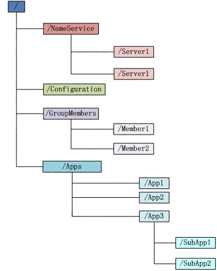
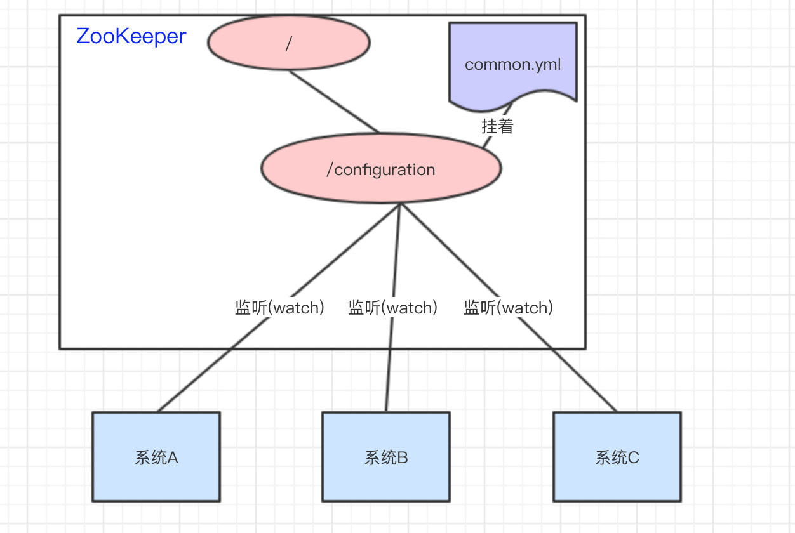

## 一、zookeeper的概念

通过官网我们可以看到

> ## What is ZooKeeper?
>
> ZooKeeper is a centralized service for maintaining configuration information, naming, providing distributed synchronization, and providing group services. All of these kinds of services are used in some form or another by distributed applications. Each time they are implemented there is a lot of work that goes into fixing the bugs and race conditions that are inevitable. Because of the difficulty of implementing these kinds of services, applications initially usually skimp on them, which make them brittle in the presence of change and difficult to manage. Even when done correctly, different implementations of these services lead to management complexity when the applications are deployed.
>
> Learn more about ZooKeeper on the [ZooKeeper Wiki](https://cwiki.apache.org/confluence/display/ZOOKEEPER/Index).

Wikipedia中这样介绍zookeeper

> # Apache ZooKeeper
>
> **Apache ZooKeeper** is a software project of the [Apache Software Foundation](https://en.wikipedia.org/wiki/Apache_Software_Foundation). It is essentially a [service](https://en.wikipedia.org/wiki/Service_(systems_architecture)) for [distributed systems](https://en.wikipedia.org/wiki/Distributed_computing) offering a [hierarchical](https://en.wikipedia.org/wiki/Hierarchical_database_model) [key-value store](https://en.wikipedia.org/wiki/Key-value_database), which is used to provide a distributed [configuration service](https://en.wikipedia.org/wiki/Configuration_management), [synchronization service](https://en.wikipedia.org/wiki/Synchronization_(computer_science)), and [naming registry](https://en.wikipedia.org/wiki/Directory_service) for large distributed systems (see *Use cases*).[[2\]](https://en.wikipedia.org/wiki/Apache_ZooKeeper#cite_note-2) ZooKeeper was a sub-project of [Hadoop](https://en.wikipedia.org/wiki/Hadoop) but is now a [top-level Apache project](https://en.wikipedia.org/wiki/Apache_Software_Foundation#Projects) in its own right.
>
> ZooKeeper's [architecture](https://en.wikipedia.org/wiki/Software_architecture) supports [high availability](https://en.wikipedia.org/wiki/High-availability_cluster) through [redundant services](https://en.wikipedia.org/wiki/Redundancy_(engineering)). The clients can thus ask another ZooKeeper leader if the first fails to answer. ZooKeeper nodes store their data in a hierarchical name space, much like a file system or a [tree](https://en.wikipedia.org/wiki/Tree_(data_structure)) data structure. Clients can read from and write to the nodes and in this way have a shared configuration service. ZooKeeper can be viewed as an [atomic broadcast](https://en.wikipedia.org/wiki/Atomic_broadcast) system, through which updates are [totally ordered](https://en.wikipedia.org/wiki/Total_order). The ZooKeeper Atomic Broadcast (ZAB) protocol is the core of the system.[[3\]](https://en.wikipedia.org/wiki/Apache_ZooKeeper#cite_note-3)
>
> ZooKeeper is used by companies including [Yelp](https://en.wikipedia.org/wiki/Yelp), [Rackspace](https://en.wikipedia.org/wiki/Rackspace), [Yahoo!](https://en.wikipedia.org/wiki/Yahoo!),[[4\]](https://en.wikipedia.org/wiki/Apache_ZooKeeper#cite_note-4) [Odnoklassniki](https://en.wikipedia.org/wiki/Odnoklassniki), [Reddit](https://en.wikipedia.org/wiki/Reddit),[[5\]](https://en.wikipedia.org/wiki/Apache_ZooKeeper#cite_note-5) [NetApp](https://en.wikipedia.org/wiki/NetApp) [SolidFire](https://en.wikipedia.org/wiki/SolidFire),[[6\]](https://en.wikipedia.org/wiki/Apache_ZooKeeper#cite_note-6) [Facebook](https://en.wikipedia.org/wiki/Facebook),[[7\]](https://en.wikipedia.org/wiki/Apache_ZooKeeper#cite_note-7) [Twitter](https://en.wikipedia.org/wiki/Twitter)[[8\]](https://en.wikipedia.org/wiki/Apache_ZooKeeper#cite_note-8) and [eBay](https://en.wikipedia.org/wiki/EBay) as well as [open source](https://en.wikipedia.org/wiki/Open-source_software) [enterprise search](https://en.wikipedia.org/wiki/Enterprise_search) systems like [Solr](https://en.wikipedia.org/wiki/Solr).[[9\]

中文：

> **Apache ZooKeeper**是[Apache软件基金会](https://zh.wikipedia.org/wiki/Apache%E8%BD%AF%E4%BB%B6%E5%9F%BA%E9%87%91%E4%BC%9A)的一个软件项目，它为大型[分布式计算](https://zh.wikipedia.org/wiki/%E5%88%86%E5%B8%83%E5%BC%8F%E8%AE%A1%E7%AE%97)提供[开源](https://zh.wikipedia.org/wiki/%E5%BC%80%E6%BA%90)的分布式配置服务、同步服务和命名注册。[[需要解释](https://zh.wikipedia.org/wiki/Wikipedia:%E4%B8%8D%E8%A6%81%E6%A8%A1%E7%A8%9C%E5%85%A9%E5%8F%AF)] ZooKeeper曾经是[Hadoop](https://zh.wikipedia.org/wiki/Hadoop)的一个子项目，但现在是一个独立的顶级项目。
>
> ZooKeeper的架构通过冗余服务实现[高可用性](https://zh.wikipedia.org/w/index.php?title=%E9%AB%98%E5%8F%AF%E7%94%A8%E6%80%A7%E9%9B%86%E7%BE%A4&action=edit&redlink=1)。因此，如果第一次无应答，客户端就可以询问另一台ZooKeeper主机。ZooKeeper节点将它们的数据存储于一个分层的命名空间，非常类似于一个文件系统或一个[前缀树](https://zh.wikipedia.org/wiki/%E5%89%8D%E7%BC%80%E6%A0%91)结构。客户端可以在节点读写，从而以这种方式拥有一个共享的配置服务。更新是[全序](https://zh.wikipedia.org/wiki/%E5%85%A8%E5%BA%8F)的。[[1\]](https://zh.wikipedia.org/wiki/Apache_ZooKeeper#cite_note-1)
>
> 使用ZooKeeper的公司包括[Rackspace](https://zh.wikipedia.org/wiki/Rackspace)、[雅虎](https://zh.wikipedia.org/wiki/%E9%9B%85%E8%99%8E)[[2\]](https://zh.wikipedia.org/wiki/Apache_ZooKeeper#cite_note-2)和[eBay](https://zh.wikipedia.org/wiki/EBay)，以及类似于像[Solr](https://zh.wikipedia.org/wiki/Solr)这样的开源[企业级搜索](https://zh.wikipedia.org/w/index.php?title=%E4%BC%81%E4%B8%9A%E7%BA%A7%E6%90%9C%E7%B4%A2&action=edit&redlink=1)系统。[[3\]](https://zh.wikipedia.org/wiki/Apache_ZooKeeper#cite_note-3)

简单概括就是：

1）Zookeeper主要服务于分布式系统，可以用Zookeeper来做：统一配置管理、统一命名服务、分布式锁、集群管理

2）使用分布式系统就无法避免对节点管理的问题（需要实时感知节点的状态、对节点进行统一管理等等），而由于这些问题处理起来可能相对麻烦和提高了系统的复杂性，Zookeeper作为一个能够通用解决这些问题的中间件就应运而生了

## 二、ZooKeeper的数据模型

zookeeper的数据结构，跟unix文件系统非常类似，可以看做是一棵树，每个节点叫做znode。每一个节点可以通过路径来标识，结构图如下



Zookeeper 这种数据结构有如下这些特点：

1. 每个子目录项如 NameService 都被称作为 znode，这个 znode 是被它所在的路径唯一标识，如 Server1 这个 znode 的标识为 /NameService/Server1
2. znode 可以有子节点目录，并且每个 znode 可以存储数据，注意 EPHEMERAL 类型的目录节点不能有子节点目录
3. znode 是有版本的，每个 znode 中存储的数据可以有多个版本，也就是一个访问路径中可以存储多份数据
4. znode 可以是临时节点，一旦创建这个 znode 的客户端与服务器失去联系，这个 znode 也将自动删除，Zookeeper 的客户端和服务器通信采用长连接方式，每个客户端和服务器通过心跳来保持连接，这个连接状态称为 session，如果 znode 是临时节点，这个 session 失效，znode 也就删除了
5. znode 的目录名可以自动编号，如 App1 已经存在，再创建的话，将会自动命名为 App2
6. znode 可以被监控，包括这个目录节点中存储的数据的修改，子节点目录的变化等，一旦变化可以通知设置监控的客户端，这个是 Zookeeper 的核心特性，Zookeeper 的很多功能都是基于这个特性实现的，后面在典型的应用场景中会有实例介绍

znode分为两种类型

- **短暂/临时（Ephemeral）**：当客户端和服务端断开连接后，所创建的znode节点会**自动删除**
- **持久（Persistent）**：当客户端和服务端断开连接后，所创建的znode节点**不会删除**

> - PERSISTENT-**持久化目录节点**
>
>   客户端与zookeeper断开连接后，该节点依旧存在
>
> - PERSISTENT_SEQUENTIAL-**持久化顺序编号目录节点**
>
>   客户端与zookeeper断开连接后，该节点依旧存在，只是Zookeeper给该节点名称进行顺序编号
>
> - EPHEMERAL-**临时目录节点**
>
>   客户端与zookeeper断开连接后，该节点被删除
>
> - EPHEMERAL_SEQUENTIAL-**临时顺序编号目录节点**
>
>   客户端与zookeeper断开连接后，该节点被删除，只是Zookeeper给该节点名称进行顺序编号


### 2.1 监听器

常见的监听场景有以下两项：

- 监听znode节点的数据变化
- 监听子节点的增减变化


## 三、zookeeper的应用场景

### 3.1 统一配置管理

比如我们现在有三个系统A、B、C，他们有三份配置，分别是`ASystem.yml、BSystem.yml、CSystem.yml`，然后，这三份配置又非常类似，很多的配置项几乎都一样。

> 此时，如果我们要改变其中一份配置项的信息，很可能其他两份都要改。并且，改变了配置项的信息**很可能就要重启系统**

于是，我们希望把`ASystem.yml、BSystem.yml、CSystem.yml`相同的配置项抽取出来成一份**公用**的配置`common.yml`，并且即便`common.yml`改了，也不需要系统A、B、C重启。


做法：我们可以将`common.yml`这份配置放在ZooKeeper的Znode节点中，系统A、B、C监听着这个Znode节点有无变更，如果变更了，**及时**响应。 



参考：<https://blog.csdn.net/u011320740/article/details/78742625> 

### 3.2 统一命名服务

统一命名服务的理解其实跟**域名**一样，是我们为这某一部分的资源给它**取一个名字**，别人通过这个名字就可以拿到对应的资源。

比如说，现在我有一个域名`www.java3y.com`，但我这个域名下有多台机器：

- 192.168.1.1
- 192.168.1.2
- 192.168.1.3
- 192.168.1.4

别人访问`www.java3y.com`即可访问到我的机器，而不是通过IP去访问。


### 3.3 分布式锁

共享锁在同一个进程中很容易实现，但是在跨进程或者在不同 Server 之间就不好实现了。Zookeeper 却很容易实现这个功能，实现方式也是需要获得锁的 Server 创建一个 EPHEMERAL_SEQUENTIAL 目录节点，然后调用 [getChildren](http://hadoop.apache.org/zookeeper/docs/r3.2.2/api/org/apache/zookeeper/ZooKeeper.html#getChildren%28java.lang.String,%20boolean%29)方法获取当前的目录节点列表中最小的目录节点是不是就是自己创建的目录节点，如果正是自己创建的，那么它就获得了这个锁，如果不是那么它就调用 [exists](http://hadoop.apache.org/zookeeper/docs/r3.2.2/api/org/apache/zookeeper/ZooKeeper.html#exists%28java.lang.String,%20boolean%29)([String](http://java.sun.com/javase/6/docs/api/java/lang/String.html?is-external=true) path, boolean watch) 方法并监控 Zookeeper 上目录节点列表的变化，一直到自己创建的节点是列表中最小编号的目录节点，从而获得锁，释放锁很简单，只要删除前面它自己所创建的目录节点就行了。 

分布式锁的流程图如下：


例子：


访问的时候会创建**带顺序号的临时/短暂**(`EPHEMERAL_SEQUENTIAL`)节点，比如，系统A创建了`id_000000`节点，系统B创建了`id_000002`节点，系统C创建了`id_000001`节点。  

接着，拿到`/locks`节点下的所有子节点(id_000000,id_000001,id_000002)，**判断自己创建的是不是最小的那个节点**

- 如果是，则拿到锁。
  - 释放锁：执行完操作后，把创建的节点给删掉
- 如果不是，则监听比自己要小1的节点变化

举个例子：

- 系统A拿到`/locks`节点下的所有子节点，经过比较，发现自己(`id_000000`)，是所有子节点最小的。所以得到锁
- 系统B拿到`/locks`节点下的所有子节点，经过比较，发现自己(`id_000002`)，不是所有子节点最小的。所以监听比自己小1的节点`id_000001`的状态
- 系统C拿到`/locks`节点下的所有子节点，经过比较，发现自己(`id_000001`)，不是所有子节点最小的。所以监听比自己小1的节点`id_000000`的状态
- …...
- 等到系统A执行完操作以后，将自己创建的节点删除(`id_000000`)。通过监听，系统C发现`id_000000`节点已经删除了，发现自己已经是最小的节点了，于是顺利拿到锁
- ….系统B如上

### 3.4 集群管理

Zookeeper 能够很容易的实现集群管理的功能，如有多台 Server 组成一个服务集群，那么必须要一个“总管”知道当前集群中每台机器的服务状态，一旦有机器不能提供服务，集群中其它集群必须知道，从而做出调整重新分配服务策略。同样当增加集群的服务能力时，就会增加一台或多台 Server，同样也必须让“总管”知道。

Zookeeper 不仅能够帮你维护当前的集群中机器的服务状态，而且能够帮你选出一个“总管”，让这个总管来管理集群，这就是 Zookeeper 的另一个功能 Leader Election。

它们的实现方式都是在 Zookeeper 上创建一个 EPHEMERAL 类型的目录节点，然后每个 Server 在它们创建目录节点的父目录节点上调用 [getChildren](http://hadoop.apache.org/zookeeper/docs/r3.2.2/api/org/apache/zookeeper/ZooKeeper.html#getChildren%28java.lang.String,%20boolean%29)([String](http://java.sun.com/javase/6/docs/api/java/lang/String.html?is-external=true) path, boolean watch) 方法并设置 watch 为 true，由于是 EPHEMERAL 目录节点，当创建它的 Server 死去，这个目录节点也随之被删除，所以 Children 将会变化，这时 [getChildren](http://hadoop.apache.org/zookeeper/docs/r3.2.2/api/org/apache/zookeeper/ZooKeeper.html#getChildren%28java.lang.String,%20boolean%29)上的 Watch 将会被调用，所以其它 Server 就知道已经有某台 Server 死去了。新增 Server 也是同样的原理。

Zookeeper 如何实现 Leader Election，也就是选出一个 Master Server。和前面的一样每台 Server 创建一个 EPHEMERAL 目录节点，不同的是它还是一个 SEQUENTIAL 目录节点，所以它是个 EPHEMERAL_SEQUENTIAL 目录节点。之所以它是 EPHEMERAL_SEQUENTIAL 目录节点，是因为我们可以给每台 Server 编号，我们可以选择当前是最小编号的 Server 为 Master，假如这个最小编号的 Server 死去，由于是 EPHEMERAL 节点，死去的 Server 对应的节点也被删除，所以当前的节点列表中又出现一个最小编号的节点，我们就选择这个节点为当前 Master。这样就实现了动态选择 Master，避免了传统意义上单 Master 容易出现单点故障的问题。


例子：


只要系统A挂了，那`/groupMember/A`这个节点就会删除，通过**监听**`groupMember`下的子节点，系统B和C就能够感知到系统A已经挂了。(新增也是同理)

除了能够感知节点的上下线变化，ZooKeeper还可以实现**动态选举Master**的功能。(如果集群是主从架构模式下)

原理也很简单，如果想要实现动态选举Master的功能，Znode节点的类型是带**顺序号的临时节点**(`EPHEMERAL_SEQUENTIAL`)就好了。

- Zookeeper会每次选举最小编号的作为Master，如果Master挂了，自然对应的Znode节点就会删除。然后让**新的最小编号作为Master**，这样就可以实现动态选举的功能了。


## 四、zoo.cfg配置文件

在安装zookeeper的时候我们要去修改zookeeper预装是conf目录下面的zoo_sample.cfg这个文件，首先我们要做的事就是重命名这个文件 

```txt
# The number of milliseconds of each tick  心跳停止的最长时间2s
tickTime=2000

# The number of ticks that the initial    
# synchronization phase can take           
initLimit=10

# The number of ticks that can pass between 
# sending a request and getting an acknowledgement  
syncLimit=5

# the directory where the snapshot is stored.
# do not use /tmp for storage, /tmp here is just     
# example sakes.
dataDir=/home/bigdata/app/zookeeper/data

# the port at which the clients will connect     
clientPort=2181

# Be sure to read the maintenance section of the 
# administrator guide before turning on autopurge.
#
# http://zookeeper.apache.org/doc/current/zookeeperAdmin.html#sc_maintenance
#
# The number of snapshots to retain in dataDir
#autopurge.snapRetainCount=3
# Purge task interval in hours
# Set to "0" to disable auto purge feature
#autopurge.purgeInterval=1
# autopurge.snapRetainCount=500

#2888端口：各个zookeeper之间进行数据的同步，3888端口：各个zookeeper之间进行选主。选一个为主，其他为从（单机模式只需要配一台）
#server后面的数字和myid保持一致就行
server.0=hadoop2:2888:3888
```


### 4.1 tickTime

通信心跳数，Zookeeper服务器与客户端心跳时间，单位毫秒Zookeeper使用的基本时间，服务器之间或客户端与服务器之间维持心跳的时间间隔，也就是每个tickTime时间就会发送一个心跳，时间单位为毫秒。 它用于心跳机制，并且设置最小的session超时时间为两倍心跳时间。（session的最小超时时间是2*tickTime） 

### 4.2 initLimit

LF初始通信时限 集群中的Fo1lower跟随者服务器与Leader领导者服务器之间初始连接时能容忍的最多心跳数（tickTime的数量），用它来限定集群中的Zookeeper服务器连接到Leader的时限。 

### 4.3 syncLimit

LF同步通信时限 集群中Leader与Fo1lower之间的最大响应时间单位，假如响应超过syncLimit*tickTime，Leader认为Fo11wer死掉，从服务器列表中删除Fo1lwer。 

### 4.4 dataDir

数据文件目录+数据持久化路径 主要用于保存Zookeeper中的数据。 该属性对应的目录是用来存放myid信息跟一些版本，日志，跟服务器唯一的ID信息等。 

### 4.5 clientPort

客户端连接的接口，客户端连接zookeeper服务器的端口，zookeeper会监听这个端口，接收客户端的请求访问！这个端口默认是2181。 


## 五、常用命令

### 启动zk服务

 ```properties
[root@localhost bin]# ./zkServer.sh
ZooKeeper JMX enabled by default
Using config: /usr/home/zookeeper-3.4.11/bin/../conf/zoo.cfg
Usage: ./zkServer.sh {start|start-foreground|stop|restart|status|upgrade|print-cmd}
# 提示要以./zkCli.sh start 启动zk
./zkCli.sh start 
 ```

### 查看zk的运行状态

```properties
[root@localhost bin]# ./zkServer.sh status
ZooKeeper JMX enabled by default
Using config: /usr/home/zookeeper-3.4.11/bin/../conf/zoo.cfg
Mode: leader
```

### 客户端连接zk

```properties
[root@localhost bin]# ./zkCli.sh 
......
WatchedEvent state:SyncConnected type:None path:null
[zk: localhost:2181(CONNECTED) 0]
```

### help 查看客户端帮助命令

```properties
[zk: localhost:2181(CONNECTED) 0] help
ZooKeeper -server host:port cmd args
    stat path [watch]
    set path data [version]
    ls path [watch]
    delquota [-n|-b] path
    ls2 path [watch]
    setAcl path acl
    setquota -n|-b val path
    history 
    redo cmdno
    printwatches on|off
    delete path [version]
    sync path
    listquota path
    rmr path
    get path [watch]
    create [-s] [-e] path data acl
    addauth scheme auth
    quit 
    getAcl path
    close 
    connect host:port
[zk: localhost:2181(CONNECTED) 1] 
```

### ls查看

`ls` 查看命令(`niocoder`是我测试集群创建的节点，默认只有`zookeeper`一个节点) 

```properties
[zk: localhost:2181(CONNECTED) 1] ls /
[niocoder, zookeeper]
[zk: localhost:2181(CONNECTED) 2] ls /zookeeper 
[quota]
[zk: localhost:2181(CONNECTED) 4] ls /zookeeper/quota
[]
```

### get获取节点数据和更新信息

- get 内容为空
- cZxid ：创建节点的id
- ctime ： 节点的创建时间
- mZxid ：修改节点的id
- mtime ：修改节点的时间
- pZxid ：子节点的id
- cversion : 子节点的版本
- dataVersion ： 当前节点数据的版本
- aclVersion ：权限的版本
- ephemeralOwner ：判断是否是临时节点
- dataLength ： 数据的长度
- numChildren ：子节点的数量

```properties
[zk: localhost:2181(CONNECTED) 7] get /zookeeper #下面空行说明节点内容为空

cZxid = 0x0
ctime = Thu Jan 01 00:00:00 UTC 1970
mZxid = 0x0
mtime = Thu Jan 01 00:00:00 UTC 1970
pZxid = 0x0
cversion = -1
dataVersion = 0
aclVersion = 0
ephemeralOwner = 0x0
dataLength = 0
numChildren = 1
[zk: localhost:2181(CONNECTED) 8]
```

### stat获得节点的更新信息

```properties
[zk: localhost:2181(CONNECTED) 8] stat /zookeeper
cZxid = 0x0
ctime = Thu Jan 01 00:00:00 UTC 1970
mZxid = 0x0
mtime = Thu Jan 01 00:00:00 UTC 1970
pZxid = 0x0
cversion = -1
dataVersion = 0
aclVersion = 0
ephemeralOwner = 0x0
dataLength = 0
numChildren = 1
```

### ls2  ls命令和stat命令的结合

```properties
[zk: localhost:2181(CONNECTED) 10] ls2 /zookeeper
[quota]
cZxid = 0x0
ctime = Thu Jan 01 00:00:00 UTC 1970
mZxid = 0x0
mtime = Thu Jan 01 00:00:00 UTC 1970
pZxid = 0x0
cversion = -1
dataVersion = 0
aclVersion = 0
ephemeralOwner = 0x0
dataLength = 0
numChildren = 1
[zk: localhost:2181(CONNECTED) 11] 
```

### create创建节点

`create [-s] [-e] path data acl` 可以注意一下各个版本的变化 

```properties
#创建merryyou节点，节点的内容为merryyou
[zk: localhost:2181(CONNECTED) 1] create /merryyou merryyou
Created /merryyou
#获得merryyou节点内容
[zk: localhost:2181(CONNECTED) 3] get /merryyou
merryyou
cZxid = 0x200000004
ctime = Sat Jun 02 14:20:06 UTC 2018
mZxid = 0x200000004
mtime = Sat Jun 02 14:20:06 UTC 2018
pZxid = 0x200000004
cversion = 0
dataVersion = 0
aclVersion = 0
ephemeralOwner = 0x0
dataLength = 8
numChildren = 0
```

#### create -e 创建临时节点

```properties
#创建临时节点
[zk: localhost:2181(CONNECTED) 4] create -e  /merryyou/temp merryyou
Created /merryyou/temp
[zk: localhost:2181(CONNECTED) 5] get /merryyou
merryyou
cZxid = 0x200000004
ctime = Sat Jun 02 14:20:06 UTC 2018
mZxid = 0x200000004
mtime = Sat Jun 02 14:20:06 UTC 2018
pZxid = 0x200000005
cversion = 1
dataVersion = 0
aclVersion = 0
ephemeralOwner = 0x0
dataLength = 8
numChildren = 1
[zk: localhost:2181(CONNECTED) 6] get /merryyou/temp
merryyou
cZxid = 0x200000005
ctime = Sat Jun 02 14:22:24 UTC 2018
mZxid = 0x200000005
mtime = Sat Jun 02 14:22:24 UTC 2018
pZxid = 0x200000005
cversion = 0
dataVersion = 0
aclVersion = 0
ephemeralOwner = 0x2000000d4500000
dataLength = 8
numChildren = 0
[zk: localhost:2181(CONNECTED) 7] 
#断开重连之后，临时节点自动消失
WATCHER::

WatchedEvent state:SyncConnected type:None path:null
#因为默认的心跳机制，此时查询临时节点还存在
[zk: localhost:2181(CONNECTED) 0] ls /merryyou
[temp]
#再次查询，临时节点消失
[zk: localhost:2181(CONNECTED) 1] ls /merryyou
[]
[zk: localhost:2181(CONNECTED) 2] 
```

#### create -s创建顺序节点 自动累加

```properties
# 创建顺序节点，顺序节点会自动累加
[zk: localhost:2181(CONNECTED) 2] create -s /merryyou/sec seq
Created /merryyou/sec0000000001
[zk: localhost:2181(CONNECTED) 3] create -s /merryyou/sec seq
Created /merryyou/sec0000000002 
```

### set path data [version] 修改节点

```properties
# 修改节点内容为new-merryyou
[zk: localhost:2181(CONNECTED) 7] set /merryyou new-merryyou
cZxid = 0x200000004
ctime = Sat Jun 02 14:20:06 UTC 2018
mZxid = 0x20000000a
mtime = Sat Jun 02 14:29:23 UTC 2018
pZxid = 0x200000009
cversion = 4
dataVersion = 1
aclVersion = 0
ephemeralOwner = 0x0
dataLength = 12
numChildren = 2
#再次查询，节点内容已经修改
[zk: localhost:2181(CONNECTED) 8] get /merryyou
new-merryyou
cZxid = 0x200000004
ctime = Sat Jun 02 14:20:06 UTC 2018
mZxid = 0x20000000a
mtime = Sat Jun 02 14:29:23 UTC 2018
pZxid = 0x200000009
cversion = 4
dataVersion = 1
aclVersion = 0
ephemeralOwner = 0x0
dataLength = 12
numChildren = 2
#set 根据版本号更新 dataVersion 乐观锁
[zk: localhost:2181(CONNECTED) 9] set /merryyou test-merryyou 1
cZxid = 0x200000004
ctime = Sat Jun 02 14:20:06 UTC 2018
mZxid = 0x20000000b
mtime = Sat Jun 02 14:31:30 UTC 2018
pZxid = 0x200000009
cversion = 4
dataVersion = 2
aclVersion = 0
ephemeralOwner = 0x0
dataLength = 13
numChildren = 2
#因为数据的版本号已经修改为2 再次使用版本号1修改节点提交错误
[zk: localhost:2181(CONNECTED) 10] set /merryyou test-merryyou 1
version No is not valid : /merryyou
```

###  delete path [version] 删除节点

```properties
[zk: localhost:2181(CONNECTED) 13] delete /merryyou/sec000000000

sec0000000001   sec0000000002
[zk: localhost:2181(CONNECTED) 13] delete /merryyou/sec0000000001
[zk: localhost:2181(CONNECTED) 14] ls /merryyou
[sec0000000002]
[zk: localhost:2181(CONNECTED) 15] 
#版本号操作与set类似 version
```


### watcher通知机制

关于watcher机制大体的理解可以为，当每个节点发生变化，都会触发watcher事件，类似于mysql的触发器。zk中 watcher是一次性的，触发后立即销毁。可以参考https://blog.csdn.net/hohoo1990/article/details/78617336

- stat path [watch] 设置watch事件
- get path [watch]设置watch事件
- 子节点创建和删除时触发watch事件，子节点修改不会触发该事件

##### stat path [watch] 设置watch事件

```properties
#添加watch 事件
[zk: localhost:2181(CONNECTED) 18] stat /longfei watch
Node does not exist: /longfei
#创建longfei节点时触发watcher事件
[zk: localhost:2181(CONNECTED) 19] create /longfei test

WATCHER::

WatchedEvent state:SyncConnected type:NodeCreated path:/longfei
Created /longfei
```

##### get path [watch] 设置watch事件

```properties
#使用get命令添加watch事件
[zk: localhost:2181(CONNECTED) 20] get /longfei watch
test
cZxid = 0x20000000e
ctime = Sat Jun 02 14:43:15 UTC 2018
mZxid = 0x20000000e
mtime = Sat Jun 02 14:43:15 UTC 2018
pZxid = 0x20000000e
cversion = 0
dataVersion = 0
aclVersion = 0
ephemeralOwner = 0x0
dataLength = 4
numChildren = 0
#修改节点触发watcher事件
[zk: localhost:2181(CONNECTED) 21] set /longfei new_test

WATCHER::

WatchedEvent state:SyncConnected type:NodeDataChanged path:/longfei
cZxid = 0x20000000e
ctime = Sat Jun 02 14:43:15 UTC 2018
mZxid = 0x20000000f
mtime = Sat Jun 02 14:45:06 UTC 2018
pZxid = 0x20000000e
cversion = 0
dataVersion = 1
aclVersion = 0
ephemeralOwner = 0x0
dataLength = 8
numChildren = 0
[zk: localhost:2181(CONNECTED) 22] 
#删除触发watcher事件
[zk: localhost:2181(CONNECTED) 23] get /longfei watch
new_test
cZxid = 0x20000000e
ctime = Sat Jun 02 14:43:15 UTC 2018
mZxid = 0x20000000f
mtime = Sat Jun 02 14:45:06 UTC 2018
pZxid = 0x20000000e
cversion = 0
dataVersion = 1
aclVersion = 0
ephemeralOwner = 0x0
dataLength = 8
numChildren = 0
[zk: localhost:2181(CONNECTED) 24] delete /longfei

WATCHER::

WatchedEvent state:SyncConnected type:NodeDeleted path:/longfei
[zk: localhost:2181(CONNECTED) 25] 
```


## 六、四字命令

使用四字命令需要安装`nc`命令,(`yum install nc`) 

### stat 查看状态信息

```properties
[root@localhost bin]# echo stat | nc 192.168.0.68 2181
Zookeeper version: 3.4.11-37e277162d567b55a07d1755f0b31c32e93c01a0, built on 11/01/2017 18:06 GMT
Clients:
 /192.168.0.68:493460
Latency min/avg/max: 0/0/4
Received: 62
Sent: 61
Connections: 1
Outstanding: 0
Zxid: 0x50000000a
Mode: follower
Node count: 10
[root@localhost bin]# 
```

### ruok 查看zookeeper是否启动

```properties
[root@localhost bin]# echo ruok | nc 192.168.0.68 2181
imok[root@localhost bin]# 
```

### dump 列出没有处理的节点，临时节点

```properties
imok[root@localhost bin]# echo dump | nc 192.168.0.68 2181
SessionTracker dump:
org.apache.zookeeper.server.quorum.LearnerSessionTracker@29805957
ephemeral nodes dump:
Sessions with Ephemerals (0):
[root@localhost bin]# 
```


### conf 查看服务器配置

```properties
[root@localhost bin]# echo conf | nc 192.168.0.68 2181
clientPort=2181
dataDir=/usr/home/zookeeper-3.4.11/data/version-2
dataLogDir=/usr/home/zookeeper-3.4.11/data/version-2
tickTime=2000
maxClientCnxns=60
minSessionTimeout=4000
maxSessionTimeout=40000
serverId=2
initLimit=10
syncLimit=5
electionAlg=3
electionPort=3888
quorumPort=2888
peerType=0
[root@localhost bin]# 
```


### cons 显示连接到服务端的信息

```properties
[root@localhost bin]# echo cons | nc 192.168.0.68 2181
 /192.168.0.68:493540
 
 [root@localhost bin]# 
```

### envi 显示环境变量信息

```properties
[root@localhost bin]# echo envi | nc 192.168.0.68 2181
Environment:
zookeeper.version=3.4.11-37e277162d567b55a07d1755f0b31c32e93c01a0, built on 11/01/2017 18:06 GMT
host.name=localhost
java.version=1.8.0_111
java.vendor=Oracle Corporation
java.home=/usr/local/jdk1.8.0_111/jre
java.class.path=/usr/home/zookeeper-3.4.11/bin/../build/classes:/usr/home/zookeeper-3.4.11/bin/../build/lib/.jar:/usr/home/zookeeper-3.4.11/bin/../lib/slf4j-log4j12-1.6.1.jar:/usr/home/zookeeper-3.4.11/bin/../lib/slf4j-api-1.6.1.jar:/usr/home/zookeeper-3.4.11/bin/../lib/netty-3.10.5.Final.jar:/usr/home/zookeeper-3.4.11/bin/../lib/log4j-1.2.16.jar:/usr/home/zookeeper-3.4.11/bin/../lib/jline-0.9.94.jar:/usr/home/zookeeper-3.4.11/bin/../lib/audience-annotations-0.5.0.jar:/usr/home/zookeeper-3.4.11/bin/../zookeeper-3.4.11.jar:/usr/home/zookeeper-3.4.11/bin/../src/java/lib/.jar:/usr/home/zookeeper-3.4.11/bin/../conf:
java.library.path=/usr/java/packages/lib/amd64:/usr/lib64:/lib64:/lib:/usr/lib
java.io.tmpdir=/tmp
java.compiler=<NA>
os.name=Linux
os.arch=amd64
os.version=3.10.0-514.10.2.el7.x86_64
user.name=root
user.home=/root
user.dir=/usr/home/zookeeper-3.4.11/bin
[root@localhost bin]#
```


### mntr 查看zk的健康信息

```properties
[root@localhost bin]# echo mntr | nc 192.168.0.68 2181
zk_version  3.4.11-37e277162d567b55a07d1755f0b31c32e93c01a0, built on 11/01/2017 18:06 GMT
zk_avg_latency  0
zk_max_latency  4
zk_min_latency  0
zk_packets_received 68
zk_packets_sent 67
zk_num_alive_connections    1
zk_outstanding_requests 0
zk_server_state follower
zk_znode_count  10
zk_watch_count  0
zk_ephemerals_count 0
zk_approximate_data_size    124
zk_open_file_descriptor_count   32
zk_max_file_descriptor_count    4096
[root@localhost bin]# 
wchs 展示watch的信息
[root@localhost bin]# echo wchs | nc 192.168.0.68 2181
0 connections watching 0 paths
Total watches:0
[root@localhost bin]# 
```


### wchc和wchp 显示session的watch信息 path的watch信息

需要在 配置zoo.cfg文件中添加 4lw.commands.whitelist=*

```properties
[root@localhost bin]# echo wchc | nc 192.168.0.68 2181
wchc is not executed because it is not in the whitelist.
[root@localhost bin]# echo wchp | nc 192.168.0.68 2181
wchp is not executed because it is not in the whitelist.
```

