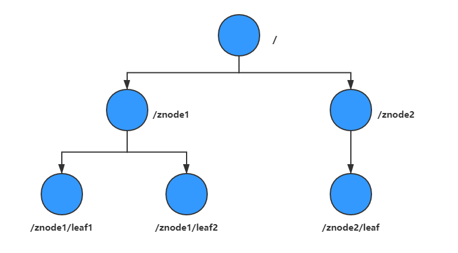
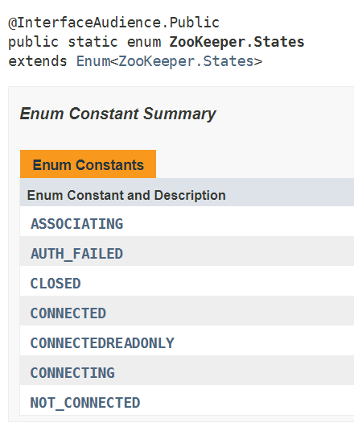
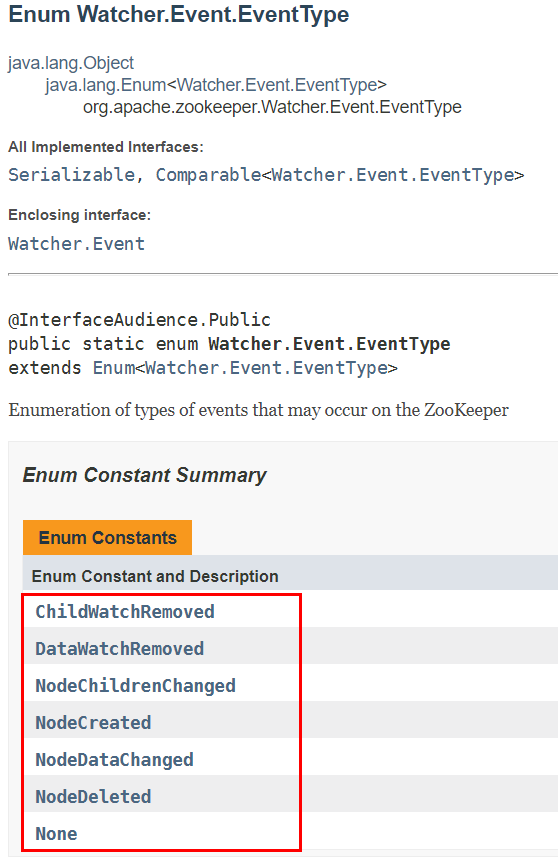
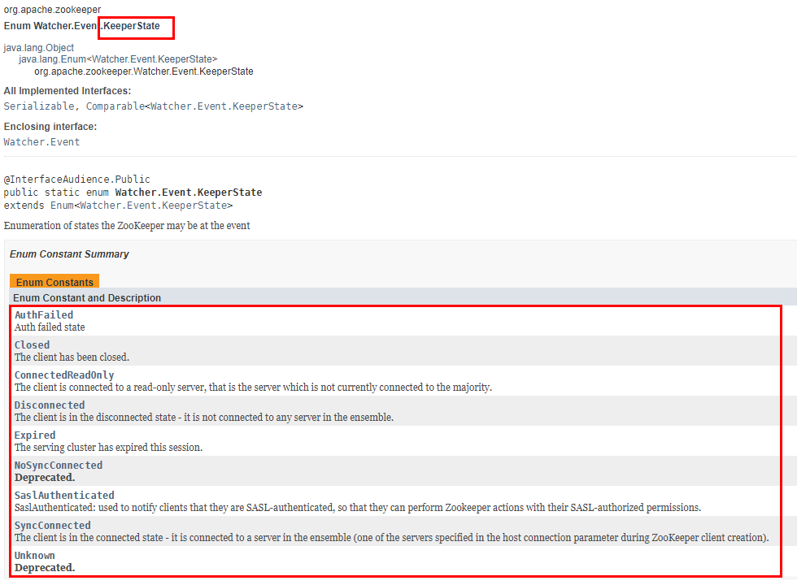
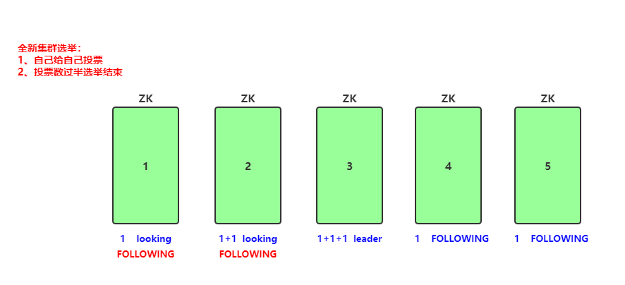

# 一、入门

## 1.1 概念

​	Zookeeper是一个**分布式协调服务的开源框架**。主要用来解决分布式集群中应用系统的一致性问题，例如怎样避免同时操作同一数据造成脏读的问题。
	ZooKeeper本质上是一个分布式的**小文件存储系统**。提供基于类似于文件系统的**目录树方式**的数据存储，并且可以对树中的节点进行有效管理。从而用来维护和监控你存储的数据的状态变化。通过监控这些数据状态的变化，从而可以达到基于数据的集群管理。诸如：**统一命名服务、分布式配置管理、分布式消息队列、分布式锁、分布式协调**等功能。

## 1.2 特性

- `全局数据一致`：每个server保存一份相同的数据副本，client无论连接到哪个server，展示的数据都是一致的，这是最重要的特征；
- `可靠性`：如果消息被其中一台服务器接受，那么将被所有的服务器接受。
- `顺序性`：包括全局有序和偏序两种：全局有序是指如果在一台服务器上消息a在消息b前发布，则在所有Server上消息a都将在消息b前被发布；偏序是指如果一个消息b在消息a后被同一个发送者发布，a必将排在b前面。
- `数据更新原子性`：一次数据更新要么成功（半数以上节点成功），要么失败，不存在中间状态；
- `实时性`：Zookeeper保证客户端将在一个时间间隔范围内获得服务器的更新信息，或者服务器失效的信息。

# 二、数据模型

​	Znode维护了一个stat结构，这个stat包含数据变化的版本号、访问控制列表变化、还有时间戳。版本号和时间戳一起，可让zookeeper验证缓存和协调更新。**每次znode的数据发生了变化，版本号就增加**。例如：无论何时客户端检索数据，它也一起检索数据的版本号，并且当客户端执行更新或删除时，客户端必须提供他正在改变的znode的版本号。**如果它提供的版本号和真是的数据版本号不一致，更新将会失败**

1. `Znode兼具文件和目录两种特点`。既像文件一样维护着数据、元信息、ACL、时间戳等数据结构，又像目录一样可以作为路径标识的一部分，并可以具有子Znode。用户对Znode具有增、删、改、查等操作（权限允许的情况下）。
2. `Znode具有原子性操作`，读操作将获取与节点相关的所有数据，写操作也将替换掉节点的所有数据。另外，每一个节点都拥有自己的ACL（访问控制列表），这个列表规定了用户的权限，即限定了特定用户对目标节点可以执行的操作。
3. `Znode存储数据大小有限制`。ZooKeeper虽然可以关联一些数据，但并没有被设计为常规的数据库或者大数据存储，相反的是，它用来管理调度数据，比如分布式应用中的配置文件信息、状态信息、汇集位置等等。这些数据的共同特性就是它们都是很小的数据，==通常以KB为大小单位==。**ZooKeeper的服务器和客户端都被设计为严格检查并限制==每个Znode的数据大小至多1M==，当时常规使用中应该远小于此值**。
4. `Znode通过路径引用`，如同Unix中的文伴路径。**路径必须是绝对的**，因此他们**必须由斜杠字符来开头**。除此以外，他们**必须是唯一的**，也就是说每一个路径只有一个表示，因此这些路径不能改变。在ZooKeeper中，路径由Unicode字符串组成，并且有一些限制。字符串"/zookeeper"用以保存管理信息，比如关键配额信息。

## 2.1 数据结构



每个节点称为znode。znode有3个部分组成：

- `stat`：状态信息，描述该znode的版本，权限等信息
- `data`：znode关联的数据
- `children`：znode的子节点

## 2.1 节点属性

```shell
[zk: localhost:2181(CONNECTED) 16] get -s /testNode
v11
cZxid = 0xc
ctime = Thu Mar 19 21:02:55 CST 2020
mZxid = 0xc
mtime = Thu Mar 19 21:02:55 CST 2020
pZxid = 0xc
cversion = 0
dataVersion = 0
aclVersion = 0
ephemeralOwner = 0x0
dataLength = 3
numChildren = 0
```

​	对于zk来说，每次的变化都会产生一个唯一的事务id，zxid（ZooKeeper Transaction Id）。通过zxid，可以确定更新操作的先后顺序。例如，如果zxid1小于zxid2，说明zxidl操作先于zxid2发生，zxid对于整个zk都是唯一的，即使操作的是不同的znode。

==**cZxid**==：引起这个znode创建的事务id，创建节点的事务的zxid（zookeeper transaction id）
ctime：znode被创建的毫秒数（从1970年开始）
==**mZxid**==：znode被修改的事务id，即每次对znode修改都会更新zxid
mtime：znode最后修改的毫秒数（从1970年开始）
pZxid：znode最后更新的子节点zxid
cversion：znode子节点版本号，znode子节点修改次数
==**dataVersion**==：znode数据版本号，每次对znode节点进行set操作，dataVersion的值都会+1
aclVersion：znode访问控制列表的变化号
ephemeralOwner：如果是临时节点，这是znode拥有者的session id。如果不是临时节点则是0
==**dataLength**==：znode的数据长度
==**numChildren**==：znode子节点数量

znode的集合是一个树形结构，znode=path+nodevalue+stat

## 2.2 节点类型

​	Znode的节点类型分为**持久节点**和**临时节点**。Znode还有一个**序列化的特性**，如果创建的时候指定的话，该Znode的名字后面会==**自动追加一个不断增加的序列号**==。序列号对于此节点的父节点来说是唯一的，这样便会==**记录每个子节点创建的先后顺序**==。它的格式为“%10d”（10位数字，没有数值的数位用0补充，例如“0000000001”）。

```shell
create -s -c path data

 -e 创建临时节点
临时节点如何清除或者过期，可以将客户端断掉，当客户端不在发送心跳包，则zk服务器端会将该客户端下的所有临时节点清除。
 -s 创建顺序节点
```

**持久节点**：生命周期不依赖于会话，只有执行删除操作才会被删除

1. `PERSISTENT` - **持久化目录节点**
   - 客户端与zookeeper断开连接后，该节点依旧存在
2. `PERSISTENT_SEQUENTIAL` - **持久化顺序编号目录节点**
   - 客户端与zookeeper断开连接后，该节点依旧存在，只是zookeeper给该节点名称进行顺序编号

**临时节点**：生命周期依赖于会话，一旦会话结束，就会自动被删除。==**临时节点不允许有子节点**==

1. `EPHEMERAL` - **临时目录节点**
   - 客户端与zookeeper断开连接后，该节点被删除
2. `EPHEMERAL_SEQUENTIAL` - **临时顺序编号目录节点**
   - 客户端与zookeeper断开连接后，该节点被删除，只是zookeeper给该节点名称进行顺序编号


# 三、zoo.cfg配置文件解读

```shell
# The number of milliseconds of each tick  心跳停止的最长时间2s
tickTime=2000

# The number of ticks that the initial    
# synchronization phase can take           
initLimit=10

# The number of ticks that can pass between 
# sending a request and getting an acknowledgement  
syncLimit=5

# the directory where the snapshot is stored.
# do not use /tmp for storage, /tmp here is just     
# example sakes.
dataDir=/home/bigdata/app/zookeeper/data

# the port at which the clients will connect     
clientPort=2181

# Be sure to read the maintenance section of the 
# administrator guide before turning on autopurge.
#
# http://zookeeper.apache.org/doc/current/zookeeperAdmin.html#sc_maintenance
#
# The number of snapshots to retain in dataDir
#autopurge.snapRetainCount=3
# Purge task interval in hours
# Set to "0" to disable auto purge feature
#autopurge.purgeInterval=1
# autopurge.snapRetainCount=500

#2888端口：各个zookeeper之间进行数据的同步，3888端口：各个zookeeper之间进行选主。选一个为主，其他为从（单机模式只需要配一台）
#server后面的数字和myid保持一致就行
server.0=hadoop2:2888:3888
```

**tickTime**：通信心跳数，zookeeper服务器心跳时间，单位毫秒。zookeeper使用的基本事件，服务器之间或客户端与服务器之间维持心跳的时间间隔，也就是每个tickTime的时间就会发送一个心跳，时间单位为毫秒。它用于心跳机制，并且设置最小的session超时时间为两倍心跳时间。（session的最小超时时间是2*tickTime）

**initLimit：LF**初始通信时限，集群中的follower与leader领导者服务器之间初始连接时能容忍的最多心跳数（tickTime的数量），用它来限定集群中zookeeper服务器连接到leader的时限，也就是说，主机跟从机第一次建立连接时最大的时限是10*tickTime

**syncLimit：LF**同步通信时限，集群中leader与follower之间的最大响应时间单位，假如响应超过syncLimit*tickTime，leader认为follower死掉，从服务器列表中删除follower

**dataDir**：数据文件目录+数据持久化路径 主要用于保存Zookeeper中的数据。 该属性对应的目录是用来存放myid信息跟一些版本，日志，跟服务器唯一的ID信息等

clientPort：客户端连接的接口，客户端连接zookeeper服务器的端口，zookeeper会监听这个端口，接收客户端的请求访问！这个端口默认是2181。 

# 四、Watch机制

​	ZooKeeper中，引入了Watcher 机制来实现这种分布式的通知功能。ZooKeeper允许客户端向服务端注册一个Watcher监听，当服务端的一些事件触发了这个Watcher，那么就会向指定客户端发送一个事件通知来实现分布式的通知功能。
	触发事件种类很多，如：节点创建，节点删除，节点改变，子节点改变等。
	总的来说可以概括Watcher为以下三个过程：**客户端向服务端注册 Watcher、服务端事件发生触发Watcher、客户端回调Watcher 得到触发事件情况**

**常见的监听场景有以下两项**：

- 监听znode节点的数据变化
- 监听子节点的增减变化

## 4.1 特点

**一次性触发**

​	事件发生触发监听，一个watcher event就会被发送到设置监听的客户端，这种效果是一次性的，后续再次发生同样的事件，不会再次触发。要实现持续监听就需要触发完成后再次设置watcher

**事件封装**

​	ZooKeeper 使用WatchedlEvent对象来封装服务端事件并传递。
WatchedEvent包含了每一个事件的三个基本属性：
`通知状态（keeperState）`，`事件类型（EventType）`和`节点路径（path）`

**event异步发送**

​	watcher的通知事件从服务端发送到客户端是异步的。

**先注册再触发**

​	Zookeeper中的watch机制，必须客户端先去服务端注册监听，这样事件发送才会触发监听，通知给客户端。

## 4.2 通知状态和事件类型

​	同一个事件类型在不同的通知状恐中代表的含义有所不同，下表列举了常见的通知状态和事件类型。

**zookeeper的状态信息**：



**zookeeper中EvetnType的API**：



**zookeeper中的keeperstate的API**：



| KeeperState      | EventType           | 触发条件                                                     | 说明                                                         |
| ---------------- | ------------------- | ------------------------------------------------------------ | ------------------------------------------------------------ |
|                  | None(-1)            | 客户端与服务器成功建立连接                                   |                                                              |
|                  | NodeCreated(1)      | Watcher监听的对应数据节点被创建                              |                                                              |
| SyncConnected(0) | NodeDeleted(2)      | Watcher监听的对应数据节点被删除                              | 此时客户端和服务器处于连接状态                               |
|                  | NodeDataChanged(3)  | Watcher监听的对应数据节点内容发生变更                        |                                                              |
|                  | NodeChildChanged(4) | Watcher监听的对应数据节点的子节点内容发生变更                |                                                              |
| DisConnected(0)  | None(-1)            | 客户端与zookeeper服务端断开连接                              | 此时客户端和服务器处于断开状态                               |
| Expired(-112)    | None(-1)            | 会话超时                                                     | 此时客户端会话失效，通常同时也会收到SessionExpiredException异常 |
| AuthFailed(4)    | None(-1)            | 通常有两种情况，1、使用错误schema进行权限检查；2、SASL权限检查失败 | 通常也会收到AuthFailedException异常                          |


# 五、客户端API

```java
public static void main（String[]args）throws Exception{
    //初始化2ooKeeper实例（zk地址、会话超时时间，与系统默认一致、watcher）
    ZooKeeper zk=new ZooKeeper（"node-21：2181，node-22：2181"，30000，new Watcher）{
    @0verride 
    public void process（WatchedEvent event）{
        System.out.println（"事件类型为："+event.getType））：
        System.out.println（"事件发生的路径："+event.getPath（））：
        System.out.println（"通知状态为："+event.getState0）；
    ]）：
    //创建一个目录节点
    zk.create（"/testRootPath"，"testRootData".getBytes（），Ids.OPEN_ACL_UNSAFE，Createllode.PERSISTENT）；
    //创建一个子目录节点
    zk.create（"/testRootPath/testChi liPathone"，"testChildDataOne".getBytes），Ids.OPEN ACLUNSAFE，CreatelMode，PERSISTENT）；System.out.println（new String（zk.getData（"/testRootPath"，false，null）））；
    //取出子目录节点列表
    System.out.println（zk.getChildren（"/testRootPath"，true））；
    //修改子目录节点数据
    zk.setData（"/testRootPath/testChildPathOne"，"modifyChildDataOne".getBytesO，-1）：System.out.println（“目录节点状态：["+zk.exists（"/testRootPath"，true）+]"）：
    //创建另外一个子目录节点
                                                                                                               zk.create（"/testRootPath/testChildPathTwo"，"testChildDatafwo".getBytes）,Ids.OPEN ACL_UNSAFE，Createllode.PERSISTENT）；                                         }
```


# 六、选举机制

​	zookeeper默认的算法是FastLeaderElection，采用投票数==**大于半数则胜出**==的逻辑。

## 6.1 概念

**服务器ID**

​	比如有三台服务器，编号分别是1，2，3。

​	编号越大在选择算法中的权重越大。

**选举状态**

​	L00KING，竞选状态。

​	FOLLOWING，随从状态，同步leader状态，参与投票。

​	0BSERVING，观察状态，同步leader状态，不参与投票。

​	LEADING，领导者状态。

**数据ID**

​	服务器中存放的最新数据version。

​	值越大说明数据越新，在选举算法中数据越新权重越大。

**逻辑时钟**
	也叫投票的次数，同一轮投票过程中的逻辑时钟值是相同的。每投完一次票这个数据就会增加，然后与接收到的其它服务器返回的投票信息中的数值相比，根据不同的值做出不同的判断。

## 6.2 全新集群选举



假设目前有5台服务器，每台服务器均没有数据，它们的编号分别是1，2，3，4，5，按编号依次启动，它们的选择举过程如下：

- 服务器1启动，给自己投票，然后发投票信息，由于其它机器还没有启动所以它收不到反馈信息，服务器1的状态一直属于Looking。
- 服务器2启动，给自己投票，同时与之前启动的服务器1交换结果，由于服务器2的编号大所以服务器2胜出，但此时投票数没有大于半数，所以两个服务器的状态依然是LOOKING。
- 服务器3启动，给自己投票，同时与之前启动的服务器1，2交换信息，由于服务器3的编号最大所以服务器3胜出，此时投票数正好大于半数，所以服务器3成为领导者，服务器1，2成为小弟。
- 服务器4启动，给自己投票，同时与之前启动的服务器1，2，3交换信息，尽管服务器4的编号大，但之前服务器3已经胜出，所以服务器4只能成为小弟。
- 服务器5启动，后面的逻辑同服务器4成为小弟。

## 6.3 非全新集群选举

​	对于运行正常的zookeeper集群，中途有机器down掉，需要重新选举时，选举过程就需要加入数据ID、服务器ID和逻辑时钟。

- **数据ID**：数据新的version就大，数据每次更新都会更新 version。
- **服务器ID**：就是我们配置的myid中的值，每个机器一个。
- **逻辑时钟**：这个值从0开始递增，每次选举对应一个值。如果在同一次选举中，这个值是一致的。这样选举的标准就变成：
  1. 逻辑时钟小的选举结果被忽略，重新投票；
  2. 统一逻辑时钟后，数据id大的胜出；
  3. 数据id相同的情况下，服务器id大的胜出；根据这个规则选出leader。


# 七、应用场景

### 7.1 统一配置管理

比如我们现在有三个系统A、B、C，他们有三份配置，分别是`ASystem.yml、BSystem.yml、CSystem.yml`，然后，这三份配置又非常类似，很多的配置项几乎都一样。

> 此时，如果我们要改变其中一份配置项的信息，很可能其他两份都要改。并且，改变了配置项的信息**很可能就要重启系统**

于是，我们希望把`ASystem.yml、BSystem.yml、CSystem.yml`相同的配置项抽取出来成一份**公用**的配置`common.yml`，并且即便`common.yml`改了，也不需要系统A、B、C重启。


做法：我们可以将`common.yml`这份配置放在ZooKeeper的Znode节点中，系统A、B、C监听着这个Znode节点有无变更，如果变更了，**及时**响应。 


参考：<https://blog.csdn.net/u011320740/article/details/78742625> 

### 7.2 统一命名服务

统一命名服务的理解其实跟**域名**一样，是我们为这某一部分的资源给它**取一个名字**，别人通过这个名字就可以拿到对应的资源。

比如说，现在我有一个域名`www.java3y.com`，但我这个域名下有多台机器：

- 192.168.1.1
- 192.168.1.2
- 192.168.1.3
- 192.168.1.4

别人访问`www.java3y.com`即可访问到我的机器，而不是通过IP去访问。


### 7.3 分布式锁

#### 7.3.1 保持独占


#### 7.3.2 控制时序

共享锁在同一个进程中很容易实现，但是在跨进程或者在不同 Server 之间就不好实现了。Zookeeper 却很容易实现这个功能，实现方式也是需要获得锁的 Server 创建一个 EPHEMERAL_SEQUENTIAL 目录节点，然后调用 [getChildren](http://hadoop.apache.org/zookeeper/docs/r3.2.2/api/org/apache/zookeeper/ZooKeeper.html#getChildren%28java.lang.String,%20boolean%29)方法获取当前的目录节点列表中最小的目录节点是不是就是自己创建的目录节点，如果正是自己创建的，那么它就获得了这个锁，如果不是那么它就调用 [exists](http://hadoop.apache.org/zookeeper/docs/r3.2.2/api/org/apache/zookeeper/ZooKeeper.html#exists%28java.lang.String,%20boolean%29)([String](http://java.sun.com/javase/6/docs/api/java/lang/String.html?is-external=true) path, boolean watch) 方法并监控 Zookeeper 上目录节点列表的变化，一直到自己创建的节点是列表中最小编号的目录节点，从而获得锁，释放锁很简单，只要删除前面它自己所创建的目录节点就行了。 

分布式锁的流程图如下：


例子：


访问的时候会创建**带顺序号的临时/短暂**(`EPHEMERAL_SEQUENTIAL`)节点，比如，系统A创建了`id_000000`节点，系统B创建了`id_000002`节点，系统C创建了`id_000001`节点。  

接着，拿到`/locks`节点下的所有子节点(id_000000,id_000001,id_000002)，**判断自己创建的是不是最小的那个节点**

- 如果是，则拿到锁。
  - 释放锁：执行完操作后，把创建的节点给删掉
- 如果不是，则监听比自己要小1的节点变化

举个例子：

- 系统A拿到`/locks`节点下的所有子节点，经过比较，发现自己(`id_000000`)，是所有子节点最小的。所以得到锁
- 系统B拿到`/locks`节点下的所有子节点，经过比较，发现自己(`id_000002`)，不是所有子节点最小的。所以监听比自己小1的节点`id_000001`的状态
- 系统C拿到`/locks`节点下的所有子节点，经过比较，发现自己(`id_000001`)，不是所有子节点最小的。所以监听比自己小1的节点`id_000000`的状态
- …...
- 等到系统A执行完操作以后，将自己创建的节点删除(`id_000000`)。通过监听，系统C发现`id_000000`节点已经删除了，发现自己已经是最小的节点了，于是顺利拿到锁
- ….系统B如上

### 7.4 集群管理

Zookeeper 能够很容易的实现集群管理的功能，如有多台 Server 组成一个服务集群，那么必须要一个“总管”知道当前集群中每台机器的服务状态，一旦有机器不能提供服务，集群中其它集群必须知道，从而做出调整重新分配服务策略。同样当增加集群的服务能力时，就会增加一台或多台 Server，同样也必须让“总管”知道。

Zookeeper 不仅能够帮你维护当前的集群中机器的服务状态，而且能够帮你选出一个“总管”，让这个总管来管理集群，这就是 Zookeeper 的另一个功能 Leader Election。

它们的实现方式都是在 Zookeeper 上创建一个 EPHEMERAL 类型的目录节点，然后每个 Server 在它们创建目录节点的父目录节点上调用 [getChildren](http://hadoop.apache.org/zookeeper/docs/r3.2.2/api/org/apache/zookeeper/ZooKeeper.html#getChildren%28java.lang.String,%20boolean%29)([String](http://java.sun.com/javase/6/docs/api/java/lang/String.html?is-external=true) path, boolean watch) 方法并设置 watch 为 true，由于是 EPHEMERAL 目录节点，当创建它的 Server 死去，这个目录节点也随之被删除，所以 Children 将会变化，这时 [getChildren](http://hadoop.apache.org/zookeeper/docs/r3.2.2/api/org/apache/zookeeper/ZooKeeper.html#getChildren%28java.lang.String,%20boolean%29)上的 Watch 将会被调用，所以其它 Server 就知道已经有某台 Server 死去了。新增 Server 也是同样的原理。

Zookeeper 如何实现 Leader Election，也就是选出一个 Master Server。和前面的一样每台 Server 创建一个 EPHEMERAL 目录节点，不同的是它还是一个 SEQUENTIAL 目录节点，所以它是个 EPHEMERAL_SEQUENTIAL 目录节点。之所以它是 EPHEMERAL_SEQUENTIAL 目录节点，是因为我们可以给每台 Server 编号，我们可以选择当前是最小编号的 Server 为 Master，假如这个最小编号的 Server 死去，由于是 EPHEMERAL 节点，死去的 Server 对应的节点也被删除，所以当前的节点列表中又出现一个最小编号的节点，我们就选择这个节点为当前 Master。这样就实现了动态选择 Master，避免了传统意义上单 Master 容易出现单点故障的问题。


例子：


只要系统A挂了，那`/groupMember/A`这个节点就会删除，通过**监听**`groupMember`下的子节点，系统B和C就能够感知到系统A已经挂了。(新增也是同理)

除了能够感知节点的上下线变化，ZooKeeper还可以实现**动态选举Master**的功能。(如果集群是主从架构模式下)

原理也很简单，如果想要实现动态选举Master的功能，Znode节点的类型是带**顺序号的临时节点**(`EPHEMERAL_SEQUENTIAL`)就好了。

- Zookeeper会每次选举最小编号的作为Master，如果Master挂了，自然对应的Znode节点就会删除。然后让**新的最小编号作为Master**，这样就可以实现动态选举的功能了。


