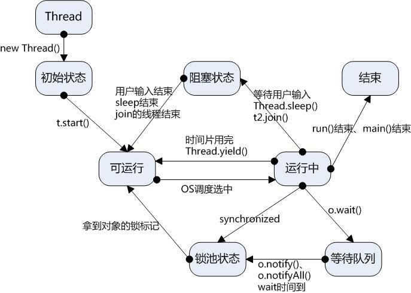

# Java多线程学习

## 1、进程与线程

1、进程：每个进程都有独立的代码和数据空间（进程上下文），进程间的切换会有较大的开销，一个线程包含1~n个线程。（进程是资源分配的最小单位）

线程：同一类线程共享代码和数据空间，每个线程有独立的运行栈和线程计数器（PC），线程切换开销小，（线程是cpu调度的最小单位）

2、进程有自己的独立地址空间，每启动一个进程，系统就会为它分配地址空间，建立数据表来维护代码段、堆栈段和数据段，这种操作开销非常大；而线程是共享进程中的数据的，使用相同的地址空间，因此cpu切换一个线程的花费远比进程要小很多，同时创建一个线程的开销也比进程要小很多；

3、线程之间的通信更方便，同一个进程下的线程共享全局变量、静态变量等数据，而进程之间的通信需要以通信的方式（IPC）进行。

4、但是多进程程序更健壮，多线程程序只要有一个线程死掉，整个进程也死掉了，而一个进程死掉并不会对另外一个进程造成影响，因为进程有自己独立的地址空间。

通俗点来讲，进程就像是任务管理器中的qq，chrome，网易云音乐这种一个个应用，而线程就像是在这个进程中间的一次任务，比如你点击切换音乐，聊天发送信息等。

## 2、 多线程的实现

在Java中多线程的实现有三种形式，这里只说前两种，继承Thread类和实现Runnable接口。

1.高聚低合前提下，线程操作资源类

2.判断/干活/通知

3.防止虚假唤醒

### 2.1 继承Thread类

```java
//继承Thread实现多线程
class MyThread extends Thread{  
    private String name;  
    public MyThread(String name) {  
       this.name=name;  
    }  
    public void run() {  
        for (int i = 0; i < 5; i++) {  
            System.out.println(name + "运行  :  " + i);  
            try {  
                sleep((int) Math.random() * 10);  
            } catch (InterruptedException e) {  
                e.printStackTrace();  
            }  
        }  
         
    }  
}  
public class Main {  
  
    public static void main(String[] args) {  
        MyThread mTh1=new Thread1("Thread A");  
        MyThread mTh2=new Thread1("Thread B");  
        mTh1.start();  
        mTh2.start();  
  
    }  
}  

```

上面这个两个类，`MyThread`类继承了Thread父类，并重写了里面的`run`方法。实现了多线程里面的方法，并在main函数中进行实例化了两个`mTh1`,`mTh2`两个线程 

执行结果：

```java
Thread A运行  ：  0
Thread B运行  ：  0
Thread B运行  ：  1
Thread A运行  ：  1
Thread B运行  ：  2
Thread A运行  ：  2
Thread B运行  ：  3
Thread A运行  ：  3
Thread B运行  ：  4
Thread A运行  ：  4
```

> 说明
>
> 程序在启动main函数时，Java虚拟机就已经启动了一个主线程来运行main函数，在调用到`mTh1`，`mTh2`的start方法时，就相当于有三个线程在同时工作了，这就是多线程的模式，进入了`mTh1`子线程，这个线程中的操作，在这个线程中有`sleep()`方法，Thread.sleep()方法调用目的是不让当前线程独自霸占该进程所获取的CPU资源，以留出一定时间给其他线程执行的机会。

实际上所有的线程执行顺序都是不确定的，CPU资源的获取完全是看两个线程之间谁先抢占上谁就先运行，当`mTh1`抢占上线程后，运行`run`方法中的代码，到`sleep()`方法进入休眠状态，也就是阻塞状态，然后`CPU`资源会被释放，`A`，`B`再次进行抢占`CPU`资源操作，抢占上的继续运行。在运行的结果中你也可以看到这个现象。

 注意:

一个实例的start()方法不能重复调用，否则会出现`java.lang.IllegalThreadStateException`异常。


### 2.2 实现java.lang.Runnable接口

采用Runnable也是非常常见的一种方式，我们只需要重写run方法即可

```java
class Thread2 implements Runnable{  
    private String name;  
  
    public Thread2(String name) {  
        this.name=name;  
    }  
  
    @Override  
    public void run() {  
          for (int i = 0; i < 5; i++) {  
                System.out.println(name + "运行  :  " + i);  
                try {  
                    Thread.sleep((int) Math.random() * 10);  
                } catch (InterruptedException e) {  
                    e.printStackTrace();  
                }  
            }  
          
    }  
      
}  
public class Main {  
  
    public static void main(String[] args) {  
        new Thread(new Thread2("Thread C")).start();  
        new Thread(new Thread2("Thread D")).start();  
    }  
  
}  

```

整体和继承Thread类相似

运行结果：

```java
Thread C运行  ：  0
Thread D运行  ：  0
Thread D运行  ：  1
Thread C运行  ：  1
Thread D运行  ：  2
Thread C运行  ：  2
Thread D运行  ：  3
Thread C运行  ：  3
Thread D运行  ：  4
Thread C运行  ：  4
```

 **说明：**

> `MyRunnable`类通过实现`Runnable`接口，使得该类有了多线程类的特征。`run()`方法是多线程程序的一个约定。所有的多线程代码都在`run`方法里面。`Thread`类实际上也是实现了`Runnable`接口的类。
>
> 在启动的多线程的时候，需要先通过`Thread`类的构造方法`Thread(Runnable target)`构造出对象，然后调用Thread对象的start()方法来运行多线程代码。
>
> 实际上所有的多线程代码都是通过运行`Thread`的`start()`方法来运行的。因此，不管是扩展Thread类还是实现`Runnable`接口来实现多线程，最终还是通过`Thread`的对象的`API`来控制线程的，熟悉`Thread`类的`API`是进行多线程编程的基础。

##  3、Thread类和Runnable接口的区别

如果一个类继承Thread，则不适合资源共享，但是如果实现了Runnable接口，则更容易实现资源共享。

**总结：**

**实现Runnable接口比继承Thread类所具有的优势：**

**1）：适合多个相同的程序代码的线程去处理同一个资源**

**2）：可以避免java中的单继承的限制**

**3）：增加程序的健壮性，代码可以被多个线程共享，代码和数据独立**

**4）：线程池只能放入实现Runnable或callable类线程，不能直接放入继承Thread的类**

**提醒一下大家：main方法其实也是一个线程。在java中所以的线程都是同时启动的，至于什么时候，哪个先执行，完全看谁先得到CPU的资源。**

**在java中，每次程序运行至少启动2个线程。一个是main线程，一个是垃圾收集线程。因为每当使用java命令执行一个类的时候，实际上都会启动一个JVM，每一个JVM实习在就是在操作系统中启动了一个进程。**

 

## 4、线程的状态




 1：新建状态(New)：new Thread()，新创建了一个线程；

2：就绪状态(Runnable)：新建完成后，主线程(main()方法)调用了该线程的start()方法，CPU目前在执行其他任务或者线程，这个创建好的线程就会进入就绪状态，等待CPU资源运行程序，在运行之前的这段时间处于就绪状态；

3：运行状态(Running)：字面意思，线程调用了start()方法之后并且抢占到了CPU资源，运行run方法中的程序代码；

4：阻塞状态(Blocked)：阻塞状态时线程在运行过程中因为某些操作暂停运行，放弃CPU使用权，进入就绪状态和其他线程一同进行下次CPU资源的抢占。

当发生如下情况时，线程将会进入阻塞状态

  ① 线程调用sleep()方法主动放弃所占用的处理器资源

  ② 线程调用了一个阻塞式IO方法，在该方法返回之前，该线程被阻塞

  ③ 线程试图获得一个同步监视器，但该同步监视器正被其他线程所持有。关于同步监视器的知识、后面将有深入的介绍

  ④ 线程在等待某个通知（notify）

  ⑤ 程序调用了线程的suspend()方法将该线程挂起。**但这个方法容易导致死锁，所以应该尽量避免使用该方法**

  当前正在执行的线程被阻塞之后，其他线程就可以获得执行的机会。被阻塞的线程会在合适的时候重新进入就绪状态，注意是就绪状态而不是运行状态。也就是说，被阻塞线程的阻塞解除后，必须重新等待线程调度器再次调度它。

**解除阻塞**

  针对上面几种情况，当发生如下特定的情况时可以解除上面的阻塞，让该线程重新进入就绪状态：

  ① 调用sleep()方法的线程经过了指定时间。

  ② 线程调用的阻塞式IO方法已经返回。

  ③ 线程成功地获得了试图取得的同步监视器。

  ④ 线程正在等待某个通知时，其他线程发出了个通知。

  ⑤ 处于挂起状态的线程被调用了`resdme()`恢复方法(会导致死锁，尽量避免使用)。

5：死亡状态(Dead)：线程程序执行完成或者因为发生异常跳出了run()方法，线程生命周期结束。

##  5、线程的调度

1：调整线程优先级：`Java`线程有优先级，优先级高的线程会获得较多的运行机会。

`Java`线程的优先级用整数表示，取值范围是1~10，`Thread`类有以下三个静态常量：

`static int MAX_PRIORITY`线程可以具有的最高优先级，取值为10。

`static int MIN_PRIORITY`线程可以具有的最低优先级，取值为1。

`static int NORM_PRIORITY`分配给线程的默认优先级，取值为5。

`Thread`类的`setPriority()`和`getPriority()`方法分别用来设置和获取线程的优先级。

每个线程都有默认的优先级。主线程的默认优先级为`Thread.NORM_PRIORITY`。

线程的优先级有继承关系，比如A线程中创建了B线程，那么B将和A具有相同的优先级。

`JVM`提供了10个线程优先级，但与常见的操作系统都不能很好的映射。如果希望程序能移植到各个操作系统中，应该仅仅使用`Thread`类有以下三个静态常量作为优先级，这样能保证同样的优先级采用了同样的调度方式。

2、**线程睡眠：**`Thread.sleep(long millis)`方法，使线程转到阻塞状态。`millis`参数设定睡眠的时间，以毫秒为单位。当睡眠结束后，就转为就绪（`Runnable`）状态。`sleep()`平台移植性好。

3、**线程等待：**`Object`类中的`wait()`方法，导致当前的线程等待，直到其他线程调用此对象的 `notify()` 方法或`notifyAll()`唤醒方法。这个两个唤醒方法也是`Object`类中的方法，行为等价于调用 wait(0) 一样。

4、**线程让步：**`Thread.yield()`方法，暂停当前正在执行的线程对象，把执行机会让给相同或者更高优先级的线程。

5、**线程加入：**`join()`方法，等待其他线程终止。在当前线程中调用另一个线程的`join()`方法，则当前线程转入阻塞状态，直到另一个进程运行结束，当前线程再由阻塞转为就绪状态。

6、**线程唤醒：**Object类中的`notify()`方法，唤醒在此对象监视器上等待的单个线程。如果所有线程都在此对象上等待，则会选择唤醒其中一个线程。选择是任意性的，并在对实现做出决定时发生。线程通过调用其中一个 wait 方法，在对象的监视器上等待。 直到当前的线程放弃此对象上的锁定，才能继续执行被唤醒的线程。被唤醒的线程将以常规方式与在该对象上主动同步的其他所有线程进行竞争；例如，唤醒的线程在作为锁定此对象的下一个线程方面没有可靠的特权或劣势。类似的方法还有一个`notifyAll()`，唤醒在此对象监视器上等待的所有线程。

注意：Thread中suspend()和resume()两个方法在JDK1.5中已经废除，不再介绍。因为有死锁倾向。

 

##  6、常用函数说明

### **1：sleep(long millis): 在指定的毫秒数内让当前正在执行的线程休眠(暂停执行);**

sleep()使当前线程进入停滞状态（阻塞当前线程），让出CUP的使用、目的是不让当前线程独自霸占该进程所获的CPU资源，以留一定时间给其他线程执行的机会;

   sleep()是Thread类的Static(静态)的方法；因此他不能改变对象的机锁，所以当在一个Synchronized块中调用Sleep()方法是，线程虽然休眠了，但是对象的机锁并木有被释放，其他线程无法访问这个对象（即使睡着也持有对象锁）。

  在sleep()休眠时间期满后，该线程不一定会立即执行，这是因为其它线程可能正在运行而且没有被调度为放弃执行，除非此线程具有更高的优先级。

### **2：join():指等待t线程终止**。

 ```java
Thread t = new AThread(); 
t.start(); 
t.join();  
 ```

为什么要用join()方法

在很多情况下，主线程生成并起动了子线程，如果子线程里要进行大量的耗时的运算，主线程往往将于子线程之前结束，但是如果主线程处理完其他的事务后，需要用到子线程的处理结果，也就是主线程需要等待子线程执行完成之后再结束，这个时候就要用到join()方法了

不加join()方法：

 ```java
class Thread1 extends Thread{  
    private String name;  
    public Thread1(String name) {  
        super(name);  
       this.name=name;  
    }  
    public void run() {  
        System.out.println(Thread.currentThread().getName() + " 线程运行开始!");  
        for (int i = 0; i < 5; i++) {  
            System.out.println("子线程"+name + "运行 : " + i);  
            try {  
                sleep((int) Math.random() * 10);  
            } catch (InterruptedException e) {  
                e.printStackTrace();  
            }  
        }  
        System.out.println(Thread.currentThread().getName() + " 线程运行结束!");  
    }  
}  
  
public class Main {  
  
    public static void main(String[] args) {  
        System.out.println(Thread.currentThread().getName()+"主线程运行开始!");  
        Thread1 mTh1=new Thread1("A");  
        Thread1 mTh2=new Thread1("B");  
        mTh1.start();  
        mTh2.start();  
        System.out.println(Thread.currentThread().getName()+ "主线程运行结束!");  
  
    }  
  
}  

 ```

 执行结果：

```java
main主线程运行开始!
main主线程运行结束!
B 线程运行开始!
子线程B运行 : 0
A 线程运行开始!
子线程A运行 : 0
子线程A运行 : 1
子线程A运行 : 2
子线程A运行 : 3
子线程A运行 : 4
A 线程运行结束!
子线程B运行 : 1
子线程B运行 : 2
子线程B运行 : 3
子线程B运行 : 4
B 线程运行结束!
```

发现了`main`函数主线程比A，B子线程都提前结束。 


加入join()方法：

```java
public class Main {  
  
    public static void main(String[] args) {  
        System.out.println(Thread.currentThread().getName()+"主线程运行开始!");  
        Thread1 mTh1=new Thread1("A");  
        Thread1 mTh2=new Thread1("B");  
        mTh1.start();  
        mTh2.start();  
        try {  
            mTh1.join();  
        } catch (InterruptedException e) {  
            e.printStackTrace();  
        }  
        try {  
            mTh2.join();  
        } catch (InterruptedException e) {  
            e.printStackTrace();  
        }  
        System.out.println(Thread.currentThread().getName()+ "主线程运行结束!");  
  
    }  

}  

```

执行结果：

```java
main主线程运行开始!
A 线程运行开始!
子线程A运行 : 0
B 线程运行开始!
子线程B运行 : 0
子线程A运行 : 1
子线程A运行 : 2
子线程A运行 : 3
子线程A运行 : 4
A 线程运行结束!
子线程B运行 : 1
子线程B运行 : 2
子线程B运行 : 3
子线程B运行 : 4
B 线程运行结束!
main主线程运行结束!
```

主线程一定会等子线程结束了才结束

### **3：yield():暂停当前正在执行的线程对象，并执行其他线程。**

`Thread.yield()`方法作用是：暂停当前正在执行的线程对象，并执行其他线程。

`yield()`应该做的是让当前运行线程回到可运行状态，以允许具有相同优先级的其他线程获得运行机会。因此，使用yield()的目的是让相同优先级的线程之间能适当的轮转执行。但是，实际中无法保证`yield()`达到让步目的，因为让步的线程还有可能被线程调度程序再次选中。

结论：`yield()`从未导致线程转到等待/睡眠/阻塞状态。在大多数情况下，`yield()`将导致线程从运行状态转到可运行状态，但有可能没有效果。可看上面的图。

```java
class ThreadYield extends Thread{  
    public ThreadYield(String name) {  
        super(name);  
    }  
   
    @Override  
    public void run() {  
        for (int i = 1; i <= 50; i++) {  
            System.out.println("" + this.getName() + "-----" + i);  
            // 当i为30时，该线程就会把CPU时间让掉，让其他或者自己的线程执行（也就是谁先抢到谁执行）  
            if (i ==30) {  
                this.yield();  
            }  
        }  
      
	}  
}  
  
public class Main {  
  
    public static void main(String[] args) {  
          
        ThreadYield yt1 = new ThreadYield("张三");  
        ThreadYield yt2 = new ThreadYield("李四");  
        yt1.start();  
        yt2.start();  
    }  
  
}  

```

**运行结果：**

第一种情况：李四（线程）当执行到30时会CPU时间让掉，这时张三（线程）抢到CPU时间并执行。

第二种情况：李四（线程）当执行到30时会CPU时间让掉，这时李四（线程）抢到CPU时间并执行。

 **sleep()和yield()的区别**

sleep()使当前线程进入停滞状态，确切来说进入阻塞状态，等sleep()规定的时间过了之后，该线程会继续执行，而停滞时间内会执行其他线程，yield()方法是直接停止该线程然后让线程从运行状态变成就绪状态，跟其他线程一块去抢夺CPU资源，有可能他会立即又抢夺到CPU资源，继续执行线程。

sleep 方法使当前运行中的线程睡眠一段时间，进入不可运行状态，这段时间的长短是由程序设定的，yield 方法使当前线程让出 CPU 占有权，但让出的时间是不可设定的。实际上，yield()方法对应了如下操作：先检测当前是否有相同优先级的线程处于同可运行状态，如有，则把 CPU  的占有权交给此线程，否则，继续运行原来的线程。所以yield()方法称为“退让”，它把运行机会让给了同等优先级的其他线程。

另外，sleep 方法允许较低优先级的线程获得运行机会，但 yield()  方法执行时，当前线程仍处在可运行状态，所以，不可能让出较低优先级的线程些时获得 CPU 占有权。在一个运行系统中，如果较高优先级的线程没有调用 sleep 方法，又没有受到 I\O 阻塞，那么，较低优先级线程只能等待所有较高优先级的线程运行结束，才有机会运行。

###  **4：setPriority(): 更改线程的优先级。**   

> MIN_PRIORITY = 1  
>
> NORM_PRIORITY = 5 
>
> MAX_PRIORITY = 10 

### **5：interrupt():**

`interrupt()`方法不是中断某个线程，而是给线程发送一个中断信号，让线程在无限等待时（如死锁时）能抛出异常，从而结束线程，但是如果你吃掉了这个异常，那么这个线程还是不会中断的！

(中断这块我会专门写一篇来讲`interrupt，isInterrupted，interrupted`。还有已经被淘汰的`stop，suspend`方法为什么会被淘汰)

### **6：其他方法**

还有`wait()，notify(),notifyAll()`这些方法，因为这三个方法要跟线程的锁结合起来讲解，所以我们放在下次跟多线程的锁一块讲解。还有就是Java线程池的概念以及锁中的区别等等。

##  7、线程数据传递

在传统的同步开发模式下，当我们调用一个函数时，通过这个函数的参数将数据传入，并通过这个函数的返回值来返回最终的计算结果。但在多线程的异步开发模式下，数据的传递和返回和同步开发模式有很大的区别。由于线程的运行和结束是不可预料的，因此，在传递和返回数据时就无法象函数一样通过函数参数和return语句来返回数据。

###  **1：通过构造方法传递数据**

在创建线程时，必须要建立一个Thread类的或其子类的实例。因此，我们不难想到在调用start方法之前通过线程类的构造方法将数据传入线程。并将传入的数据使用类变量保存起来，以便线程使用(其实就是在run方法中使用)。下面的代码演示了如何通过构造方法来传递数据：

```java
package mythread;   
public class MyThread1 extends Thread   {   
    private String name;   
    public MyThread1(String name){   
        this.name = name;   
    }   
	public void run(){   
		System.out.println("hello " + name);   
	}   
	public static void main(String[] args){   
        Thread thread = new MyThread1("world");   
        thread.start();   
	}   
}   

```

由于这种方法是在创建线程对象的同时传递数据的，因此，在线程运行之前这些数据就就已经到位了，这样就不会造成数据在线程运行后才传入的现象。如果要传递更复杂的数据，可以使用集合、类等数据结构。使用构造方法来传递数据虽然比较安全，但如果要传递的数据比较多时，就会造成很多不便。由于Java没有默认参数，要想实现类似默认参数的效果，就得使用重载，这样不但使构造方法本身过于复杂，又会使构造方法在数量上大增。因此，要想避免这种情况，就得通过类方法或类变量来传递数据。

### **2：通过变量和方法传递数据**

向对象中传入数据一般有两次机会，第一次机会是在建立对象时通过构造方法将数据传入，另外一次机会就是在类中定义一系列的public的方法或变量（也可称之为字段）。然后在建立完对象后，通过对象实例逐个赋值。下面的代码是对MyThread1类的改版，使用了一个setName方法来设置 name变量：

 ```java
package mythread;

public class MyThread2 implements Runnable {
    private String name;

    public void setName(String name) {
        this.name = name;
    }

    public void run() {
        System.out.println("hello " + name);
    }

    public static void main(String[] args) {
        MyThread2 myThread = new MyThread2();
        myThread.setName("world");
        Thread thread = new Thread(myThread);
        thread.start();
    }
}   

 ```

###  **3：通过回调函数传递数据**

上面讨论的两种向线程中传递数据的方法是最常用的。但这两种方法都是main方法中主动将数据传入线程类的。这对于线程来说，是被动接收这些数据的。然而，在有些应用中需要在线程运行的过程中动态地获取数据，如在下面代码的run方法中产生了3个随机数，然后通过Work类的process方法求这三个随机数的和，并通过Data类的value将结果返回。从这个例子可以看出，在返回value之前，必须要得到三个随机数。也就是说，这个 value是无法事先就传入线程类的。

 ```java
package mythread;

class Data {
    public int value = 0;
}

class Work {
    public void process(Data data, Integer numbers) {
        for (int n : numbers) {
            data.value += n;
        }
    }
}

public class MyThread3 extends Thread {
    private Work work;

    public MyThread3(Work work) {
        this.work = work;
    }

    public void run() {
        java.util.Random random = new java.util.Random();
        Data data = new Data();
        int n1 = random.nextInt(1000);
        int n2 = random.nextInt(2000);
        int n3 = random.nextInt(3000);
        work.process(data, n1, n2, n3); // 使用回调函数   
        System.out.println(String.valueOf(n1) + "+" + String.valueOf(n2) + "+"
                + String.valueOf(n3) + "=" + data.value);
    }

    public static void main(String[] args) {
        Thread thread = new MyThread3(new Work());
        thread.start();
    }
}   
 ```


##  8、线程锁

首先来说说为什么要加锁。这里就要提到了共享资源这个话题，比如说：一个卖票系统，售票员有三个，总共有100张票，那么共享资源就是这100张票，有三个线程在一起消费它，当这100张票卖完时，三个线程就都得停止了。

我们都知道，线程在CPU中的机制时竞争机制，也就是说谁抢到了下一张票，谁就卖下一张票。但是要注意的是，当线程一抢到要卖的下一张票，准备抢占CPU资源运行时，线程二抢到了下一张票，并且抢到了CPU的资源，那么就会提前将下一张票卖出。这样就会导致票的顺序呗打乱。

```java
class Count {
    public static int count = 100;
}

@Data
class TicketThread implements Runnable {
    private String name;
    public TicketThread(String name){
        super();
        this.name = name;
    }
    @Override
    public void run() {
        int all = 1;

        while (Count.count >0){
            System.out.println(this.getName()+":::卖出了第"+(all++)+"张,还剩"+ (--(Count.count))+"张");
        }
    }
}

class main {
    public static void main(String[] args){
        new Thread(new TicketThread("售票员1")).start();
        new Thread(new TicketThread("售票员2")).start();
        new Thread(new TicketThread("售票员3")).start();
    }
}

```


 执行结果：

```java
售票员2:::卖出了第90张，还剩8张
售票员2:::卖出了第91张，还剩7张
售票员2:::卖出了第92张，还剩6张
售票员2:::卖出了第93张，还剩5张
售票员2:::卖出了第94张，还剩4张
售票员2:::卖出了第95张，还剩3张
售票员2:::卖出了第96张，还剩2张
售票员2:::卖出了第97张，还剩1张
售票员2:::卖出了第98张，还剩0张
售票员3:::卖出了第1张，还剩98张
售票员1:::卖出了第1张，还剩99张
```

 当售票员2卖出地98张的时候，显示还剩0张，但是售票员1和3都卖出了一张，这就出现了问题

这样的问题如何解决呢？

顺应的锁的概念就应该提出来了，给这个买票过程加锁，当一个线程进去取到一张票并卖出的时候，加上锁，这样另外两个线程就只能在外面等待该线程把这张票卖出之后，三个人再进行资源的竞争。这样的情况下，就不会出现上面的情况了。


**如何加锁**

### 1：synchronized代码块

```java
@Override
public void run() {
	int all = 1;
    while (Count.count >0){
        synchronized (Count.class){
            if (Count.count<=0){
                    return;
                }
            System.out.println(this.getName()+":::卖出了第"+(all++)+"张,还剩"+ (--(Count.count))+"张");
        }
    }
}

```


### 2：同步方法

我们直接写一个方法，给count（票）加锁。

如果一个类里面所有东西都是线程需要的，可以将synchronized加在方法上修饰。

 ```java
private synchronized static void count() {
        int all = 1;
        if (Count.count <= 0) {
            return;
        }
        System.out.println(new TicketThread().getName()+":::卖出了"+(all++)+"张,还剩"+ (--(Count.count))+"张");

    }

 ```

然后再run方法中引用该方法 

```java
@Override
public void run() {
    int all = 1;
    while (Count.count >0){
        count();
    }
}

```

> 注意：
>
> 一个对象里面如果有多个synchronized方法，某一个时刻内，只要一个线程去调用其中的一个synchronized方法了，其他的线程只能等待，换句话说，**某一个时刻内，只能有唯一一个线程去访问这些synchronized方法。**
>
> **锁的是当前对象this，被锁定后，其他的线程都不能进入到当前对象的其他synchronized方法**
>
> 加个普通方法后发现和同步锁无关
>
> 换成两个对象后，不是同一把锁了，情况立刻变化


**synchronized实现同步的基础：在Java中的每一个对象都可以作为锁**

> 具体表现为以下三种形式：
>
> -对于同步方法，锁的是当前对象this
>
> -对于同步代码块，锁是synchronized括号里配置的对象
>
> -对于静态同步方法，锁是当前类的class对象

### 3：Lock接口的使用

```java
import java.util.concurrent.locks.Lock;
import java.util.concurrent.locks.ReentrantLock;

public class Thread1 {
    public static void main(String[] args) {

        //实例化上锁对象 ReentrantLock
        Lock lock = new ReentrantLock();

        Runnable runnable = new Runnable() {
            @Override
            public void run() {
                while (Count.count>0){
                    //对临界资源进行上锁
                    lock.lock();
                    if (Count.count<=0){
                        return;
                    }
                    try{
                        System.out.println("数量减少1，总数count"+ --(Count.count));
                    }catch(Exception e){
                        e.printStackTrace();
                    }finally {
                        //解锁
                        lock.unlock();
                    }

                }
            }
        };
        Thread t1 = new Thread(runnable,"t1");
        Thread t2 = new Thread(runnable,"t2");
        Thread t3 = new Thread(runnable,"t3");
        Thread t4 = new Thread(runnable,"t4");
        t1.start();
        t2.start();
        t3.start();
        t4.start();
    }
}

```


 直接给临界资源上锁。

这三种方法都可以加锁，加锁之后，再次运行程序。

```java
售票员1:::卖出了第17张，还剩25张
售票员1:::卖出了第18张，还剩24张
售票员1:::卖出了第19张，还剩23张
售票员1:::卖出了第20张，还剩22张
售票员2:::卖出了第1张，还剩21张
售票员2:::卖出了第2张，还剩20张
售票员2:::卖出了第3张，还剩19张
售票员2:::卖出了第4张，还剩18张
售票员2:::卖出了第5张，还剩17张
售票员2:::卖出了第6张，还剩16张
售票员2:::卖出了第7张，还剩15张
售票员2:::卖出了第8张，还剩14张
售票员2:::卖出了第9张，还剩13张
售票员2:::卖出了第10张，还剩12张
售票员2:::卖出了第11张，还剩11张
售票员2:::卖出了第12张，还剩10张
售票员2:::卖出了第13张，还剩9张
售票员2:::卖出了第14张，还剩8张
售票员2:::卖出了第15张，还剩7张
售票员2:::卖出了第16张，还剩6张
售票员2:::卖出了第17张，还剩5张
售票员2:::卖出了第18张，还剩4张
售票员2:::卖出了第19张，还剩3张
售票员2:::卖出了第20张，还剩2张
售票员2:::卖出了第21张，还剩1张
售票员2:::卖出了第22张，还剩0张
```

这样就算是正常情况了。

所以说，在多线程情况下，如果一个变量会被几个线程同时用到，那么要给该变量加锁，让一个线程进去使用完之后，在进行CPU资源竞争，这样能保证程序不出现一些看不懂的异常。

### 4：死锁

多线程中有一种情况叫做死锁，就是A线程拿到A和B线程的锁，B线程也拿到A和B线程的锁，他们在同时等对方释放对方手中拿到的自己需要的锁，这样就造成死锁现象了。看代码 

 ```java
class DeadLock {

    public static void main(String[] args) {
        Runnable runnable1 = () -> {
          synchronized ("A"){
              System.out.println("A线程持有A锁，等待B锁");

              synchronized ("B"){
                  System.out.println("A线程同时持有A，B锁");
              }
          }
        };
        Runnable runnable2 = () -> {
            synchronized ("B"){
                System.out.println("B线程持有B锁，等待A锁");
                synchronized ("A"){
                    System.out.println("B线程同时持有A，B锁");
                }
            }
        };
        Thread t1 = new Thread(runnable1);
        Thread t2 = new Thread(runnable2);
        t1.start();
        t2.start();
    }
}

 ```


 执行结果：


 

 只输出了这两句话，然后程序还在运行中，这就是上面所说到的死锁现象，A，B互相持有对方的锁，都在等待对方释放自己所需要的锁，进行下面的操作。

那么如何避免死锁现象呢？

这里就要引出我们一直准备说的三个方法了：wait()，notify()，notifyAll() 


##### 1：`wait()`

wait()方法是使当前线程阻塞，前提是必须先获得锁，一般配合`synchronized` 关键字使用，即，一般在synchronized 同步代码块里使用`wait()、notify/notifyAll()` 方法。

当线程使用wait()方法时，该线程进入阻塞状态，会释放出当前的锁，然后让出CPU，进入等待状态。

##### 2：`notify()，notifyAll()`

而`notify，notifyAll`两个方法的作用是唤醒一个或者多个正处于等待状态的线程，让他们继续往下执行，直到执行完synchronized 代码块的代码或是中途遇到wait() ，再次释放锁。

也就是说，`notify/notifyAll()`的执行只是唤醒沉睡的线程，而不会立即释放锁，锁的释放要看代码块的具体执行情况。所以在编程中，尽量在使用了`notify/notifyAll()`后立即退出临界区，以唤醒其他线程让其获得锁。

**需要注意的是**：

1：`wait()`需要被try catch包围，以便发生异常中断也可以使wait等待的线程唤醒。

2：`notify` 和`wait`的顺序不能错，如果A线程先执行`notify`方法，B线程在执行`wait`方法，那么B线程是无法被唤醒的。

3：`notify` 和 `notifyAll`的区别

notify方法只唤醒一个等待（对象的）线程并使该线程开始执行。所以如果有多个线程等待一个对象，这个方法只会唤醒其中一个线程，选择哪个线程取决于操作系统对多线程管理的实现。`notifyAll` 会唤醒所有等待(对象的)线程，尽管哪一个线程将会第一个处理取决于操作系统的实现。如果当前情况下有多个线程需要被唤醒，推荐使用`notifyAll` 方法。比如在生产者-消费者里面的使用，每次都需要唤醒所有的消费者或是生产者，以判断程序是否可以继续往下执行。

4：在多线程中要测试某个条件的变化，使用if 还是while？

要注意，notify唤醒沉睡的线程后，线程会接着上次的执行继续往下执行。所以在进行条件判断时候，可以先把 wait 语句忽略不计来进行考虑；显然，要确保程序一定要执行，并且要保证程序直到满足一定的条件再执行，要使用while进行等待，直到满足条件才继续往下执行。

 修改了上面的代码：

```java
 public static void main(String[] args) {
        Runnable runnable1 = () -> {
          synchronized ("A"){
              System.out.println("A线程持有A锁，等待B锁");

              try {
                  //释放A锁，进入等待队列
                  "A".wait();
              } catch (InterruptedException e) {
                  e.printStackTrace();
              }

              synchronized ("B"){
                  System.out.println("A线程同时持有A，B锁");
              }
          }
        };
        Runnable runnable2 = () -> {
            synchronized ("B"){
                System.out.println("B线程持有B锁，等待A锁");
                synchronized ("A"){
                    System.out.println("B线程同时持有A，B锁");
                    //唤醒持有A锁的线程
                    "A".notifyAll();
                }
            }
        };
        Thread t1 = new Thread(runnable1);
        Thread t2 = new Thread(runnable2);
        t1.start();
        t2.start();
    }

```


 执行结果：

```java
A线程持有A锁，等待B锁
B线程持有B锁，等待A锁
B线程同时持有A，B锁
A线程同时持有A，B锁
```


 main函数直接输出完后结束掉，没有再像前面一样的死锁现象发生。

这里的具体操作是：当A线程持有了A锁时，遇到wait()方法，A线程进入阻塞状态，释放了A锁，让出了CPU资源，这是B线程就可以通顺的获得B锁，再获得A锁，然后在B线程执行完成任务后，用notifyAll方法唤醒所有等待A锁的线程，让他们进行CPU竞争。当然我写的代码只有一个A线程在等待A锁。这样A线程就会接着自己前面的程序继续执行下去，完成任务。

 

 

 

 

 

 

 

 

 

 

 

 

 

 

 

 